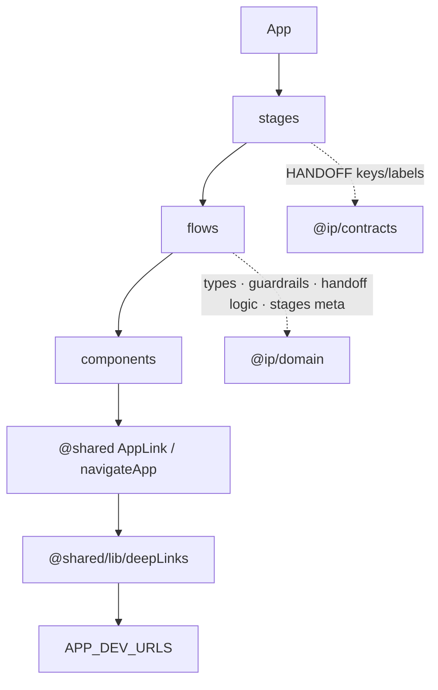

# apps/workbench · SaaS 办理台

**Ownership：** multi-app `:5174` 的规范实现在 `flows/*`；对外模块边界是 `stages/*`（`App.tsx` 只从 `./stages` 导入）。根 `src/pages/workbench` 仅 legacy `dev:legacy`，不归本 app，勿盲目 sync-copy — 见 [docs/workbench/OWNERSHIP.md](../../docs/workbench/OWNERSHIP.md)。

阶段化办理台应用（Vite + React + TS）。业务页在本 app 的 `flows/`；`stages/` 为可独立依赖的模块边界（re-export + 清单）。共享 context / UI / hooks / seeds 经 `@shared/*`；可执行领域（types · guardrails · handoff 逻辑 · getStageMeta · commands）经 `@ip/domain`（types-only 可用 `@ip/domain/types`）；跨口深链与根侧同口径：相对路径 + `@shared/components/AppLink` / `navigateApp`（`lib/deepLinks.ts` re-export `@shared/lib/deepLinks`）。

## 启动 / URL

```bash
# 仓库根目录
npm run dev:workbench
npm run typecheck -w @ip/workbench
```

- URL: **http://localhost:5174**（`APP_DEV_URLS.workbench`）
- 路由：`/workbench/*`、`/inventor`（及 `/portal/inventor`）

## 字体

入口 `main.tsx` 已 `import '@shared/index.css'`，与根应用同一系统字体栈；**无第二套 webfont**，不引入 Google Fonts。

## 结构

```
apps/workbench/src/
  App.tsx                 # 经 ./stages 导入页面；未匹配路由 AppLink to="/" → mid
  main.tsx                # @shared/index.css（系统字体）
  lib/deepLinks.ts        # re-export @shared/lib/deepLinks（resolveAppHref / navigateApp）
  components/
    WorkbenchInsightDataBanner.tsx   # P0 本地替身（数据策略 → mid）
    WorkbenchBillingHoldBanner.tsx   # P0 本地替身（案/费用 → mid）
    flow/ CaseHeader · HandoffActionBar · …
    FlowChrome / FormBlocks / VersionPanel / …
  flows/                  # 业务实现（internal；flows/index 已 deprecated）
  stages/                 # 唯一公共导出面（九段 + home + inventor）
    research|intake|draft|prosecution|maintain|monetize|watch|layout|home|inventor/
    index.ts              # OWNED-BY + 聚合导出 + STAGE_MODULES
```



## P0 · 跨口深链（AppLink 口径）

与根 `src` 对齐：业务里写**相对路径**（`/cases` · `/docket` · `/billing` · `/agent` · `/settings/data`），渲染用 `AppLink`，程序跳转用 `navigateApp`；由 `resolveAppHref` 在 multi-app 下解析为 `APP_DEV_URLS`。

| 调用方 | 本地替身 / 组件 | 链 |
|--------|-----------------|-----|
| `ResearchFlow` | `WorkbenchInsightDataBanner` | `AppLink to="/settings/data"` |
| `WorkbenchHome` | `WorkbenchBillingHoldBanner` | `AppLink` → `/cases/:id` · billing 相对 path |
| Flow / toast / CaseHeader 等 | `AppLink` | `/cases` · `/docket` · `/agent` · `/workbench/*` |
| `App.tsx` 404 fallback | `AppLink to="/"` | mid 首页（勿本地 `APP_DEV_URLS.mid`） |

本口路径（`/workbench/*`、`/inventor`）仍相对（`Link` 或 `AppLink` 同面）。

## P1 · 阶段模块骨架

- `stages/*`：边界 + re-export；业务仍在 `flows/`，可渐进迁。
- 每 stage `index.ts` 注释：flowKey、主 stageId、handoff 键来自 `@ip/contracts`（**禁止** stage 内再定义 labels）。
- `STAGE_MODULES` 与 `FLOW_CATALOG` 对齐；handoffKey 读 `ARTIFACT_FOR_STAGE`。
- `App.tsx` 从 `./stages` 导入；`flows/index.ts` 为 internal（无并行公共列表）。
- **未建** `packages/workbench-*`（避免薄包/循环依赖；以 `apps/workbench/src/stages` 为准）。

handoff **labels**（`HANDOFF_LABELS` / `HANDOFF_ARTIFACT_LABELS` / `ARTIFACT_FOR_STAGE`）唯一源 `@ip/contracts`（CasePicker / VersionPanel / Draft / Intake / Inventor / Layout / CaseHeader）。可执行领域（`canPerformHandoff` / `REQUIRED_*` / check items / guardrails / `getStageMeta` / commands / types）从 `@ip/domain`（或 `@ip/domain/types`）；勿在同一文件从 contracts 与 domain 各引一套 labels。

### 依赖 · `@ip/domain`

`package.json` 已声明 `"@ip/domain": "*"`。办理台领域层不再经 `@shared/types` / `@shared/domain/*` / `@shared/data/handoff` / `@shared/data/stages`（`getStageMeta`）间接取用；`@shared` 仍用于 context、UI 组件、hooks、`flowSteps`、`workbenchSeeds`、agents、utils、css。

## 与中台深链

未匹配路由回作业中台：`AppLink to="/"`（经 `resolveAppHref` → mid）。跨口用 `AppLink` / `navigateApp`（勿对跨口面直接用 react-router `Link`）。
