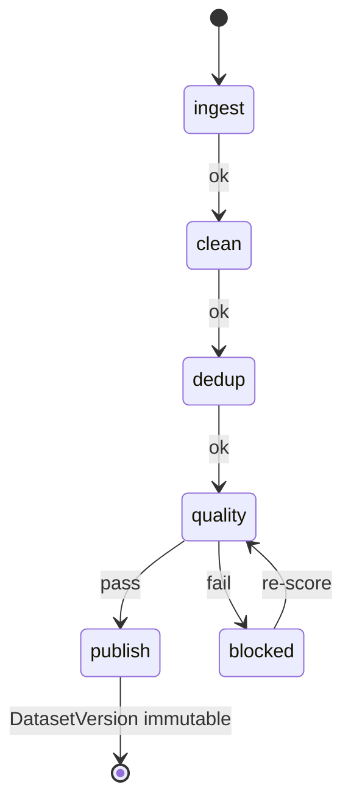

# AI Data · 样机深业务（deep-demo）

> **样机诚实**：仍无真 Spark / 湖仓 / PII 引擎；状态机在浏览器内存；publish 可写 localStorage 供训推壳读。  
> **目标**：把 `apps/ai-data:5181` 做成**可点 Pipeline 闭环**——质量门不达标不能发布；version 不可变；跨壳写出约定键。  
> 对齐实现 Owner：AI Data助手。本篇是规格，不代替改代码。

## 1. 必须做出的闭环

| # | 面 | 可点行为 | 状态机（建议） |
|---|-----|----------|----------------|
| 1 | **Sources → Ingest** | 「拉取」创建 IngestJob；写 raw 计数 | `queued` → `running` → `done` \| `fail` |
| 2 | **Pipelines** | 多步 DAG 可 Run：采集→清洗→去重→**质量门**→发布；每步有状态 | step 同上；**质量门 `fail` 阻断 publish 成功** |
| 3 | **Quality** | 对数据集跑打分；mock findings（敏感/污染，标「非真引擎」）；不达标打红 | run：`idle` → `scoring` → `pass` \| `fail` |
| 4 | **Datasets** | 发布产生**不可变** version（`vN` / semver + 假 checksum）；可 pin；已发布内容不可改，只能出新 version | version：`draft` → `published`（immutable） |
| 5 | **Recipes** | 配比（预训练/SFT/偏好/评测）可保存；采样预览条数拆分 | 保存即内存生效 |
| 6 | **Lineage** | Pipeline / 发布后**自动**追加边（source → dataset version） | append-only 边表 |
| 7 | **Exports** | 脱敏导出单：申请→审批→完成；完成后可「生成候选数据集」进 datasets（**无案正文**） | `requested` → `approved` → `done` |
| 8 | **评测回流** | ImprovementTicket 列表；「创建难例回灌任务」挂到 pipeline | ticket → 新 pipeline run 引用 |
| 9 | **跨壳写出** | 每次成功 publish version → 写 localStorage（§3） | 合并去重 |

禁止：PatentCase / DomainCommand；真湖仓；改 `APP_PORTS` / 五壳 / `apps/ai-infra` 代码。

## 2. Pipeline × 质量门（硬）

- UI：**质量门未 pass 时「发布」按钮 disabled**（或点击 toast 说明原因）。  
- 禁止静默跳过门禁把 version 标成 published。

## 3. 跨壳约定（写）

| 项 | 值 |
|----|-----|
| **键** | `ip.harness.aiData.publishedDatasets` |
| **写入时机** | 每次成功 publish 一个 dataset version |
| **合并语义** | 读出数组 → 按 `id`+`version` 去重 → 写回；新发布置顶或按 `publishedAt` 排序 |
| **JSON shape** | `[{ "id": "ds-claims-sft", "name": "claims-sft", "version": "v1.4" }]` |
| **读取方** | `apps/ai-infra:5179` Jobs 下拉（见 [../ai-infra/deep-demo.md](../ai-infra/deep-demo.md)） |

### 诚实：端口与 localStorage

不同 Vite 端口 **默认不共享** `localStorage`。键名与 shape 仍冻结，便于：

1. 同 origin 反代后自动生效；或  
2. 演示脚本注入；或  
3. 5179 种子 fallback 独立演示。

**禁止**产品文案写「已与训推面实时同步」除非同源或另接 bridge。对齐 [../data-flow.md](../data-flow.md)。

## 4. 与 ai-infra / case-core

- 发布的是 **dataset version 元数据**，不是模型 Release（后者属 ai-infra）。  
- 导出单 **无** PatentCase 列、无案正文；候选集只进本壳 datasets。  
- 不申请 GPU job。

## 5. 验收（实现侧）

- [ ] 上表 1–9 均可点通  
- [ ] 质量门失败路径实测阻断发布  
- [ ] publish 后键存在且 shape 正确（同 origin 自测）；README 写清键名  
- [ ] 横幅：`样机 · 非真 Spark / 湖仓 / PII`  
- [ ] 不改邻居业务代码  

相关：[surfaces.md](./surfaces.md) · [topology.md](./topology.md) · [../ai-infra/deep-demo.md](../ai-infra/deep-demo.md)

---

## 脚注 · 跨壳与 localStorage（冻结）

> **不同 Vite 端口 = 不同 origin**，浏览器 **`localStorage` 不共享**（5179 读不到 5181 写入的键，反之亦然）。  
> **跨壳演示以共享种子 ID 契约为准**（双方内置同一组 `id` / `name` / `version`，如 `claims-sft@v1.4`）。  
> 键 `ip.harness.aiData.publishedDatasets` 的写入**仅利于同端口多 tab / 刷新**持久；**不是**跨口同步通道。禁止产品文案声称已跨 5179↔5181 自动共享。
