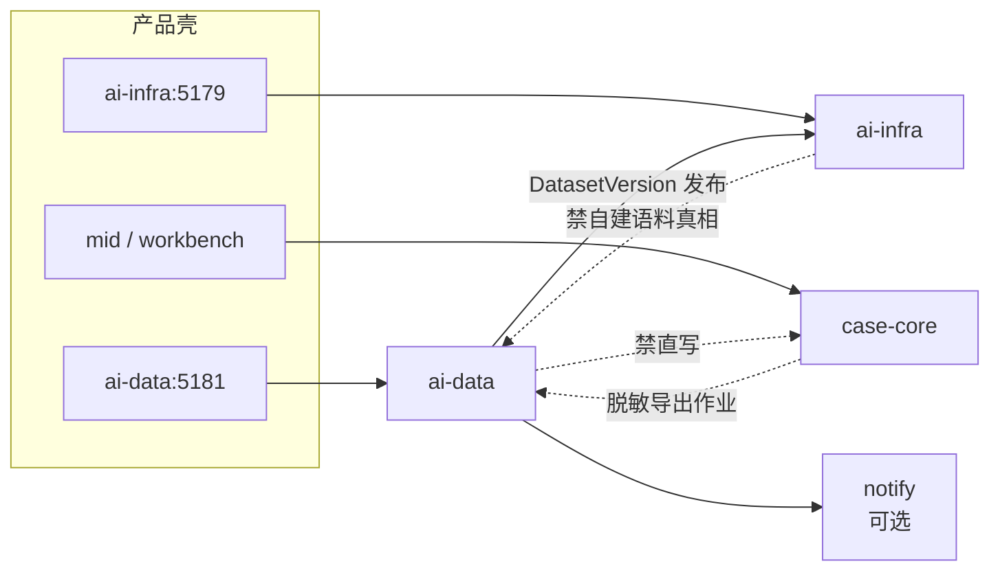

# 拓扑与边界

> **样机诚实**：无真实 ETL 箭头；下图为落地目标。  
> **落地目标**：ai-data 发布数据集；ai-infra 训练/评测只读消费。

## 1. 上下文图

## 2. 边界表

| 邻居 | 关系 | 禁止 |
|------|------|------|
| **ai-infra** | 训练/评测 Job 引用 `datasetId@version`；loader 契约对齐 | ai-infra 偷偷拷贝无版本原始桶当真相 |
| **case-core** | 仅触发/审批**脱敏导出**；导出产物进 ai-data | PatentCase / handoff / audit 写入 ai-data |
| **ops-platform** | 共享密钥引用与 OTel 采集器 | 把 Pipeline UI 永久塞进 ops 六路由 |
| **agent-session** | **不**直连 ai-data 读案语料 | 会话里挂未脱敏案全文当 prompt 缓存进湖 |
| **notify** | Pipeline / 质量门禁事件 | ai-data 自建 SMTP |

## 3. 同步 / 异步

| 路径 | 模式 |
|------|------|
| 采集 / 清洗 / 去重 / 大规模处理 | 异步 Job + 状态机 |
| 数据集发布（打 version） | 同步门禁 + 异步物化清单 |
| ai-infra 拉取/挂载 | 异步准备 + 训练时只读 |
| 脱敏导出 | 异步；须审计「谁导出了什么范围」在导出侧，**不是**把案写入湖 |
