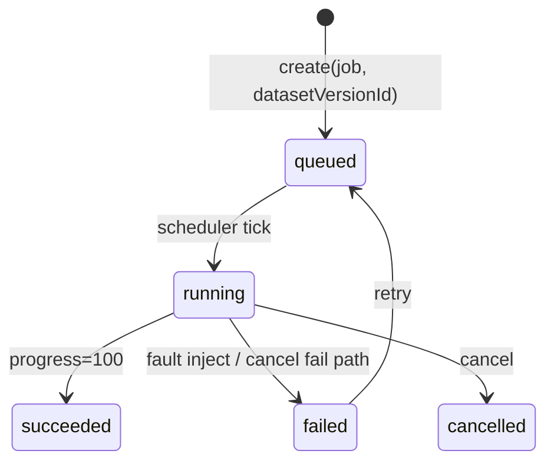

# AI Infra · 样机深业务（deep-demo）

> **样机诚实**：仍无真 GPU / K8s / 权重仓 / 推理进程；状态机在浏览器内存（+ 可选读 localStorage）。  
> **目标**：把 `apps/ai-infra:5179` 从空壳表单升级为**可点闭环**——作业 / 发布 / 端点 / 压测 / 告警真正推进状态。  
> 对齐实现 Owner：AI Infra助手。本篇是规格，不代替改代码。

## 1. 必须做出的闭环

| # | 面 | 可点行为 | 状态机（建议枚举） |
|---|-----|----------|-------------------|
| 1 | **Jobs** | 新建训练/批推（选 `datasetVersionId`、队列、优先级）→ 取消 / 失败重试；详情假日志流 | `queued` → `running`（定时推进 `progress`）→ `succeeded` \| `failed`；`cancelled` 可选 |
| 2 | **GPU** | 配额占用随 **running** job 增减；节点 **drain** 后不可再调度到该节点 | 节点：`schedulable` \| `draining` \| `down`（示意） |
| 3 | **Models + Endpoints** | 注册 → **晋级 Confirm** → canary/prod；端点绑 model revision；流量 % 可调；一键回滚 | revision：`candidate` → `canary` → `prod`（或 `rolled_back`） |
| 4 | **Pipelines** | 模板「训练→评测门禁→发布」跑一遍；失败停在门禁；**通过才可点发布** | step：`pending` → `running` → `passed` \| `failed`；gate 失败阻断后续 |
| 5 | **Loadtest** | 对某 endpoint 启压测 → 出 TTFT / tokens/s / 错误率（可随参数变的假数） | `idle` → `running` → `report_ready` |
| 6 | **Alerts** | job 失败 / GPU 高占用 **自动追加**；可确认 / 静默 | `open` → `acked` \| `silenced` |
| 7 | **跨壳读** | 作业创建下拉消费 ai-data 已发布数据集 | 见 §3 |

禁止：PatentCase / DomainCommand；真集群；改 `APP_PORTS` / 五壳 / `apps/ai-data`（写入由 AI Data 做）。

## 2. 作业 × 数据集引用

- 创建表单 **必须** 有 dataset 下拉：来源 §3；空则用内置种子（见下）。  
- Job 行保存 `datasetId` + `version`（展示用），**不**拉语料正文。

## 3. 跨壳约定（读）

| 项 | 值 |
|----|-----|
| **键** | `ip.harness.aiData.publishedDatasets` |
| **写入方** | `apps/ai-data:5181`（每次成功 publish version，合并去重） |
| **读取方** | `apps/ai-infra:5179`（Jobs 创建下拉） |
| **JSON shape** | `Array<{ id: string, name: string, version: string }>`（可附加 `checksum?` / `publishedAt?`，读方忽略未知字段） |
| **空时** | 使用内置种子（如 `claims-sft@v1.4`、`eval-hard@v2.0`），UI 标明「种子 · 非跨壳」 |

### 诚实：端口与 localStorage

Vite 默认 **不同端口 = 不同 origin**，浏览器 **不**共享 `localStorage`。因此：

- 规格键名冻结如上，便于同仓对齐与将来反代同 origin。  
- 今日演示：**禁止**文案声称「已跨 5179/5181 自动共享」；5179 必须以种子 fallback 可独立演示。  
- 可选开发态：同源反代或演示脚本注入该键（非本规格必做）。

对齐 [../data-flow.md](../data-flow.md)：勿写「各 app 同一套 localStorage」。

## 4. 与门禁 / 告警的耦合（样机）

- Pipeline 评测门禁失败 → 不可点「发布」；可点「重跑评测」。  
- Job → `failed` → 自动 push 一条 Alerts（出站仍标 notify，**不**发 SMTP）。  
- 晋级 Confirm **不是**办案 HITL / `clearedHitlGates`；文案区分。

## 5. 验收（实现侧）

- [ ] 上表 1–7 均可点通；刷新可失态（内存诚实）或声明若做了 session 持久  
- [ ] 横幅仍为：`样机 · 非真 GPU / 非真 K8s`  
- [ ] README（`apps/ai-infra`）写清 §3 键名 / shape / 种子 fallback  
- [ ] 不改邻居业务代码  

相关：[surfaces.md](./surfaces.md) · [topology.md](./topology.md) · [../ai-data/deep-demo.md](../ai-data/deep-demo.md)
