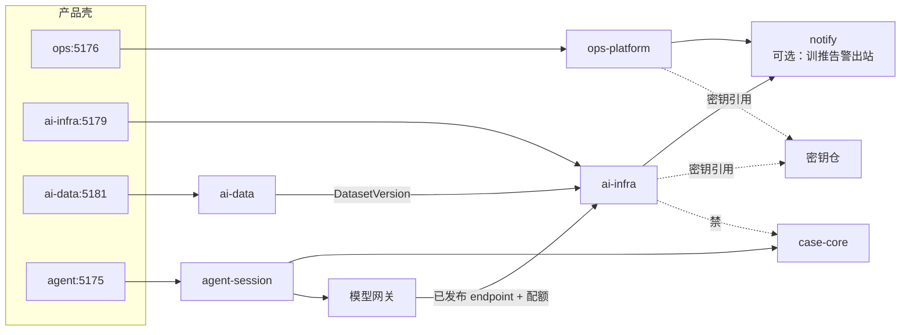

# 拓扑与边界

> **样机诚实**：无真实箭头实现；下图为落地目标关系。  
> **落地目标**：ai-infra 与办案面通过**网关与发布契约**弱耦合。

## 1. 上下文图

## 2. 边界表

| 邻居 | 关系 | 禁止 |
|------|------|------|
| **ops-platform** | 共享密钥仓引用、全局 OTel 管道可共用采集器；产品壳分离 | 把 GPU 作业塞进 ops 六路由长期糊弄 |
| **notify** | ai-infra 可产生「训练失败/发布门禁」类事件 → outbox | ai-infra 自己发 SMTP |
| **agent-session** | 只消费网关；会话/HITL 仍在 agent-session | session 里塞 GPU job id 当办案真相 |
| **case-core** | **无**写路径；无 PatentCase | dispatch / handoff / audit 进 ai-infra |
| **ai-data** | **数据面在 ai-data**：发布 dataset version；本平面训练/评测只读消费 | 在 ai-infra 自建无版本语料真相 |
| **模型网关** | 面向办案的唯一模型入口；背后绑 ai-infra Release | Agent 直调集群 scheduler |

## 3. 同步 / 异步

| 路径 | 模式 |
|------|------|
| 提交训练 / 批推 | 异步 Job + 状态机 |
| 在线推理调用（办案） | 同步（经网关）；超时/限流回 agent-session |
| 模型发布 | 同步门禁 + 异步切流量 |
| 告警 | 异步 → notify |
