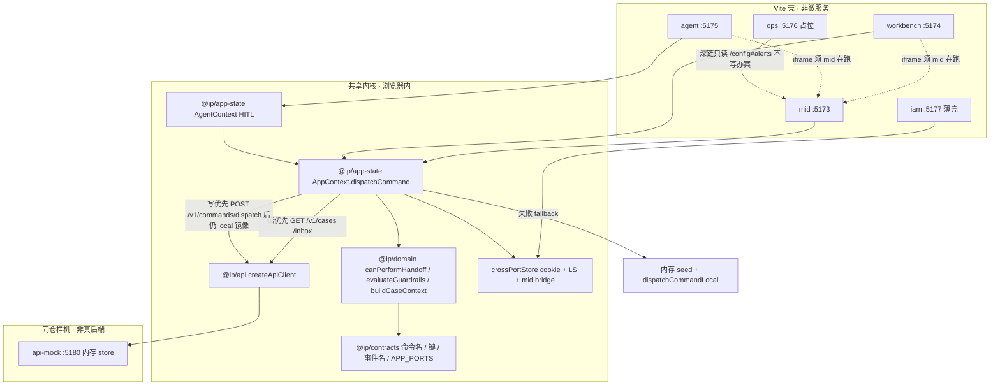
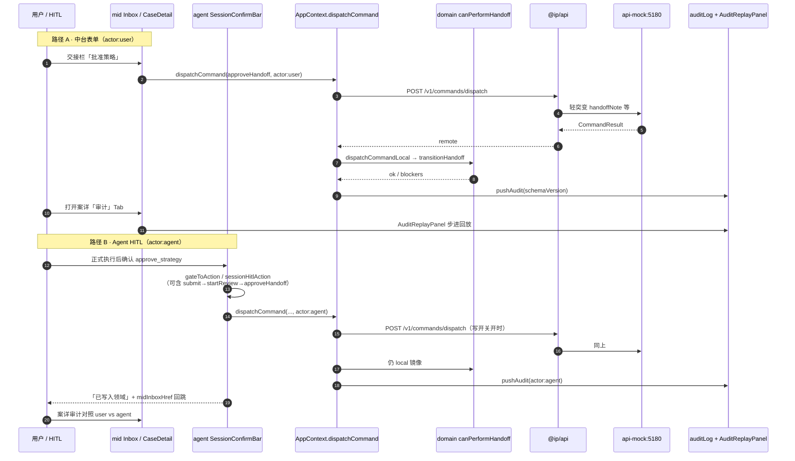

# 多壳数据流（完整稿 · 样机级）

> **现状样机** vs **目标设计** 分节标明。  
> 本篇对齐现仓真实端口、开关、merge / 双写语义；不假装已有网关 / 消息总线 / 共享库。  
> 命令与 HITL 细则只链 [COMMANDS.md](../COMMANDS.md) / [HARNESS.md](../HARNESS.md)，不整篇复制。

## 1. 诚实边界

### 现状样机

| 项 | 事实 |
|----|------|
| 进程 | 六个独立 Vite / Node：`APP_PORTS`（`@ip/contracts` `ports.ts`）mid **5173** · workbench **5174** · agent **5175** · ops **5176** · iam **5177** · api **5180** |
| 真相所在 | 浏览器内存（`AppProvider` / `AgentProvider`，`@ip/app-state`）+ 可选同仓 HTTP mock；进程重启 / 清 LS 即丢 |
| 事件 | `DOMAIN_EVENTS`（`packages/contracts/src/events.ts`）**只有事件名常量，无 bus 实现** |
| 跨口 | cookie（persona/workspace）+ mid iframe bridge（大块态）；**不是**共享后端 |

### 目标设计

- 读走真服务、写走命令服务；壳不再各持一份 `PatentCase[]`。
- 跨口不再依赖 localhost cookie / mid iframe bridge。
- 事件有真实订阅方（见 [backends.md](./backends.md)）。

### 六端口表（对齐 `APP_PORTS`）

| AppId | 端口 | 包 / 目录 | 角色（现状） |
|-------|------|-----------|--------------|
| `mid` | 5173 | `apps/mid` · `@ip/mid` | 作业中台；兼 cross-port bridge 宿主 |
| `workbench` | 5174 | `apps/workbench` · `@ip/workbench` | 办理台 Flow + 发明人门户 |
| `agent` | 5175 | `apps/agent` · `@ip/agent` | 知产 Agent / HITL |
| `ops` | 5176 | `apps/ops` · `@ip/ops` | 运维占位；告警试发不写办案 |
| `iam` | 5177 | `apps/iam` · `@ip/iam` | Login / Persona / 工作区薄壳；**非真 SSO** |
| `api` | 5180 | `apps/api-mock` · `@ip/api-mock` | 同仓 Node `http` 内存店；**非真后端** |

开发 URL：`APP_DEV_URLS`（同文件）。深链解析：`src/lib/deepLinks.ts` `resolveAppHref`。

---

## 2. 各壳职责与深链规则

### 现状样机

| 壳 | 主路由 / 职责 | 跨口规则 |
|----|---------------|----------|
| **mid** | Dashboard / Case* / Pipeline / Docket / Billing / OrgSettings / Insight | 侧栏 `/workbench/*`、`/agent` 在 multi-app 下经 `resolveAppHref` 深链到 5174 / 5175；宿主 `__cross_port_bridge.html` |
| **workbench** | `/workbench/*` Flow + `/inventor` | 跨口经 `apps/workbench/src/lib/deepLinks.ts` + `<a href>`；**勿**用本口 `Link` 跳别壳 |
| **agent** | `/agent/sessions/:id` HITL | Inbox 回跳必须绝对 mid URL（`midInboxHref`）；相对 path 会停在 5175 |
| **iam** | Login / Persona / 工作区 | 亦挂 `AppProvider`（与 mid/workbench/agent 同）；写 `CROSS_PORT_PERSONA_COOKIE` / `CROSS_PORT_WORKSPACE_COOKIE`；**非** SSO 会话 |
| **ops** | 运维占位 | 通知试发见 [ops README · 通知渠道](../../apps/ops/README.md#通知渠道开发者告警样机)，入口 `/config#alerts`；**不**参与办案写路径 |
| **api-mock** | HTTP 样机 | 仅被 `@ip/api` 客户端调用；详见 [api-mock README](../../apps/api-mock/README.md) |

深链实现权威：

- 根：`src/lib/deepLinks.ts`（`resolveAppHref` / `APP_DEV_URLS`）+ `AppLink`
- agent：`apps/agent/src/lib/deepLinks.ts`（`midInboxHref` / `midHref` / `workbenchHref`）
- 联调步骤只链 [OPTIMIZE_NOTES · 联调彩排](../OPTIMIZE_NOTES.md#联调彩排--多壳深链2026-09-12)

### 目标设计

- 统一网关 / 同源部署后，深链退化为相对 path；iam 换成真会话。
- ops 告警出站接真通道（今日明确不做）。

---

## 3. 读路径（查询侧）

### 现状样机

**开关（默认开）**

| 机制 | 关法 |
|------|------|
| env | `VITE_IP_API_MOCK_READ=0` |
| localStorage | `ip-harness.api-mock.read` = `'0'` |

实现：`isApiMockReadPreferred()`（`packages/app-state/src/apiMockRead.ts`）。关则只走内存 seed。

**入口与端点**

1. `AppContext.reloadFromApiMock`（挂载时若读开关开则调用）
2. `createApiClient()`（`@ip/api`）→  
   - `GET /v1/cases` → `CaseSummary[]`  
   - `GET /v1/inbox?persona=` → `InboxItem[]`  
   （另有 `GET /v1/cases/:id`、`GET /health`，见 api-mock）

**merge 语义（硬纪律）**

- 使用 `mergeCaseSummaryOntoPatentCase(c, s)`：**按 id 叠加**瘦字段到已有 `PatentCase`。
- 覆盖/合并字段：`title` / `caseNo` / `nextDeadline` / `summary`；合法时覆盖 `stage` / `risk`；`handoffNote` 轻量追加进 `summary`。
- **禁止**用 `CaseSummary[]` 整表替换 `PatentCase[]`。
- 仅 API 有、seed 无的 id **跳过**（避免半残案；亦导致 mock `c-mock-*` 进不了壳）。

**Inbox 双轨**

- 样机结果另存 `apiMockInbox`（调试 / 对照）。
- **不拆**现有 `slaInbox` / watch / maintain 等纯函数 Inbox。

**Fallback**

- 网络失败 / 未起服 / 抛错 → `null` → 保持内存 seed（`src/data/cases.ts` 等）。

### 目标设计

- `CaseSummary` 升级为完整聚合读模型，或分资源（案 / 交接 / 发票）按需拉取。
- Inbox 收敛为单一查询服务，去掉「样机 Inbox + 纯函数 Inbox」双轨。

---

## 4. 写路径（`dispatchCommand` 唯一入口）

### 现状样机

**唯一入口**：`AppContext.dispatchCommand(cmd, meta)`（`@ip/app-state`）。

- 作业中台表单（`HandoffActionBar` 等）与 Agent HITL / 正式执行 **共用**此入口。
- `meta: CommandMeta`：`actor: 'user' | 'agent'`，可选 `agentId` / `detail`（`@ip/contracts`）。

**写开关（默认开）**

| 机制 | 关法 |
|------|------|
| env | `VITE_IP_API_MOCK_WRITE=0` |
| localStorage | `ip-harness.api-mock.write` = `'0'` |

实现：`isApiMockWritePreferred()` / `tryDispatchViaApiMock`（`apiMockWrite.ts`）。

**双写镜像（样机特有）**

```
dispatchCommand(cmd, meta)
  ├─ 写开关开？
  │    ├─ POST /v1/commands/dispatch 成功（拿到 JSON，含 ok:false）
  │    │     → 仍执行 dispatchCommandLocal   ← UI 与 mock 非同进程
  │    │     → message 附「· via api-mock:5180（样机）」
  │    └─ 不可达 / 抛错
  │          → fallback dispatchCommandLocal
  │          → message 附「· api-mock 不可达，已 fallback 内存」
  └─ 写开关关 → 仅 dispatchCommandLocal
```

**本地 handler 链（执法在浏览器）**

`dispatchCommandLocal` →（交接类）`transitionHandoff` → `canPerformHandoff`（`@ip/domain`）+ 调用方侧 `evaluateGuardrails` + 成功则 `pushAudit`。  
成功写回可抬升 `flowProgressByCase`（中台只读树可见）。

**试运行 vs 正式 / HITL**

| 模式 | 是否调 `dispatchCommand` |
|------|--------------------------|
| Agent **试运行** | **否** — 只追加 transcript / tool cards |
| **正式执行** / HITL 批准 | **是** — `actor: 'agent'` |
| 中台表单 | **是** — `actor: 'user'` |

闸门 → 命令对照只链 [COMMANDS.md · HITL 闸门](../COMMANDS.md)（`gateToAction` / `sessionHitlAction`，`AgentContext`）。

### 目标设计

- 浏览器不再跑命令 handler；只发命令、收 `CommandResult` + 事件。
- 去掉「HTTP 成功再镜像一份 local」的双写。

---

## 5. cookie / LS / BroadcastChannel / mid bridge

### 现状样机

常量唯一源：`packages/contracts/src/crossPortKeys.ts`。运行时：`@ip/app-state` `crossPortStore.ts`。

| 机制 | Key / 类型常量 | 实际能力 |
|------|----------------|----------|
| Cookie · localhost 跨端口 | `CROSS_PORT_PERSONA_COOKIE` = `ip_harness_persona` · `CROSS_PORT_WORKSPACE_COOKIE` = `ip_harness_workspace` | Persona / 工作区真跨口；**非** SSO 会话 |
| localStorage 快照 | `CROSS_PORT_SNAPSHOT_LS_KEY` = `ip-harness.cross.v1.snapshot` | 同 origin+port 多 tab；**不**跨端口 |
| BroadcastChannel | `CROSS_PORT_BROADCAST_CHANNEL` = `ip-harness-cross-port-v1` | 同口 tab |
| mid iframe bridge | `CROSS_PORT_BRIDGE_MESSAGE_TYPE` = `ip-harness.cross.v1` → `http://localhost:5173/__cross_port_bridge.html` | 跨口大块态（cases / auditLog / flowProgressByCase / docketEvents）；**mid 须在跑**；last-write-wins `revisedAt` |
| 产品面 LS | `ACTIVE_PRODUCT_LS_KEY` = `ip-harness-activeProduct` | `ProductContext`；非办案核心 |
| 委员硬挡 LS | `COMMITTEE_VOTE_HARD_BLOCK_LS_KEY` | OrgSettings「投票硬挡 Go」 |

**诚实一句（UI 可用）**：`CROSS_PORT_LIMITS_ZH`（`crossPortStore` 导出）——  
「样机：persona/workspace 经 cookie 跨端口共享；全量案件态同端口多 tab 经 localStorage 同步；跨端口全量依赖 mid:5173 bridge（mid 须在跑）。非共享后端。」

禁止文案「各 app 同一套 localStorage」。

**快照形状**：`CrossPortSnapshotV1`  
`{ v: 1, revisedAt, cases?, auditLog?, flowProgressByCase?, docketEvents? }`

### 目标设计

- 身份走 iam 签发的会话；大块态走后端；删除 bridge / host-only cookie 作为同步通道。

---

## 6. Persona 硬闸与审计写入点

### Persona（现状样机）

- `PersonaId`：`enterprise_ip` | `agency` | `inventor` | `committee`（`@ip/contracts` `keys.ts`）
- 硬闸纯函数（`@ip/domain` `persona.ts`）：
  - `personaBlocksHandoffAction` — 发明人禁工作台批准/授权/file/审核/提交；委员禁全部交接动作（仅 Intake 投票）
  - `personaBlocksHitlGate` — 发明人禁全部 HITL；委员禁 Go 与批准/授权；代理禁企业闸（`go_nogo` / `confirm_quote` / `pay_unlock` / `authorize_file`），可走 `approve_strategy` 提交链
  - `personaBlocksPay` — 对齐 `pay_unlock`（内部调 `personaBlocksHitlGate`）
- 演示可执法，**非真 SSO**。iam 壳只写 cookie。

### 审计写入点（现状样机）

| 写入点 | 行为 |
|--------|------|
| `AppContext.pushAudit` | 强制补 `schemaVersion: AUDIT_SCHEMA_VERSION`（`2026.09.1`）；写入壳内 `auditLog` |
| `dispatchCommandLocal` 成功路径 | 多数命令成功后 `pushAudit`（`actor` 来自 `CommandMeta`） |
| Docket 专用路径 | `docketEscalate` / `docketComplete` 经 AppContext 专用函数 + `pushAudit`（未进 `DomainCommand` 联合） |
| api-mock `store.dispatch` | 另写 mock 进程内 `auditLog`（`aud-mock-N`）；**与壳不同步**、无 GET |
| UI 回放 | CaseDetail「审计」Tab → `AuditReplayPanel`（`src/components/AuditReplayPanel.tsx`）；证据包「审计命令序」 |

**不是**事件溯源 / 分布式 tracing。缺 `schemaVersion` 显示 / 导出为 `legacy`。

### 目标设计

- Persona 来自 iam 声明 / 角色绑定，不再靠可改 cookie。
- HITL 批准成为服务端授权决策；审计单一追加写日志。

---

## 7. 案级上下文同读

### 现状样机

- `buildCaseContext` / `buildCaseContextFromSession`（`@ip/domain` `caseContextContract.ts`）产出 `CaseContextSnapshot`。
- schema：`CASE_CONTEXT_SCHEMA_VERSION = '2026.09.1'`（契约在 `@ip/contracts` `caseContext.ts`）。
- Agent / 中台 / 工作台 **同读一份内存快照**；`session.caseId` ↔ 本案 `id`（`sessionBind.aligned`）。
- **不是**事件溯源库。字段 / 语义变更必须 bump 版本。
- 与 Command **同读不同写**：写仍只经 `dispatchCommand`。

细则链 [HARNESS.md · 案级上下文契约](../HARNESS.md)、[COMMANDS.md · 案级上下文](../COMMANDS.md)。

### 目标设计

- 快照由读模型服务按 `schemaVersion` 下发；回放走审计事件流。

---

## 8. 图：壳 ↔ Context ↔ @ip/api ↔ api-mock ↔ bridge



**读图注意**：箭头是样机数据/控制流，不是服务网格。ops 不参与办案写路径。

---

## 9. 图：Inbox / 表单或 HITL → approveHandoff → pushAudit → 案详回放



对照权威：[COMMANDS.md](../COMMANDS.md)（表单 vs Agent、HITL 闸门表、试运行 vs 正式）、[HARNESS.md](../HARNESS.md)（guardrails / CaseContext / Audit）。

---

## 10. 开关矩阵（读 × 写 × mock 可达）

| 读开关 | 写开关 | mock 起服 | 读行为 | 写行为 |
|--------|--------|-----------|--------|--------|
| 开 | 开 | 是 | merge 瘦字段 + `apiMockInbox` | POST 后 **仍** local；message 带 via api-mock |
| 开 | 开 | 否 | fallback seed | fallback local；message 带不可达 |
| 开 | 关 | 是/否 | 同上读 | 仅 local |
| 关 | 开 | 是 | 仅 seed | POST + local 镜像 |
| 关 | 关 | — | 仅 seed | 仅 local |

---

## 11. 相关链接（不复制）

- [COMMANDS.md](../COMMANDS.md) — 命令列表、HITL→命令、试运行纪律  
- [HARNESS.md](../HARNESS.md) — CaseContext / Audit / guardrails  
- [api-mock README](../../apps/api-mock/README.md) — 端点与局限  
- [backends.md](./backends.md) — 未来服务边界  
- [data-model.md](./data-model.md) — 类型与包归属  
