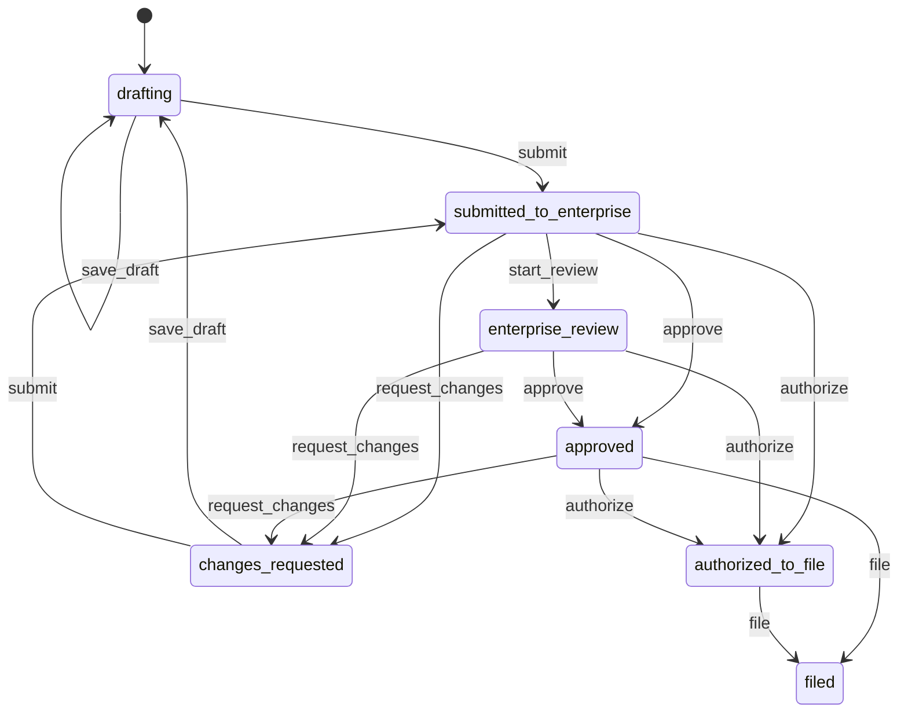

# 数据模型（完整稿 · 样机级）

> 类型 / 常量以现仓**真实导出名**为准。根 `src/types`、`src/domain/*` 是 **完整 re-export**，新代码认 `@ip/contracts` + `@ip/domain`。  
> **现状样机** = 内存对象；**目标设计** = 可持久化聚合 / 读模型（未实现）。  
> 读/写路径细节见 [data-flow.md](./data-flow.md)；服务拆分见 [backends.md](./backends.md)。

## 1. 诚实边界

### 现状样机

- 无数据库。seed 在 `src/data/cases.ts` 等；api-mock 另有瘦 `MockCase`（`apps/api-mock/src/data/cases.ts`），**不是**同一份 `PatentCase`。
- 契约层（`@ip/contracts`）不放 React、不放 handler。可执行规则在 `@ip/domain`。状态在 `@ip/app-state`。展示件在 `@ip/ui`。
- `CommandName` 含 `docketEscalate` / `docketComplete`；`DomainCommand` 联合**尚未**收这两支（api-mock `KNOWN_COMMANDS` 白名单单独认）。

### 目标设计

- 一案一聚合根；mock DTO 与领域对象用显式 mapper，禁止再「瘦字段叠加」。
- `DomainCommand` 与 `CommandName` 对齐，去掉第三份白名单。

---

## 2. 包归属总表

| 概念 | 键 / schema（`@ip/contracts`） | 富类型 + 可执行逻辑（`@ip/domain`） | 运行时（`@ip/app-state`） | 展示（`@ip/ui`） / 根 |
|------|-------------------------------|-------------------------------------|---------------------------|----------------------|
| Case | `StageId` 等 keys；`CaseContextSnapshot` | `PatentCase`（`types/index.ts`）、`buildCaseContext` | `cases` / `visibleCases` / `reloadFromApiMock` | `StageBadge` / `RiskBadge` |
| Handoff | `HandoffStatus` / `HandoffArtifactKey` / `HandoffAction`；`HANDOFF_*` labels | `HandoffState`；`canPerformHandoff`；`REQUIRED_BEFORE_SUBMIT`；`TRANSITIONS`（模块内） | `transitionHandoff`（AppContext 内） | `HandoffChip` / `handoffChipClass` |
| Command | `CommandName` / `DomainCommand` / `CommandMeta` / `CommandResult` / `COMMAND_LABELS` / `TOOL_TO_COMMAND` | re-export，不双份命令名 | `dispatchCommand` / `dispatchCommandLocal` | — |
| Persona | `PersonaId` | `PersonaDef` / `PERSONAS` / `personaBlocks*` | cookie 读写 + `persona` state | 壳内 `PersonaSwitcher`（仍在根 `src/components`，未进 `@ip/ui`） |
| Audit | `AuditEntry` / `AUDIT_SCHEMA_VERSION` | re-export + `auditSchemaVersionLabel` | `pushAudit` / `auditLog` | CaseDetail → `AuditReplayPanel`（根组件） |
| CaseContext | `CaseContextSnapshot` / `CASE_CONTEXT_SCHEMA_VERSION` | `buildCaseContext` / `buildCaseContextFromSession` | 调用方同读快照 | — |
| 跨口键 | `crossPortKeys.ts` | — | `crossPortStore.ts` | — |
| 事件名 | `DOMAIN_EVENTS` / `DomainEventName` | — | **无 bus** | — |
| Guardrail | `GuardrailEvalResult` / `GuardrailBlocker` / `mergeBlockers` | `evaluateGuardrails`（唯一执法入口） | 调用方：HITL ConfirmBar / Flow | — |
| API 瘦 DTO | — | — | 消费端 | `@ip/api`：`CaseSummary` / `InboxItem` / `HealthResponse`（`packages/api/src/types.ts`） |

根兼容：`@shared/*` → `./src/*`，见 [PACKAGES_SPLIT.md](../../PACKAGES_SPLIT.md)。  
`@ip/api` / api-mock 未列入 PACKAGES_SPLIT 包一览（已知裂缝，见 [README · 已知文档裂缝](./README.md#已知文档裂缝只记不修代码)）。

---

## 3. Case

### 权威路径

| 形态 | 包 / 路径 | 说明 |
|------|-----------|------|
| 领域对象 `PatentCase` | `@ip/domain` `packages/domain/src/types/index.ts` | 壳内真相 |
| 阶段键 `StageId` | `@ip/contracts` `keys.ts` | 契约唯一源 |
| 阶段元数据 | `@ip/domain` `stages.ts`（`StageMeta` / `STAGES` / `getStageMeta`） | `runners` 是静态目录，**不是**案级进度 |
| 读侧瘦投影 `CaseSummary` | `@ip/api` `packages/api/src/types.ts` | 客户端 DTO |
| mock 种子 `MockCase` | `apps/api-mock/src/data/cases.ts` | 与 `CaseSummary` 字段对齐；**≠** `PatentCase` |
| seed | 根 `src/data/cases.ts` | 内存初始案 |

### 现状样机 · `PatentCase` 关键字段

| 字段 | 类型要点 | 备注 |
|------|----------|------|
| `id` / `caseNo` / `title` | string | 主键与展示 |
| `type` | `PatentType` | |
| `stage` | `StageId` | merge 时仅合法 stage 覆盖 |
| `risk` | `RiskLevel`（如 低/中/高） | merge 时仅合法 risk 覆盖 |
| `nextDeadline` / `summary` / `progress` | | summary 可被 handoffNote 追加 |
| `ownerTeam` / `inventor` / `agencyName` / `enterpriseContact` | | |
| `checklist` / `artifacts` / `timeline` | 数组 | seed 富字段；mock **不**下发 |
| `handoffs` | `Partial<Record<HandoffArtifactKey, HandoffState>>` | 办理核心 |
| `engagement` | `Engagement`（含 invoices） | 费用 |
| `fulfillmentMode` | `delegated` \| `self_serve` | 自助时企业可代跑 agency 动作 |
| `ownerEnterpriseId` / `assignedAgencyId?` | | 演示级租户隔离（`visibleCases` / `canAccessCase`） |
| `linkedAlertId?` / `legalReview?` / `oaStatementConfirmed?` | | monetize / OA |
| `quoteDispatchStatus?` / `fromInsight?` | | 立项 / 洞察建案标记 |

**`StageId`**：`pre_research` | `decision` | `drafting` | `prosecution` | `maintenance` | `commercialization` | `monitoring`。

**案级 Flow 进度**：`CaseFlowNodeProgress` + `FlowKey`，存在 `AppContext.flowProgressByCase`（工作台写、中台只读）。与 `StageMeta.runners` 静态目录分离。

**merge 会覆盖的瘦字段**（来自 `CaseSummary` / api-mock）：`title` / `caseNo` / `nextDeadline` / `summary` / 合法 `stage` / 合法 `risk`；可选 `handoffNote` 追加进 summary。  
**不会**被 merge 替换：handoffs、checklist、artifacts、timeline、engagement、租户 id 等富字段。

### 目标设计

- `PatentCase` 拆读模型（列表/Inbox）与办理聚合（handoffs + engagement + docket）。
- 租户隔离下沉到服务端策略。

---

## 4. Handoff

### 权威路径

| 项 | 路径 |
|----|------|
| 键 / 状态 / 动作类型 | `@ip/contracts` `keys.ts` |
| 中文标签 / `ARTIFACT_FOR_STAGE` | `@ip/contracts` `handoff.ts`（domain re-export） |
| `HandoffState` | `@ip/domain` `types/index.ts` |
| `canPerformHandoff` / `REQUIRED_BEFORE_SUBMIT` / `TRANSITIONS` | `@ip/domain` `handoff.ts` |
| 命令映射 | `@ip/contracts` `commands.ts`：`commandForHandoffAction` / `handoffActionForCommand` / `defaultHandoffKeyForCommand` |

### 现状样机

**工件键 `HandoffArtifactKey`**：`research_report` | `intake_quote` | `disclosure_pack` | `layout_insight` | `draft_claims` | `prosecution_response` | `maintain_annuity` | `monetize_terms` | `watch_alert`。

**状态 `HandoffStatus`**：`drafting` → `submitted_to_enterprise` → `enterprise_review` → `changes_requested` | `approved` → `authorized_to_file` → `filed`。

**动作 `HandoffAction`**：`save_draft` / `submit` / `start_review` / `request_changes` / `approve` / `authorize` / `file`。

**状态对象 `HandoffState`**：`status` / `updatedAt` / `updatedBy: UserRole` / `note?` / `versions?` / `receiptNo?` / `filedAt?`。

**执法**：`canPerformHandoff(status, action, role, mode, opts?)` — 角色 + `FulfillmentMode` + Persona + 委员票硬闸 + monetize 法务已阅。  
**禁止**各 stage 再定义一份 `HANDOFF_*` 标签。

#### TRANSITIONS（from → to · 默认 role）

| Action | from | to | role |
|--------|------|-----|------|
| `save_draft` | drafting, changes_requested | drafting | agency |
| `submit` | drafting, changes_requested | submitted_to_enterprise | agency |
| `start_review` | submitted_to_enterprise | enterprise_review | enterprise |
| `request_changes` | submitted_to_enterprise, enterprise_review, approved | changes_requested | enterprise |
| `approve` | submitted_to_enterprise, enterprise_review | approved | enterprise |
| `authorize` | approved, enterprise_review, submitted_to_enterprise | authorized_to_file | enterprise |
| `file` | authorized_to_file, approved | filed | agency |

**`self_serve` 特例**：企业角色执行 `AGENCY_ACTIONS`（`save_draft` / `submit` / `file`）时 `effectiveRole` 视为 agency；委托模式下企业不可直接跑代理专属动作。



### 目标设计

- 交接作为独立聚合（或 Case 内实体），带版本与回执；状态迁移只发生在命令处理后。

---

## 5. Command

### 权威路径

| 项 | 路径 |
|----|------|
| `CommandName` / `COMMAND_LABELS` | `@ip/contracts` `commandNames.ts` |
| `DomainCommand` / `CommandMeta` / `CommandResult` / `TOOL_TO_COMMAND` | `@ip/contracts` `commands.ts` |
| 运行时 | `@ip/app-state` `AppContext.dispatchCommand` / `dispatchCommandLocal` |
| api-mock 白名单 | `apps/api-mock/src/store.ts` `KNOWN_COMMANDS` |

### 现状样机 · `DomainCommand` 联合成员

`submitResearch` · `approveHandoff` · `requestChanges` · `advanceStage` · `submitClaims` · `analyzeAndSubmitOA` · `authorizeFile` · `fileResponse` · `confirmQuote` · `assignAgency` · `issueInvoice` · `payInvoice` · `createCaseFromInsight` · `saveDraft` · `submitHandoff` · `startReview`。

**裂缝**：`CommandName` 另多 `docketEscalate` | `docketComplete`（docket 写路径走 AppContext 专用函数 + `pushAudit`，未进联合）。api-mock 白名单单独认。

**结果**：`CommandResult { ok, message, caseId?, command? }`。

**Agent 工具映射**：`TOOL_TO_COMMAND`（多数 tool 为 `null` = 不写库；如 `submit_for_review` → `submitResearch`）。详见 [COMMANDS.md](../../COMMANDS.md)。

### 目标设计

- 命令即 API 合同；handler 迁出浏览器。docket* 收进 `DomainCommand` 或另立 Docket 命令集。

---

## 6. Persona

### 权威路径

| 项 | 路径 |
|----|------|
| `PersonaId` | `@ip/contracts` `keys.ts` |
| `PersonaDef` / `PERSONAS` / `personaBlocks*` | `@ip/domain` `persona.ts` |
| URL 路由隔离 | 根 `src/data/persona`（domain README：刻意未迁） |
| cookie | `@ip/contracts` `crossPortKeys.ts` + iam 壳 / AppContext |

### 现状样机

四值：`enterprise_ip` | `agency` | `inventor` | `committee`。  
`PersonaDef`：`label` / `role: UserRole`（`enterprise` | `agency`）/ `workspaceKind`。

能力切片：`personaCanGo` / `personaCanVote` / `personaVoteIsAuditable` / `personaCanAccessWorkbench` / `personaPrefersPortal` / `personaInboxMode` / `personaCanAccessAgent`。

硬闸摘要见 [data-flow §6](./data-flow.md#6-persona-硬闸与审计写入点)。**演示可执法，非真 SSO**。

### 目标设计

- Persona / 工作区来自 iam；硬闸仍用同一组纯函数，数据源换成会话声明。

---

## 7. Audit

### 权威路径

| 项 | 路径 |
|----|------|
| `AuditEntry` / `AUDIT_SCHEMA_VERSION` | `@ip/contracts` `audit.ts` |
| 写入 | `@ip/app-state` `AppContext.pushAudit` |
| 回放 UI | 根 `src/components/AuditReplayPanel.tsx` |
| mock 侧 | `apps/api-mock/src/store.ts` 进程内 `auditLog`（无 GET） |

### 现状样机

```ts
// 形状（contracts）
AuditEntry {
  id, actor: 'user' | 'agent', agentId?, command: CommandName,
  caseId, at, detail, schemaVersion?
}
```

- 常量：`AUDIT_SCHEMA_VERSION = '2026.09.1'`。
- `pushAudit` 写入时强制带 `schemaVersion`；缺字段 UI/导出显示 `legacy`（`auditSchemaVersionLabel` / `isLegacyAudit`）。
- **两份内存日志**：壳内 `AppContext.auditLog`（回放 / 证据包）与 api-mock `store.auditLog` **不同步**。
- **不是**事件溯源 / 分布式 tracing。

### 目标设计

- 单一追加写日志；回放与 ops 审计示意同源。形状变更必须 bump `AUDIT_SCHEMA_VERSION`。

---

## 8. CaseContext 快照（读侧契约）

### 权威路径

| 项 | 路径 |
|----|------|
| `CaseContextSnapshot` / `CASE_CONTEXT_SCHEMA_VERSION` | `@ip/contracts` `caseContext.ts` |
| 构建纯函数 | `@ip/domain` `caseContextContract.ts` |
| Agent 目录注入 | 根 `src/data/agents.ts` `AGENT_CATALOG`（**未进 domain 包**） |

### 现状样机

- 常量：`CASE_CONTEXT_SCHEMA_VERSION = '2026.09.1'`。
- 快照含：`schemaVersion` / 案头 / `artifacts[]` / `checklist` / `gates` / `personaVisibility` / `agentHints` / `sessionBind?` / `builtAt`。
- Agent / 中台 / 工作台 **同读**；与 Command **同读不同写**。
- 字段 / 语义变更必须 bump 版本。细则链 [HARNESS.md](../../HARNESS.md)、[COMMANDS.md](../../COMMANDS.md)。

### 目标设计

- 作为跨面读模型的版本化 DTO；消费者按 `schemaVersion` 分支。

---

## 9. Guardrail / personaBlocks 摘要

### 权威路径

- 类型：`@ip/contracts` `guardrails.ts`（`GuardrailAction` / `GuardrailBlocker` / `GuardrailEvalResult` / `mergeBlockers`）
- 执法：`@ip/domain` `guardrails.ts` → **`evaluateGuardrails`【唯一入口】**
- Persona：`@ip/domain` `persona.ts` → `personaBlocksHandoffAction` / `personaBlocksHitlGate` / `personaBlocksPay`

### 主要 blocker `code`（`evaluateGuardrails`）

| code | 典型场景 |
|------|----------|
| `persona` | Persona 硬禁 HITL / 交接 / 付款 |
| `enterprise` | 非企业不可批准 / 授权 / 付款解锁 |
| `invoice` | 代理侧授权遇发票阻塞 |
| `disclosure_pack` | 交底包齐套未过 |
| `disclosure_approved` | 交底未批准（claims / Go） |
| `filing_check` | 递交检查清单未齐套 |
| `oa_meta` | OA 争点类型 / 策略要点缺失 |
| `oa_statement` | OA 陈述未确认 |
| `legal_review` | monetize 法务未已阅 |
| `hits_verifiable` | 调研命中不可核验 |
| `pay_unlock` | 无案 / 无票 / 已归档 |
| `full_check` | Full-check 剩余缺口 |

Agent 目录 `AgentDef.guardrails[]` 仅为展示文案；可执行硬闸以本模块为准，勿在 UI 复制。详见 [HARNESS.md](../../HARNESS.md)「Skills guardrails」。

---

## 10. schema 版本常量

| 常量 | 值 | 文件 |
|------|-----|------|
| `CASE_CONTEXT_SCHEMA_VERSION` | `'2026.09.1'` | `packages/contracts/src/caseContext.ts` |
| `AUDIT_SCHEMA_VERSION` | `'2026.09.1'` | `packages/contracts/src/audit.ts` |

纪律：形状 / 语义变更必须 bump；缺版本按 `legacy` 展示。根文档若仍写 `src/domain/commands.ts` 为 AUDIT 源，以 contracts 为准（裂缝见 [README](./README.md#已知文档裂缝只记不修代码)）。

---

## 11. 卫星对象（摘要）

均在 `@ip/domain` types，seed 多在根 `src/data/*`：

| 对象 | 用途 | 备注 |
|------|------|------|
| `DocketEvent` / `DocketEscalationLevel` | 期限 | `fileResponse` 可业务回写；docket* 命令未进 `DomainCommand` |
| `CaseInvoice` / `Engagement` / `PaymentStatus` | 费用 | `issueInvoice` / `payInvoice` |
| `AgentDef` / `AgentSession` / `AgentRun` | 插件目录 + 会话 | 无真 LLM；`clearedHitlGates` 内存 |
| `WorkbenchTodo` | 待办 | seed / handoff / docket 驱动 |
| `InventionDisclosure` | 发明人门户 | |
| Insight 族 | 赛道/布局等 | 带 `labeledMock: true`；禁止当领域核心 |

是否独立服务：见 [backends.md](./backends.md)。

---

## 12. 已知模型裂缝（只记）

| 裂缝 | 说明 |
|------|------|
| `CommandName` ⊃ `DomainCommand` | docketEscalate / docketComplete 未进联合 |
| MockCase ≠ PatentCase | 瘦字段；读路径跳过仅 API 有的 id |
| `createCaseFromInsight` → `c-mock-*` | mock 新建案进不了壳内 `PatentCase[]` |
| 双份 auditLog | 壳 vs api-mock 不同步 |
| AGENT_CATALOG 未进 domain | CaseContext extras 仍依赖根 seed |
