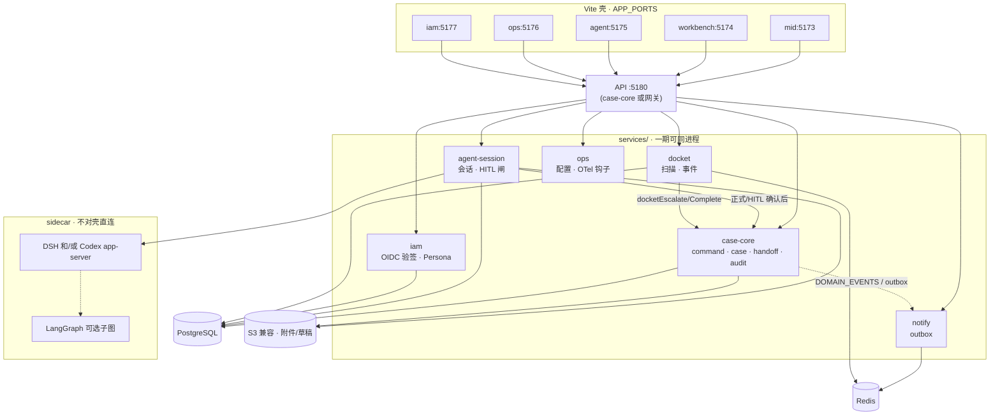
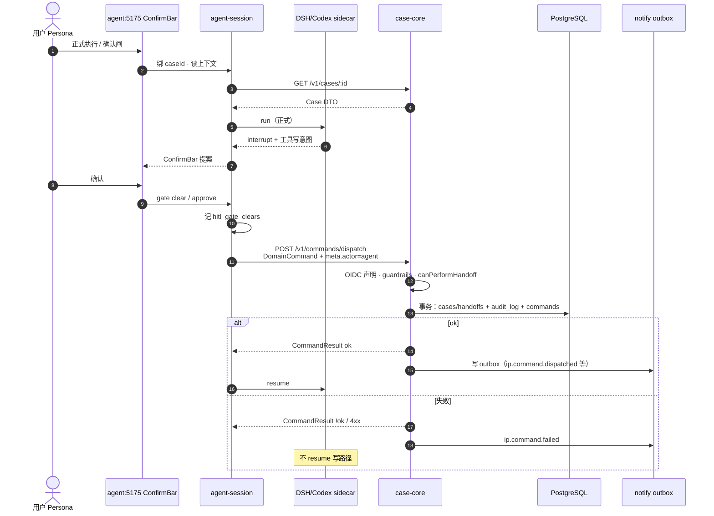

# 架构逻辑图（dev-spec）

> **样机诚实**：今日写在浏览器 `dispatchCommandLocal` ± POST api-mock；Agent = UI + mock tools + ConfirmBar，**无** DSH/Codex、**无**真模型网关。  
> **落地目标**：壳 → 网关/API → 服务模块；**C 混合** Agent = DSH 和/或 Codex sidecar + 自有 ConfirmBar↔approval + 只经 `DomainCommand` 写案。LangGraph **仅**可选领域子图。

对齐 [../enterprise/README.md](../enterprise/README.md) · [../enterprise/agent-topology.md](../enterprise/agent-topology.md)；本篇给开发开 PR 用的压缩逻辑图，不重复企业级 HA/私有化全文。

## 1. 上下文：壳 → 网关 → 服务

要点：

- 五壳只认冻 URL（见 [api-contracts.md](./api-contracts.md)）；不散打 sidecar。
- `workbench-command` 一期并入 `case-core`（图中未单列）。
- Agent **无**到 PG 的边；只有 `agent-session` → `case-core` 的 dispatch。

## 2. C 混合 Agent（落地）

| 层 | 谁做 | 说明 |
|----|------|------|
| ① runtime | **DSH 和/或 Codex app-server** | 工具环、流式、审批暂停；spike 择一或双适配 |
| ② 子图（可选） | LangGraph 等 | **降档**；仅领域子流程，非默认 runtime |
| ③ 业务闸 | 自有 `agent-session` + ConfirmBar | Persona / HITL gate id / `TOOL_TO_COMMAND` |
| ④ 写案 | **仅** `DomainCommand` → case-core | `meta.actor: 'agent'`；禁直写库 |

ConfirmBar ↔ runtime approval：

| UI / 契约 | Runtime 侧 | 落库 |
|-----------|------------|------|
| HITL ConfirmBar 展示提案 | DSH/Codex interrupt / approval 暂停 | 否 |
| 用户确认 | resume **之前**先 `POST /v1/commands/dispatch` | 是（command ok） |
| 用户退回 | 取消/标注；不 dispatch | 否 |
| 试运行 | transcript only | 不 dispatch |

闸 id 与样机 `HitlGateId` / `clearedHitlGates` **不改名**（见 HARNESS / contracts keys）。

## 3. 序列：HITL → DomainCommand → 落库

对照样机（勿当成上图已实现）：ConfirmBar → `dispatchCommandLocal` ± POST api-mock；无 sidecar、无 PG 事务、无 outbox。

## 4. 同步 vs 异步（架构层）

| 路径 | 同步 | 异步 |
|------|------|------|
| 办理 / HITL 确认后的 dispatch | **必须**等 `CommandResult` | 审计事件投影、outbox 投递 |
| Docket 到期扫描 | — | Redis/DB job → 可选自动 `docketEscalate` 或只产提醒 |
| 跨壳读案 | GET cases/inbox | 可后续 SSE；MVP 轮询/刷新即可 |
| 模型 token 流 | 对流式 UI | checkpoint 落盘可异步 |

细节流见 [data-flow.md](./data-flow.md)。

## 5. 明确不做（开发期）

- 把 LangGraph 写成默认 ① runtime。
- Agent/工具进程持有办案 PG 凭据。
- 壳内继续长期双写（HTTP 成功后又把 local 当真相）。
- Day-1 服务网格 / 多语言重写 `@ip/domain`。

## 6. 相关链接

- [app-topology.md](./app-topology.md) · [api-contracts.md](./api-contracts.md) · [adr-decisions.md](./adr-decisions.md)
- [../enterprise/agent-platform.md](../enterprise/agent-platform.md) · [../enterprise/agent-runtime-options.md](../enterprise/agent-runtime-options.md)
- [../../HARNESS.md](../../HARNESS.md) · [../../COMMANDS.md](../../COMMANDS.md)
