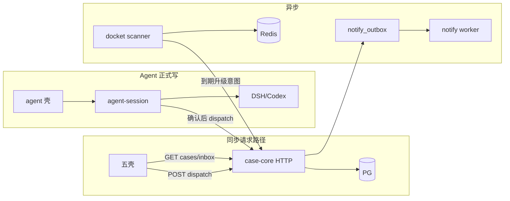
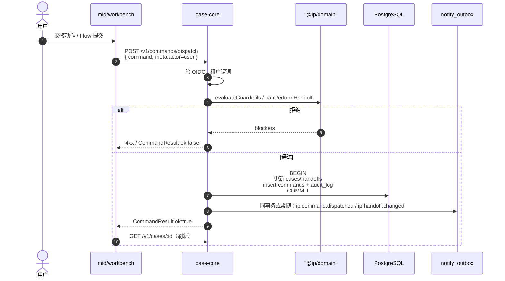
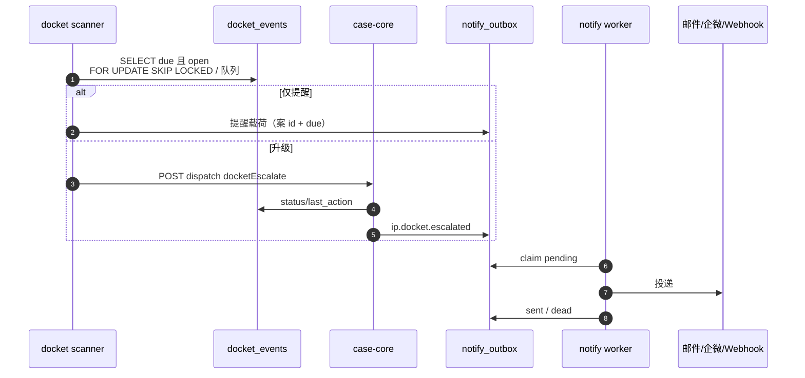

# 落地数据流（dev-spec）

> **样机诚实**：今日多壳靠 `@ip/api` → api-mock + fallback 内存；跨口大块态靠 cookie / mid bridge；**无 bus**（`DOMAIN_EVENTS` 仅常量）；执法在浏览器。细节见 [../data-flow.md](../data-flow.md)——本篇**不重复**样机 merge/跳过/双 audit 长文。  
> **落地目标**：办理命令、Agent HITL→DomainCommand、Docket 升级→notify、跨壳读的**落地版**同步/异步边界。

## 1. 总图（落地）

---

## 2. 办理命令（workbench / mid）

| | |
|--|--|
| **同步** | dispatch 全程；UI 必须以 `CommandResult` 为准再刷新 |
| **异步** | outbox → notify；读模型投影若拆库 |
| **去双写** | 成功路径**禁止**再跑 `dispatchCommandLocal` 当真相；最多只读缓存失效 |

---

## 3. Agent HITL → DomainCommand

见 [architecture.md](./architecture.md) §3 全序列。落地要点：

| 步骤 | 同步/异步 | 数据 |
|------|-----------|------|
| 读 CaseContext / GET case | 同步 | 只读 |
| runtime 工具环（只读/草稿） | 同步对流；checkpoint 可异步 | 会话表 / S3 草稿；**不**写 handoffs |
| ConfirmBar 确认 | 同步 | `hitl_gate_clears` |
| `POST .../dispatch` `actor:agent` | **同步** | 与办理共用 case-core |
| resume sidecar | 仅 command ok 后 | |
| `ip.command.failed` | 异步 outbox | notify |

试运行：整条不写 `commands` / `handoffs`（可写会话 transcript）。

`TOOL_TO_COMMAND`（`@ip/contracts`）仍是工具名→命令名唯一表；null = 无写意图。

---

## 4. Docket 升级 → notify

| | |
|--|--|
| **同步** | 用户手动 `docketEscalate` / `docketComplete`（与办理相同 HTTP） |
| **异步** | 到期扫描；notify 投递与重试 |
| **边界** | docket **不**直接改 handoff 状态机绕过 command；notify **不**持完整 `PatentCase` |

---

## 5. 跨壳读

| 场景 | 落地 | 不再依赖 |
|------|------|----------|
| 列表 / 详情 / Inbox | `GET /v1/cases` · `/:id` · `/v1/inbox?persona=` | seed merge「仅 API 有则跳过」 |
| Persona 可见性 | IAM 声明 + 服务端 `tenant_id` 谓词 | 仅 cookie 过滤 |
| 跨口深链 | 可保留 `APP_DEV_URLS` | 大块态 cookie / bridge 逐步废弃 |
| 审计回放 | 扩展 `GET /v1/audit?caseId=`（建议） | 壳内存 `auditLog` |

MVP 跨壳一致 = **共读同一 PG 投影**，不是 shared Worker 或 iframe bridge。

---

## 6. 事件（字符串冻、实现渐进）

| `DOMAIN_EVENTS` | 谁写 outbox | 谁消费（MVP） |
|-----------------|-------------|---------------|
| `ip.command.dispatched` | case-core | 投影 / ops 计数 |
| `ip.command.failed` | case-core | notify |
| `ip.handoff.changed` | case-core | mid Inbox 失效 / notify |
| `ip.audit.appended` | case-core | 可选审计索引进 |
| `ip.docket.escalated` | case-core（经命令） | notify |
| `ip.persona.changed` | iam | 壳刷新声明 |
| 其余 | 按需 | 无消费者则只冻名 |

**无**强制 Kafka；MVP = PG outbox + Redis 队列即可。

---

## 7. 相关链接

- [architecture.md](./architecture.md) · [data-model.md](./data-model.md) · [api-contracts.md](./api-contracts.md)
- [../data-flow.md](../data-flow.md)（样机完整稿）
- [../landing/reminders-notify.md](../landing/reminders-notify.md)
