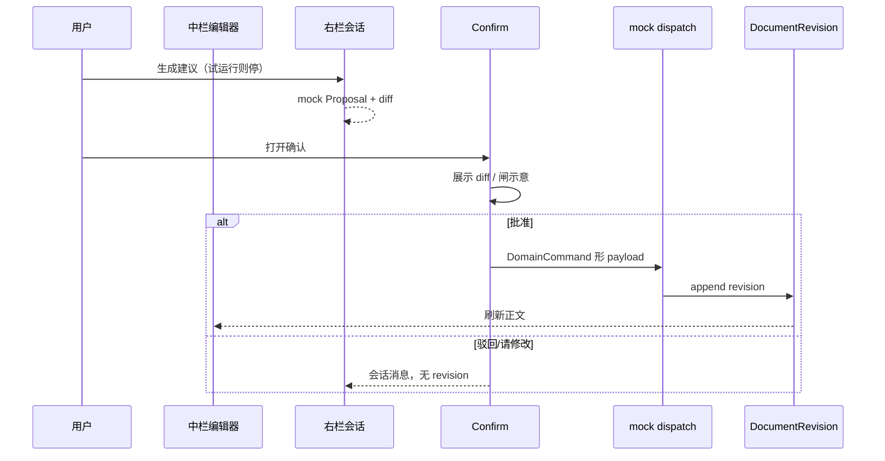

# Harness loop：建议 → Confirm → mock 命令

> **样机诚实**：无真 LLM、无 DSH/Codex 进程；建议来自脚本/模板。  
> **落地目标**：同一 UI 契约接到 C 混合 ① runtime；批准后只经 DomainCommand 写真相。

## 1. 循环



## 2. Proposal（样机）

```ts
interface DocProposal {
  id: string
  documentId: string
  chapterId: string
  baseRevisionId: string
  proposedBody: string
  /** 展示用 diff 摘要 */
  summary: string
  /** 示意闸，如 approve_strategy */
  hitlGateId?: string
  status: 'pending' | 'accepted' | 'rejected'
}
```

- **试运行**：`status` 不进入 pending 确认，或确认禁用写入。  
- **正式**：pending → Confirm。

## 3. Confirm 与闸示意

- UI 可复用 agent ConfirmBar 心智（本壳自建即可，**不改** `apps/agent`）。  
- 展示：`HitlGateId` 文案（如批准策略）+ Persona 只读提示（mock）。  
- **框架 Approve ≠ 领域已写入**：只有 mock dispatch 成功后才改 head revision。

## 4. mock dispatch 形状

对齐现仓习惯：

```ts
{
  command: { type: 'submitClaims', caseId, note?: string },
  meta: { actor: 'agent', agentId: 'doc-harness-mock', detail: 'claims chapter revision' }
}
```

- 成功：写入 `DocumentRevision`，更新 Document.head；可选本地 audit 数组（非 api-mock 同步）。  
- 失败：Toast；正文不变。

## 5. 与落地 C 混合

| 样机 | 落地 |
|------|------|
| 脚本生成 proposedBody | DSH/Codex 工具环产出 |
| Confirm UI | 同 UI；runtime approval 暂停钩对齐（见 enterprise agent-runtime-options） |
| mock dispatch | `POST /v1/commands/dispatch` → case-core；再投影文档服务 |

## 6. 明确不做（本样机）

- 真模型调用、真 MCP、真沙箱。  
- 改 workbench / APP_PORTS / 五壳业务。  
- 假装已接 case-core 执法。
