# 专利 Domain Pack · 设计规格（正式稿）

> **变更摘要（2026-09-21 · 内/外循环升级）**：自 [patent-domain-pack-design-v2-loops](../incoming/patent-domain-pack-design-v2-loops.md) **精修迁入**内循环 / 外循环定义、Loop 总索引、F5 四环边、F6 N 通外循环与流程定义图；保留 Catalog ids · HITL×8↔壳闸 · FTO≠维权 · 业务模式指针。  
> **正式稿**（本文）。实现蓝图：[patent-pack-impl.md](./patent-pack-impl.md)。环边样机三刀：[agent-pack-loops-roadmap](../product-apps/agent-pack-loops-roadmap.md)。  
> **产品面**：业务冷启动 = [agent-business-mode](../product-apps/agent-business-mode.md)（我的案子；**不推翻**）；专家/双文件 = [agent-patent-shell](../product-apps/agent-patent-shell.md)；中台映射 = [agent-l3-patent](../product-apps/agent-l3-patent.md)。  
> 平台背景：[../agent-platform.md](../agent-platform.md)。  
> **样机诚实**：当前 Catalog / 主链演练为 Pack **子集/过渡**；F7–F9 可 Phase，矩阵**必须列全**。  
> **禁**：端用户路径以可点 mid 深链当验收；业务面不暴露 Pack 黑话（环边用人话：退回修改 / 再查一轮）。

---

## 目录

| 章 | 内容 |
|----|------|
| §0 | 五层方法论 + **内/外循环定义（钉死）** |
| §1 | 生命周期：直线图 / 环视图 / F5·F6 展开图 |
| §2 | 编排执行状态机 |
| §3 | Handoff 信封 |
| §4 | 16 席 × Catalog · 节点摘要 · 代表性内循环 |
| §5 | 跨 bot 时序 · **Loop 总索引** · F5/F6 流程定义 |
| §6 | 与业务壳 / Catalog / 合规关系 |

完整 16 节点内循环 Mermaid：**见 incoming v2 §4**；本文保留关键环边与代表样例。

---

## 0. 方法论：五层 + 内/外循环（钉死）

### 0.1 业务逻辑五层

| 层 | 内容 | 形态 |
|----|------|------|
| **规则层** | 公式 / 校验器 / 分类器 / 期限表 | **代码（裁判）** |
| **流程层** | 内循环 SOP / 分支 / 退出条件 / **环边** | 编排脚本 / 状态机 |
| **行为层** | 人设 / 边界 / 追问策略 | system prompt（选手） |
| **产物层** | 模板 + Schema + validator | 契约文件 |
| **数据层** | 法条库 / TRIZ / 模板 / 判例 | KB/RAG；断网 bot 打进镜像 |

**铁律**：代码做裁判，LLM 做选手；能写成 if/公式/校验器的绝不写进 prompt。

### 0.2 内循环 vs 外循环（钉死）

| 类型 | 定义 | 发生处 | 典型形态 | 退出 / escalate |
|------|------|--------|----------|-----------------|
| **内循环** | **同一 bot 回合内**的追问 / 自修复 / validator 重试 | 单 bot · BotRuntime | 交底追问≤5；覆盖度自修复≤3；四类校验≤3 | 过检 → deliver；超限 → escalate 兜底台 |
| **外循环 / 跨 bot 环** | **跨步骤、跨 bot、跨 Run** 的回路 | FlowEngine · Handoff · HITL | HITL 驳回带批注；下游 feedback 退回；OA **N 通**；F9→F3 飞轮；查新不乐观回流 F2/F3 | 人工批准 / 法定结束 / 全局 iterations 熔断 |

**不要混淆**：

- 内循环 = 同沙箱、同 bot turn budget、validator retry（attempts++）。  
- 外循环 = 新 Handoff（`type: feedback`）/ 新 Run / HITL reject 回上游 / N-pass 计数 / F9→F3 信封。  
- 业务壳上屏**不说**「内循环/外循环」——映射为人话进度与「退回修改 / 再查一轮 / 下一通审查意见」；环边过程在 **专家台 / 过程面板**可见。见 [agent-business-mode](../product-apps/agent-business-mode.md) · [agent-pack-loops-roadmap](../product-apps/agent-pack-loops-roadmap.md)。

---

## 1. 生命周期全景（F1–F9）

### 1.1 直线图（阶段骨架 · 管理者）

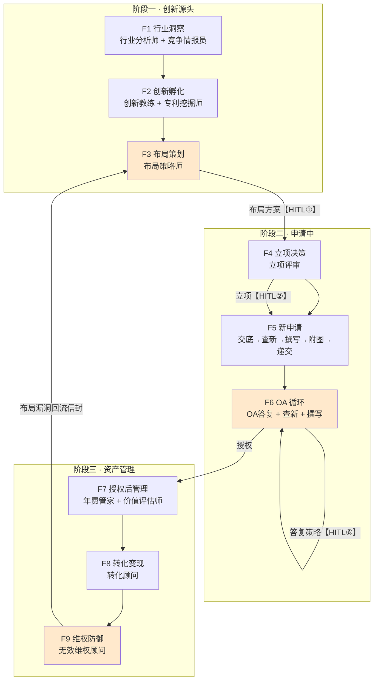

**HITL×8（收费节点）**：①布局拍板 ②立项 ③交底确认 ④查新结论 ⑤权项确认 ⑥OA 答复策略 ⑦年费缴纳 ⑧交易签约。

### 1.2 环视图（跨流程回路）

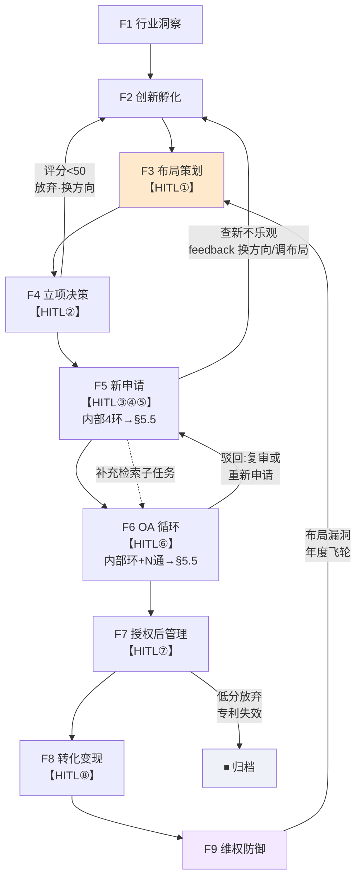

分工：**直线图讲骨架，环视图讲回路**；F5/F6 内部 bot 级环边见 §1.3 / §5.5。

### 1.3 展开图（F5/F6 bot 级 · 工程评审）

> **权威枚举 = §5.5**：下文 F5/F6 环边名单与 §5.5 流程定义图对齐；若冲突以 §5.5 为准。


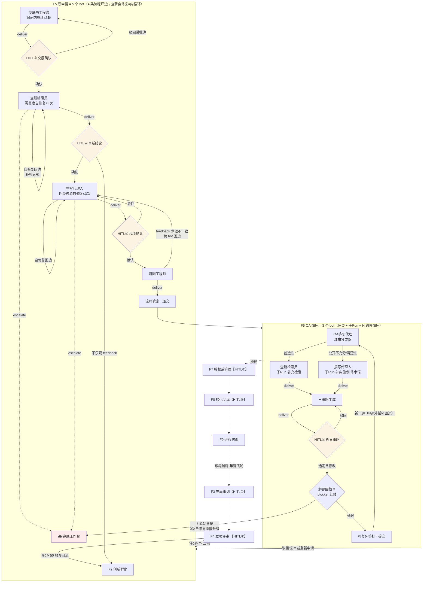

**F5 四条环边（以 §5.5 为准）**：HITL③驳回→交底；HITL⑤驳回→撰写；**附图→撰写 feedback**（跨 bot）；**escalate→兜底**。  
**另**：查新覆盖度自修复 = **节点内边（内循环）**，计入 BotRuntime，**不**列入上列四环边。  
**F6 环边 + N 通**：HITL⑥驳回→策略；超范围 blocker（0 次自修复）；**提交→理由分类（N 通外循环）**；创造性/清楚性子 Run 汇入。

---

## 2. 编排执行状态机（flow 是带环图）

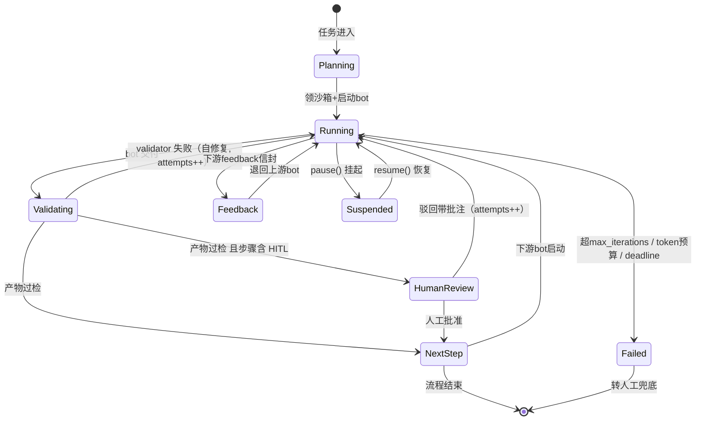

- **内循环**落在 `Running ↔ Validating`（自修复）。  
- **外循环**落在 `HumanReview → Running`（HITL 驳回）、`Feedback → Running`（跨 bot 退回）、以及流程定义图上的 N 通 / F9→F3 边。  
- 实现映射见 [patent-pack-impl §1.1](./patent-pack-impl.md)。

---

## 3. Handoff 信封

席间流转统一信封（落数据中台 = 审计链）：

```yaml
handoff:
  id: ho-20260920-0007
  flow: 新申请                  # F5 等
  step: 查新检索 → 撰写
  type: deliver | feedback      # 交付 or 退回（外循环边）
  from: 查新检索员
  to: 撰写代理人
  inputs: [检索报告v2.pdf, 特征映射表.xlsx]
  acceptance: 权利要求书草案v2
  feedback:                     # type=feedback 时必填
    reason: 特征F3缺乏最接近对比文件
    requested: 补充检索F3相关IPC小类
  audit: {timestamp, sandbox_id, validator_results}
```

与现仓 `HandoffArtifactKey` / DomainCommand：正式写库仍经 HITL → DomainCommand；信封是 Pack 运行时协议，**不**另起案库权威。中台键以 contracts 为准；提案键勿假装已写入 packages。

---

## 4. 16 席 × Catalog · 节点摘要 · 代表性内循环

### 4.1 矩阵（保留 Catalog ids · FTO≠维权）

| # | Pack Bot | Flow | egress | HITL | 现有 Catalog id（若有） | 备注 |
|---|----------|------|--------|------|-------------------------|------|
| 1 | 行业分析师 | F1 | 白名单 | — | `expert-landscape` | 提案键 `landscape_report` |
| 2 | 竞争情报员 | F1/F9 | 白名单 | — | `expert-competitor` | 提案键 `competitor_watch` |
| 3 | 创新教练 | F2 | **断网** | — | `expert-inspire` | 提案键 `inspire_brief` |
| 4 | 专利挖掘师 | F2 | 白名单 | — | `expert-mining` | 提案键 `mining_pack`；≠旧「立项」 |
| 5 | 布局策略师 | F3/F9 | **断网** | ① | `expert-layout` | 可对齐 `layout_insight` 心智 |
| 6 | 立项评审 | F4 | 白名单 | ② | `expert-intake` | **`intake_quote` + `go_nogo`** |
| 7 | 交底书工程师 | F5 | **断网** | ③ | `expert-disclosure` | **`disclosure_pack`** |
| 8 | 查新检索员 | F5/F6 | 白名单 | ④ | `expert-research` | **`research_report`** |
| 9 | 撰写代理人 | F5/F6 | **断网** | ⑤ | `expert-draft` | **`draft_claims`** |
| 10 | 附图工程师 | F5/F6 | **断网** | — | `expert-figure` | 辅席；无独立 handoff key |
| 11 | 流程管家 | F5–F7 | 白名单 | — | `expert-filing`（部分） | 期限台账 + 递交齐套；样机偏递交 |
| 12 | OA答复代理 | F6 | 白名单 | ⑥ | `expert-oa` | **`prosecution_response`**；仅已 file |
| 13 | 年费管家 | F7 | 白名单 | ⑦ | **缺口**（→ `maintain`） | Phase；STAGE `maintain_annuity` |
| 14 | 价值评估师 | F7 | 白名单 | — | **缺口** | Phase；联动年费建议 |
| 15 | 转化顾问 | F8 | 白名单 | ⑧ | **缺口**（→ `monetize`） | Phase；`monetize_terms` |
| 16 | 无效维权顾问 | F9 | 白名单 | — | **缺口** | Phase；飞轮→F3；≠ `expert-fto`；**≠** STAGE `watch`——仅职责相邻，**暂不借用** `watch_alert`；提案独立键如 `enforcement_brief`（**不写 packages**） |

另：壳内 `orchestrator`（总控/案子助手）为编排席，不计入上表 16 业务节点。  
`expert-fto`（FTO）为样机**辅席**；与 Pack「无效维权顾问」职责相邻但**不等同**，勿合并 id。

**断网组**（生成类）：创新教练 / 布局 / 交底 / 撰写 / 附图 — 法条库与模板打进镜像。  
**白名单组**（检索/数据类）：其余。

当前壳 Catalog 默认勾选主链 + 建议制图/FTO = **子集**；完整 16 席为目标态。

### 4.2 HITL×8 ↔ 现壳闸门

| # | Pack | 壳/contracts 对齐 |
|---|------|-------------------|
| ① | 布局拍板 | 样机少；目标 Confirm（layout） |
| ② | 立项 | **`go_nogo`** + `intake_quote` |
| ③ | 交底确认 | Confirm → `disclosure_pack` |
| ④ | 查新结论 | Confirm → `research_report` |
| ⑤ | 权项确认 | Confirm → `draft_claims` / `submitClaims` |
| ⑥ | OA 策略 | Confirm → `prosecution_response`；可叠 `approve_strategy` |
| ⑦ | 年费 | Phase · `maintain_annuity` |
| ⑧ | 交易签约 | Phase · `monetize_terms` |

### 4.3 节点业务逻辑摘要（五层落点）

#### 阶段一

| Bot | 规则层要点 | 关键产物 | 内循环要点 |
|-----|------------|----------|------------|
| 行业分析师 | 空白点评分 = 市场热度×(1−专利密度)×规避难度 | 全景图 / 趋势 / 空白点清单 | 评分&lt;阈值→换分类面 |
| 竞争情报员 | 预警 P0/P1/P2 | 预警 + 竞对雷达 | cron 触发；P0→通知维权 |
| 创新教练 | 方案四要素必填；自检撞车表 | 技术方案草案包 | 致命冲突→换原理再生成 |
| 专利挖掘师 | 挖掘七问；三段式 validator | 可专利点清单 | 三段式不过→回特征枚举 |
| 布局策略师 | 引用链无环+全覆盖；公开时点 | 布局方案【HITL①】 | validator 失败→改引用链；HITL 驳回→重回诊 |

#### 阶段二

| Bot | 规则层要点 | 关键产物 | 内循环要点 |
|-----|------------|----------|------------|
| 立项评审 | 三轴评分；≥75 / &lt;50 | 评分卡【HITL②】 | &lt;50→外循环回流 F2 |
| 交底书工程师 | 六段必填；效果须数据或机理 | 交底书【HITL③】 | **追问≤5 轮**（内）；HITL③驳回（外） |
| 查新检索员 | 覆盖度；新颖性/创造性风险 | 检索报告+映射表【HITL④】 | **覆盖度自修复≤3**（内）；不乐观→F2/F3（外） |
| 撰写代理人 | 引用链/支持性/单一性/清楚性 | 说明书+权项【HITL⑤】 | **四类校验≤3**（内）；HITL⑤驳回 / 附图 feedback（外） |
| 附图工程师 | 附图规范；图注 ⊆ 权项术语 | 附图集 | 术语不一致→**feedback→撰写**（外） |
| 流程管家 | 期限表=代码常量 | 台账/提醒/递交包 | 逾期升级人工 |
| OA答复代理 | 理由分类；**不得超范围** | 策略卡【HITL⑥】+答复包 | 子 Run 汇入；超范围 **0 次** escalate；**N 通外循环** |

#### 阶段三（可 Phase）

| Bot | 规则层要点 | 关键产物 | 环边 |
|-----|------------|----------|------|
| 年费管家 | 期限+滞纳金；联动价值 | 缴费/放弃【HITL⑦】 | — |
| 价值评估师 | 引用/同族/许可/产品映射 | 评分卡 | 低分→年费建议放弃 |
| 转化顾问 | 估值；合同条款 validator | 合同草案【HITL⑧】 | HITL 修改意见→重设计 |
| 无效维权顾问 | 全面覆盖比对；稳定性 | 比对表 + **F9→F3 回流信封** | **布局飞轮（外）** |

### 4.4 代表性内循环 Mermaid（F5 关键席）

完整 16 张节点图：**incoming v2 §4**。下文仅保留 F5 三条主内循环样例，便于 B 席轻扫。

**交底书工程师（追问内循环）**

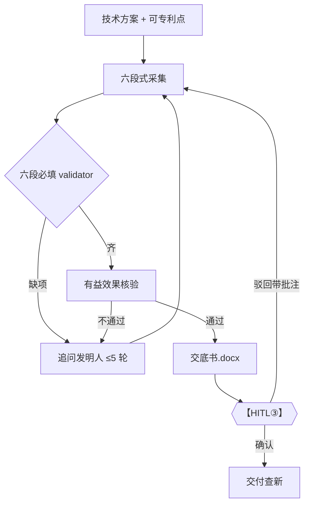

**查新检索员（覆盖度自修复）**

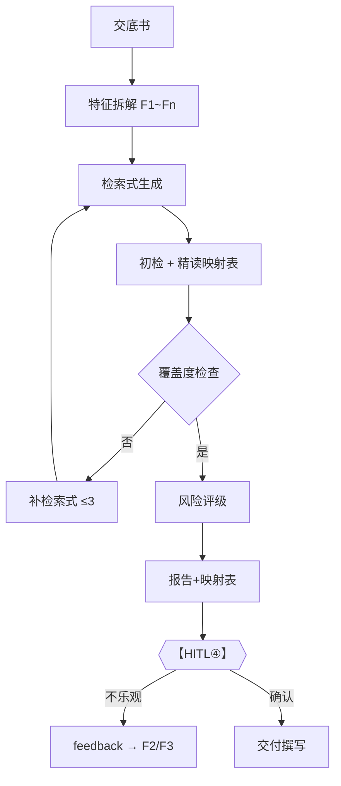

**撰写代理人（四类校验自修复）**

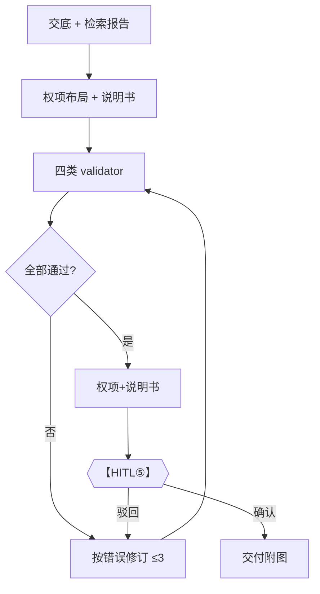

---

## 5. 跨 Bot 时序 · Loop 总索引 · F5/F6 流程定义

> 单 bot 内循环见 §4 / incoming v2 §4；本节为**多 bot 交互**与全系统 loop 索引。

### 5.1 F5 新申请 · 完整运行 trace（含 4 类 loop）

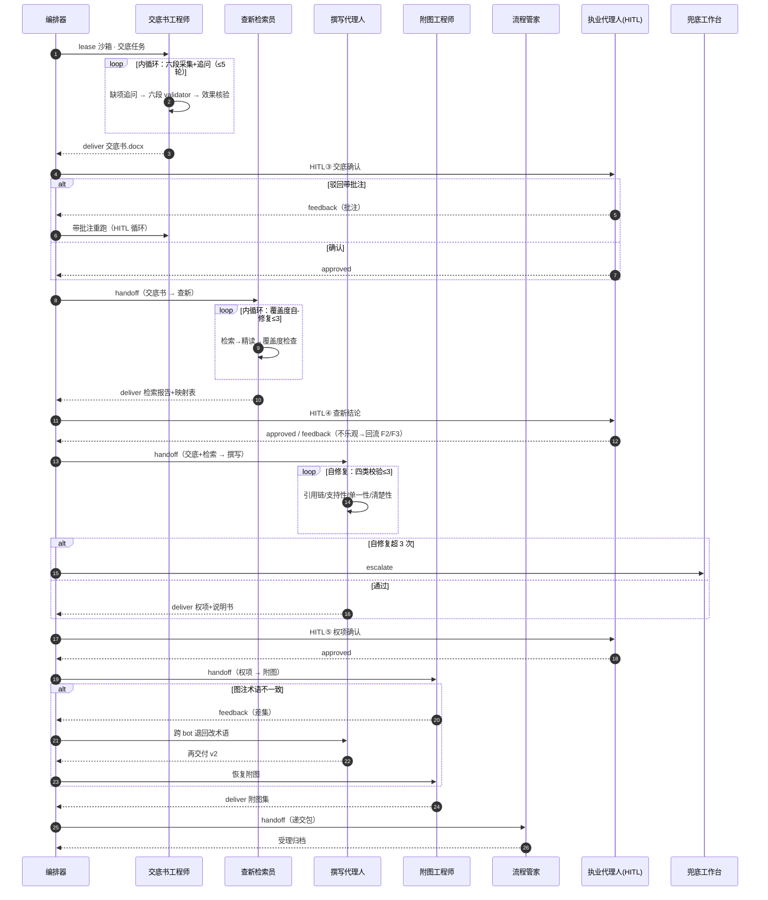

### 5.2 F6 OA · N 通外循环 trace

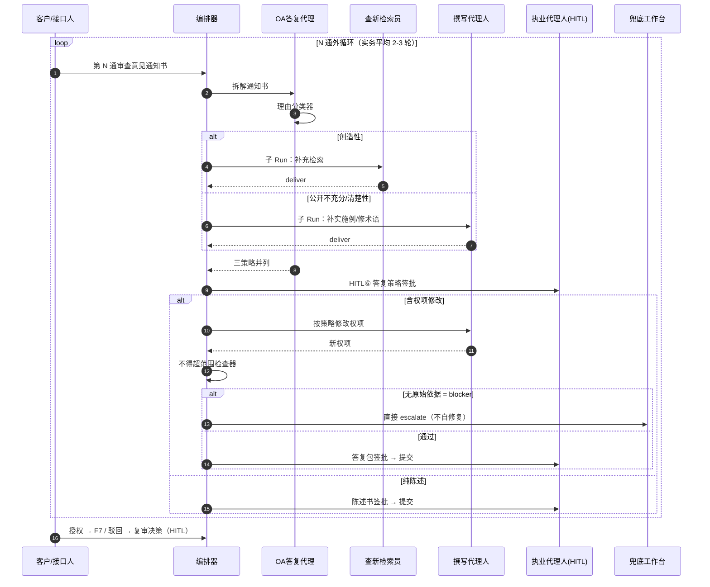

### 5.3 F9→F3 布局飞轮

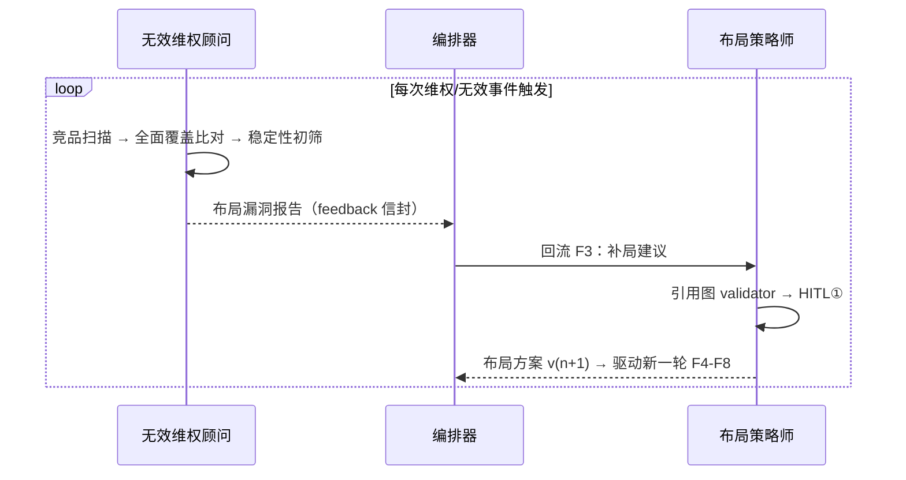

### 5.4 全系统 Loop 总索引（权威）

| Loop | 类型 | 发生位置 | 触发 | 上限 | 超限 / 退出 | 图位置 |
|------|------|----------|------|------|-------------|--------|
| 内循环 | **内** | bot 内部 | 正常干活（检索/追问/布局） | max_steps 20–30 | 步数熔断 | §4 / v2 §4 |
| 自修复循环 | **内** | bot 内部 | validator 打回 | 3 次 | escalate 兜底台 | §4 / §5.1 |
| HITL 循环 | **外** | 步骤间 | 人工驳回带批注 | 人工控制 | — | §5.1 |
| 回流转 | **外** | 步骤间 | 下游 feedback（产物不足） | 全局 iterations | 全局熔断 | §1.3 / §5.1 / §5.5 |
| N 通外循环 | **外** | F6 | 新通知书到达 | 法定程序 | 授权/驳回 | §1.3 / §5.2 / §5.5 |
| 超范围红线 | **外**（blocker） | F6 内部 | 修改无原始依据 | **0**（禁自修复） | 直接 escalate | §5.2 |
| 全局熔断 | **外** | 整个 Run | iterations≥8 | — | 挂起转人工，**绝不静默重跑** | §2 |
| 布局飞轮 | **外** | F9→F3 | 维权/无效事件 | 年度周期 | — | §1.2 / §5.3 |
| 查新不乐观回流 | **外** | F5→F2/F3 | HITL④ 不乐观 | — | 换方向/调布局 | §1.2 / §5.1 |
| 立项低分回流 | **外** | F4→F2 | 评分&lt;50 | — | 放弃·换方向 | §1.2 |

### 5.5 F5 / F6 流程定义图（编排器加载的静态图 · 带环）

> **流程定义图** = 编排器静态图，环是边；**时序图** = 一次运行 trace；**状态机** = 共用转移规则。图上没画的环，编排器不会执行。

**F5 · 4 类环**

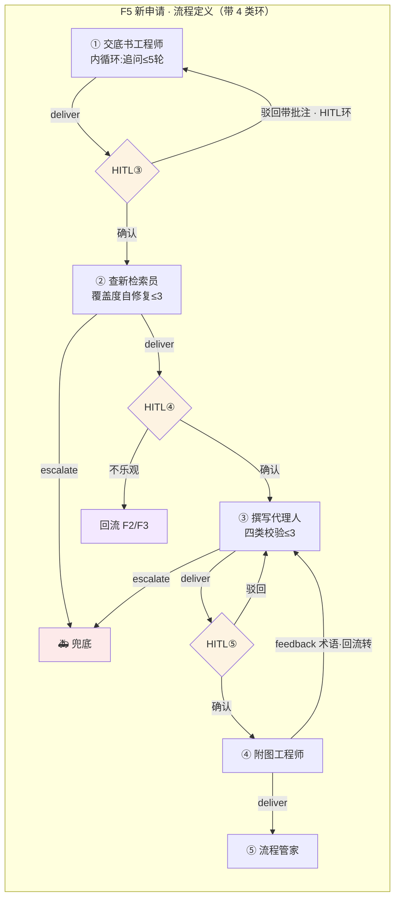

**F6 · 环边 + N 通外循环**

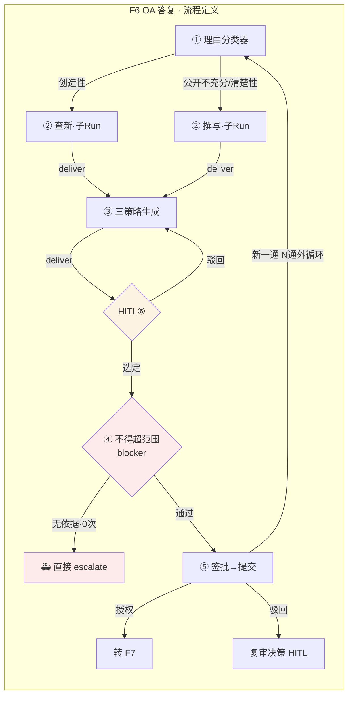

**相对纯直线图的关键差异**：

1. F5 有 4 条环边：HITL③→交底、HITL⑤→撰写、**附图→撰写 feedback**、escalate→兜底（另：查新自修复为节点内边）。  
2. F6 有子 Run 汇入、HITL⑥驳回、**提交→理由分类（N 通）**、超范围 blocker→兜底。  
3. HITL 在流程图中是**显式决策菱形**，编排器按图转移，不是顺序硬推。

---

## 6. 与业务壳 / Catalog / 合规

### 6.1 产品路径约束（不推翻既有钉）

| 规则 | 说明 |
|------|------|
| 业务冷启动 = 我的案子 | [agent-business-mode](../product-apps/agent-business-mode.md)；`/agent`≠Catalog 超市 |
| 环边可见性 | 业务面：人话进度 / 待确认；**Catalog·专家台 / 过程面板**：可见环边与 loop 过程 |
| 从建项目 / Catalog 组队起 | 禁止无 `projectId` 专家截入（尤禁冷启动直进 OA/递交） |
| OA 仅已 file 后由总控派 | 对齐 SEAT_ROSTER |
| 端用户禁 mid 可点深链验收 | 壳内映射 + Command 示意即可 |
| L1/L2/L3 入口并列保留 | Domain Pack 挂在 L3/专利壳；见 agent-layers |
| 双文件过程可见 | 成果 + worklog；缺过程不可交卷（壳规格） |

### 6.2 环边样机路线

三刀（样机 · **无真沙箱**）：见 [agent-pack-loops-roadmap](../product-apps/agent-pack-loops-roadmap.md)  
— Knife1 F5 内循环+跨席环边 · Knife2 F6 OA N通 · Knife3 F9→F3 飞轮。

### 6.3 合规

开工前读平台稿 / incoming 沙箱设计 §13–14（执业边界、交底加密与租户隔离、假设验证清单）。

---

## 7. Owner

规格：架构设计 · Pack 实现：后续平台/领域刀 · 壳/环边样机：Agent应用助手（另开令，见 loops-roadmap）· B 席轻扫本文 §0.2 + §5.4
