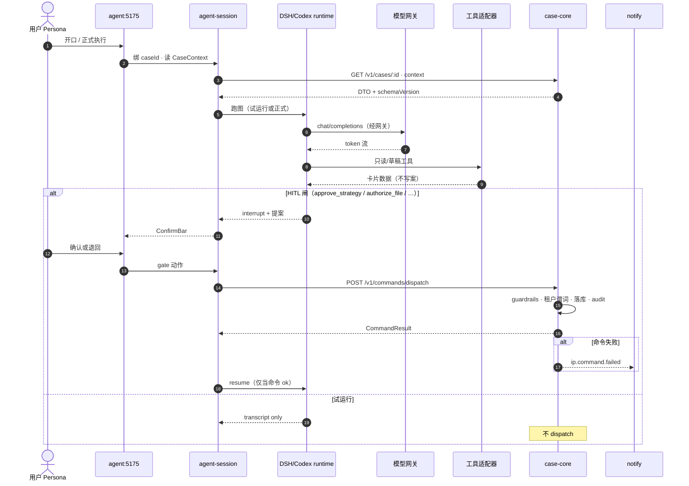

# Agent 拓扑（会话 · 工具 · 模型网关 · 记忆 · 审计 · 边界）

> **样机诚实**：拓扑今日 = `agent:5175` React 树 + 内存 `AgentSession` + mock 工具卡片 + ConfirmBar。无模型网关、无 checkpoint、无向量记忆、无独立审计查询。写办案若发生，走浏览器 `dispatchCommand`（可选再 POST api-mock）。  
> **落地目标**：画出 C 混合下各盒职责，以及与 `case-core` / `notify` 的硬边界。开源 runtime **不得**越过 command 写库。

选型见 [agent-platform.md](./agent-platform.md)；企业级部署见 [backend-enterprise.md](./backend-enterprise.md)。

## 1. 盒与边界

| 盒 | 落地归属 | 持有什么 | 不持有 |
|----|----------|----------|--------|
| Agent UI | `apps/agent` `:5175` | 会话渲染、ConfirmBar、Catalog、深链 | 执法；DB |
| `agent-session` | landing 七面；MVP 可同进程 | `AgentSession`、`clearedHitlGates`、试运行/正式分界、Catalog 配置 | `PatentCase` 写；模型 API key 明文 |
| 开源 runtime | 进程内库或 sidecar（默认 **DSH 和/或 Codex app-server**；LangGraph 可选 ② 子图） | 图、checkpoint、工具循环、流式 | Case 写连接；SMTP；Persona 真相 |
| 工具适配器 | 自有代码，挂在 runtime | 只读检索、草稿、外部只读 API | `UPDATE` 案表；未登记 HTTP |
| 模型网关 | 新薄模块（可挂 `ops-platform` 配 + `agent-session` 调） | 路由、配额、脱敏、供应商适配 | 办案命令 |
| 记忆 | 分层，见 §4 | 会话轨迹 / 可选检索切片 | 另一份 Case 真相 |
| `case-core` | landing | 案聚合、handoff、审计、command | LLM 上下文窗口 |
| `notify` | landing | 投递与提醒条目 | 完整案；模型 prompt |
| `iam` | landing | 租户 + Persona 声明 | 会话 transcript |

**硬规则**：凡改变交接、阶段、Docket、发票、派所、建案的意图 → 只能 `POST /v1/commands/dispatch`。runtime 和工具适配器允许的副作用只有：写自己的 checkpoint / 会话轨迹 / 对象存储里的**草稿附件**（正式归档仍经命令）。

---

## 2. 数据流（落地 · C 混合）



### 2.1 样机今（对照，勿当成已实现上图）

```text
用户 → ConfirmBar / 一键演示
     → AgentContext 脚本步骤（mock tools）
     → dispatchCommandLocal（浏览器）± POST api-mock
     → 无模型网关 · 无 runtime 图 · 无 notify 真消费
```

`DOMAIN_EVENTS` 仍是契约常量，**无 bus**。落地后失败命令才异步进 `notify`。

---

## 3. 会话

| | 样机诚实 | 落地 |
|--|----------|------|
| 存储 | 浏览器内存 + seed `buildSeedSessions` | `agent-session` / PG；租户键 + `caseId` |
| 绑定 | `session.caseId` ↔ 案 id（`sessionBind.aligned`） | 同；禁止无案正式执行写命令（除 `createCaseFromInsight`） |
| 闸 | `clearedHitlGates` | 同字段；与 runtime interrupt 对齐，**闸 id 不改名** |
| Auto | `suggestAgent` 确定性规则 | 仍先规则；LLM 不得擅自换 Core/Assist/Beta 分层 |
| 跨口 | 深链 `APP_DEV_URLS`；cookie 大块态 | 会话读 API；深链可留 |

会话 CRUD **同步**。正式执行同步等 `CommandResult`（办理要立刻刷新交接）。checkpoint 恢复可异步，但 HITL 按钮必须挡住。

---

## 4. 工具

| 类 | 例（现 `AgentDef.tools[]`） | 落地允许 | 写库 |
|----|----------------------------|----------|------|
| 只读检索 | `commercial_patent_search` · `cluster_hits` | 经适配器调外部/内场检索 | 否 |
| 草稿 | `draft_research_report` | 写会话产物 / 对象存储草稿 | 否（正式提交才 command） |
| 领域写意图 | `submit_for_review` · `file_oa_response` · `assign_agency` · `create_case_from_insight` | **只发 DomainCommand**（`TOOL_TO_COMMAND`） | 仅 command |
| 演示 | 一键等效演示 | 保留标「捷径」；生产默认关 | 若开，仍走 command |

工具成功文案继续：「已写入领域：SubmitResearch」——但只有 command ok 才能出这句。runtime 自己完成 ≠ 已写入领域。

沙箱：生产工具进程无 PG 凭据；网络白名单（模型网关、检索、`case-core`）。

---

## 5. 模型网关

样机：**无**。落地：所有模型调用出 `agent-session`/runtime 必须经一处网关（可先做薄 SDK，不必独立进程）。

| 职责 | MVP | 生产 |
|------|-----|------|
| 供应商适配（OpenAI 兼容 / 私有 vLLM） | 一个 endpoint | 多模型路由 |
| API key | 环境变量 | 保险库引用（ops-platform） |
| 日志 | 请求 id、token 粗计数；**默认不落全文 prompt**（案情） | 可配保留；与审计分离 |
| 关断 | 配置开关 → 回退脚本 Agent | 同 + 配额 |
| 出站合规 | 默认私有或企业网关 | 公有 API 要书面开关 + 脱敏 |

网关**不**发 DomainCommand，**不**替代 guardrails。

---

## 6. 记忆（三层，禁止第四真相）

| 层 | 内容 | 权威 | 样机今 |
|----|------|------|--------|
| 案记忆 | `CaseContextSnapshot`（`CASE_CONTEXT_SCHEMA_VERSION`） | **`case-core` / `@ip/domain` `buildCaseContext`** | 内存快照 |
| 会话记忆 | transcript、工具卡片、interrupt 栈、checkpoint | `agent-session` + runtime checkpoint（建议同 PG） | 浏览器 |
| 检索记忆（可选） | 说明书切片、历史 OA、知识库 | 独立索引；**引用案 id** | 无 |

禁止：runtime 长期记忆里存一份「自己认为的 handoff 状态」而不读 case-core。  
向量库 **非** MVP 必做；调研 Agent 需要时再加，且只读。

---

## 7. 审计与可观测

| 信号 | 谁写 | 给谁看 | 不是什么 |
|------|------|--------|----------|
| `AuditEntry`（命令序） | `case-core` `pushAudit` | 案详回放、证据包、ops 深链 | 不是 LLM trace |
| 会话轨迹 | `agent-session` | Agent UI、问题排查 | 不是领域审计 |
| OTel span | services + 网关 | ops-platform | 不是 `DOMAIN_EVENTS` |
| `ip.command.failed` / `ip.command.dispatched` | `case-core` | `notify` / ops | 样机无消费者 |
| 模型 token | 网关 | 配额/成本 | 不进 AuditEntry 除非另 bump schema |

`actor: 'user' | 'agent'` 纪律不变。HITL 由人点下去的命令：若产品认定是「人批准 Agent 提案」，`actor` 仍按现仓（HITL 确认后正式执行用 `agent`）——**落地不改语义**；若要区分「人在表单点批准」vs「人在 ConfirmBar 批准」，另加字段并 bump `AUDIT_SCHEMA_VERSION`，禁止 silently 改。

---

## 8. 与 case-core / notify 的边界（再钉死）

```text
                    ┌─ 读：GET cases/context/inbox
 agent-session ─────┤
 runtime / tools ───┴─ 写：仅 POST /v1/commands/dispatch
                              │
                              ▼
                         case-core
                              │  DOMAIN_EVENTS（落地才有消费者）
                              ├─► notify   （出站 / 站内提醒）
                              ├─► docket   （期限仍经命令升级）
                              └─► 投影     （workbench 进度 / Inbox）
```

| 允许 | 禁止 |
|------|------|
| 读 CaseContext、命中列表、发票是否阻塞（只读） | 工具里 `payInvoice` 不经 command |
| 命令失败后让 UI 显示并让 notify 投递 | runtime 直接打 SMTP |
| 把 `CommandResult` 喂回图 | 用模型「说已经批准」更新 `clearedHitlGates` |
| ops 只读深链案详审计 | ops / notify 持有 `PatentCase` |

---

## 9. 样机 vs 落地总表

| 块 | 样机今 | MVP（可晚于 case-core） | 生产 |
|----|--------|-------------------------|------|
| UI | `5175` mock harness | 同 UI，1 个 Core 接 runtime | Core 图化 |
| 会话 | 内存 | PG | HA、保留策略 |
| 编排 | `AGENT_SCRIPTS` | DSH/Codex 1 环（可选 LangGraph 子图） | Catalog 多 Agent |
| 模型 | 无 | 一网关一模型，可关 | 路由/配额 |
| 工具 | 展示卡片 | 适配器 + command | 沙箱白名单 |
| 记忆 | 无分层 | CaseContext + 会话 | 可选检索 |
| 审计 | 双内存、无 GET | 单源 GET | 保留/归档 |
| notify | 无 | 失败命令可提醒 | 多通道 |
| 网格 | 无 | 无 | 仍非必须 |

## 10. 相关链接

- [./agent-platform.md](./agent-platform.md) · [./decision-matrix.md](./decision-matrix.md) · [./backend-enterprise.md](./backend-enterprise.md)
- [../../HARNESS.md](../../HARNESS.md) · [../../COMMANDS.md](../../COMMANDS.md)
- [../landing/backends.md](../landing/backends.md) · [../landing/reminders-notify.md](../landing/reminders-notify.md)
- [../data-flow.md](../data-flow.md) · [../data-model.md](../data-model.md)
- `packages/contracts/src/events.ts` · `apps/agent/README.md`
