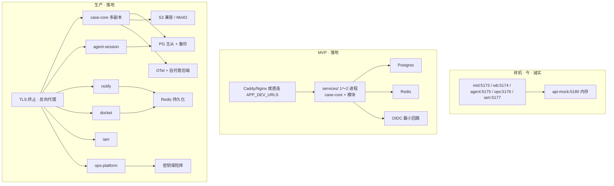

# 企业级后端（在 landing 七面之上）

> **样机诚实**：今日只有五个 Vite 壳 + `apps/api-mock`（Node `http` 内存）。无 Postgres、无 Redis、无 OIDC、无对象存储、无 OTel 采集、无调度器、无真出站。执法在浏览器 `dispatchCommandLocal`；跨口靠 cookie / mid bridge。**不是**微服务，**不是**已私有化可装包。  
> **落地目标**：在已通过的 landing 七面（`case-core` / `workbench-command` / `agent-session` / `iam` / `ops-platform` / `notify` / `docket`）之上，把部署拓扑、多租户、高可用、安全合规、审计、私有化写成**可执行到 MVP/生产**的表与检查清单。默认栈仍是 [../landing/stack.md](../landing/stack.md)：TS + PG + Redis + OIDC + S3 兼容 + OTel。  
> 一期仍同仓 `services/` 模块或少量进程，**禁止**把本文写成已有服务网格。壳继续做 BFF 消费者，不把 mid/workbench/agent 升级成微服务。

服务面职责、数据归属、同步/异步仍以 [../landing/backends.md](../landing/backends.md) 为权威；本篇不复制掏空。

## 1. 部署拓扑

### 1.1 三档（样机诚实 vs 落地）

| 档 | 进程形态 | 数据 | 明确没有 |
|----|----------|------|----------|
| **样机** | 5 Vite + 1 mock HTTP | 内存 seed + cookie | 真库 / SSO / 总线 / 网格 |
| **MVP** | 同仓 `services/` **1～2 个 Node 进程**（`case-core` 必做；docket/notify/iam/agent-session 可同进程模块） | Postgres + Redis | 服务网格、多区域、真 LLM 办案写 |
| **生产** | 按需拆 `notify` / `docket` / `iam` / `agent-session` 进程；库逻辑分 schema | PG HA + Redis + MinIO + OTel | 壳内业务 handler；cookie Persona 当鉴权 |

**拓扑纪律**：拆的是**进程与数据归属**，不是仓库（对齐 [../repos-and-vcs.md](../repos-and-vcs.md)）。生产也不强制 Istio/Linkerd；缺省 Nginx/Caddy + 进程探活即可。

### 1.2 与七面的映射（落地，非 Day-1 网格）

| 进程/模块 | 七面 | MVP | 生产 |
|-----------|------|-----|------|
| `services/case-core` | case-core + 可挂 workbench-command + 可挂 billing | **必独立进程或主进程** | 多副本无状态 + PG |
| 同进程模块 `docket` | docket | 可同进程 | 建议拆（调度与办理隔离） |
| 同进程模块 `notify` | notify | 可同进程 + Redis 队列 | 建议拆 |
| 同进程模块 `agent-session` | agent-session | 可同进程；会话进 PG | 可拆；**仍不写 Case** |
| `services/iam` 或外部 IdP | iam | 外部 Keycloak/Authentik + 薄校验中间件即可 | 独立或继续外部 IdP |
| `ops-platform` | 配置/密钥/健康 | 配置表 + 密钥引用 | 保险库 + OTel |

边缘：开发沿用 `APP_PORTS`；生产用网关主机名，**常量含义勿 silently 改**（landing roadmap §5.1）。

---

## 2. 多租户

### 2.1 样机诚实

- `PatentCase.ownerEnterpriseId` / `assignedAgencyId` 是**演示级**隔离（`visibleCases` / `canAccessCase`），执法在浏览器。
- Persona 写 workspace cookie，跨口共享；**不是**租户鉴权。
- iam `:5177` 空态占位，非真 SSO。
- api-mock **不**按租户过滤。

### 2.2 落地模型（行级，不先上 schema-per-tenant）

| 层 | 归属 | 隔离键 | 规则 |
|----|------|--------|------|
| 身份 | `iam` / IdP | `tenantId`（企业）+ 可选 `agencyId` | OIDC claim；办案服务只收已验证声明 |
| 案聚合 | `case-core` | `ownerEnterpriseId` + `assignedAgencyId?` | **每条 SQL/命令强制租户谓词**；禁止「先查再滤」当唯一门 |
| 会话 | `agent-session` | `tenantId` + `caseId` | 会话不能跨租户绑案 |
| 提醒 | `notify` | `tenantId` + 用户 id | 订阅/投递按租户；不存完整案 |
| 配置 | `ops-platform` | 平台级 vs 租户级 | 密钥引用按租户；平台密钥不进租户配置 |

Persona（企业 IP 经理 / 代理所 / 财务等）是**租户内角色声明**，不是租户本身。换 Persona 发 `ip.persona.changed`，不换 `tenantId`。

`fulfillmentMode`（`delegated` \| `self_serve`）继续表示办理关系，不另起租户维度。

### 2.3 多租户检查清单

| # | 项 | MVP | 生产 | 样机今 |
|---|----|-----|------|--------|
| T1 | dispatch / GET cases 无匹配租户声明 → 401/403 | 必 | 必 | 否（cookie Persona） |
| T2 | `c-mock-*` 式「仅 API 有的 id」可按租户查到或明确拒绝 | 必（消裂缝） | 必 | 读路径跳过 |
| T3 | 代理所只能见 `assignedAgencyId` 匹配案 | 必 | 必 | 演示级 |
| T4 | 审计带 `tenantId` + `actor` | 必 | 必 | 内存、无租户字段保证 |
| T5 | 跨租户枚举（`GET /v1/cases` 无谓词）有回归测试 | 可缓自动化 | 必 | 无 |
| T6 | schema-per-tenant / 独立库 | 不做 | 仅硬隔离客户才上 | — |

---

## 3. 高可用

> MVP **不**要求多 AZ 集群；要求「杀进程重启不丢案」。生产才上主从/备份演练。

| 组件 | MVP（可执行） | 生产 | 样机今 |
|------|----------------|------|--------|
| `case-core` | 单实例；进程死可拉起；命令同步落 PG | ≥2 副本无状态；LB 健康检查 `/health` | 单 mock 进程内存 |
| Postgres | 单节点 + **每日逻辑备份**（可 restore 验收） | 主从或托管 HA；PITR；备份恢复演练每季 | 无 |
| Redis | 单节点；AOF/RDB 开；当队列丢可重扫 docket | Sentinel/Cluster 或托管；notify 死信 | 无 |
| 对象存储 | 可先本地 PVC（证据包少） | MinIO/企数仓 **双盘或纠删** + 生命周期 | 内存/静态 |
| 调度（docket/notify） | 单消费者；`SKIP LOCKED` 或 BullMQ 单队列 | 多消费者抢锁；失败重试 + 死信 | 无（提醒空洞） |
| 网关 | 开发直连端口 | Nginx/Caddy TLS；可选双节点 | Vite dev |

**明确不做（直到有数据证明需要）**：Kafka 当默认总线、服务网格、全球多活、把 SQLite 当生产 HA。

### 3.1 故障域（落地）

| 挂了谁 | 用户可感知 | 不可丢 |
|--------|------------|--------|
| `case-core` | 办理/HITL 正式执行失败 | 已提交命令的 PG 行 |
| Redis | 提醒延迟；办理同步路径应仍可用 | 案/审计（在 PG） |
| `notify` | 邮件/Webhook 停 | 投递日志与 Inbox 读模型（PG） |
| `agent-session` / runtime | Agent 对话停；**表单办理仍可用** | 已落库的命令 |
| IdP | 新登录失败 | 已签发会话的短宽限期需书面策略 |

办理主路径（表单 + HITL→command）**不得**把 Redis 或 LLM runtime 当同步硬依赖。

---

## 4. 安全合规

### 4.1 样机诚实

- 无 TLS 终止（localhost）。
- 无真鉴权：Persona cookie 可改。
- 无密钥保险库；ops 告警样机写 sessionStorage。
- 无审计查询 API（双份 `auditLog`，mock 无 GET）。
- HARNESS 明确：**不引入真实 LLM** —— 故今日也无「案情出站到公有模型」问题；落地后才有。

### 4.2 控制面（落地，按优先级）

| 控制 | MVP | 生产 | 说明 |
|------|-----|------|------|
| TLS | 内网可 HTTP + 文档声明 | 全站 TLS；HSTS | 边缘 Caddy/Nginx |
| OIDC | 最小登录回路；API 验 JWT | 企业 IdP（Keycloak / Authentik / 客户 IdP）；刷新与登出 | 替 cookie Persona |
| 授权 | 租户谓词 + Persona 声明 + `@ip/domain` guardrails | 同上 + 管理面 RBAC | **办案硬闸仍在 domain，不在 IdP** |
| 密钥 | env / compose secrets，不进 Git | 保险库（Vault / 云 KMS 可适配）；ops 只存引用 | SMTP、模型 key、S3 |
| 输入 | 命令白名单 = `DomainCommand` | 同 + 速率限制 | 禁自由 SQL/任意 PATCH |
| 模型出站 | MVP 若接 LLM：默认**私有或企业网关**；公有 API 要开关 + 脱敏策略 | 数据驻留书面化；可审计的模型网关 | 见 [agent-topology.md](./agent-topology.md) |
| 依赖 | lockfile + `npm audit` 量级 | SBOM + 许可扫描（Agent 运行时许可见 [agent-platform.md](./agent-platform.md)） | Dify 等「改 Apache」须法务核 |

合规话术（诚实）：本方案提供**可审计、可私有化、可租户隔离**的技术条件；等保/ISO/SOC 证书是部署与流程的事，**不是**本仓已具备的资质。

### 4.3 安全检查清单

| # | 项 | MVP | 生产 |
|---|----|-----|------|
| S1 | 无 token 调 `POST /v1/commands/dispatch` → 401/403 | 必 | 必 |
| S2 | 改 cookie Persona 不能越过服务端租户谓词 | 必 | 必 |
| S3 | 密钥不进仓库；`.env.example` 无真值 | 必 | 必 |
| S4 | Agent 工具循环**不能**拿到 DB 连接串 | 必 | 必 |
| S5 | 证据包/附件不走世界可读 URL（预签名或会话） | 可缓 | 必 |
| S6 | 管理面与办案面网络/角色分离（ops 不持案） | 纪律已有 | 必执行 |
| S7 | 备份加密与恢复演练记录 | 备份有即可 | 必演练 |

---

## 5. 审计

对齐 `AUDIT_SCHEMA_VERSION`（当前 `2026.09.1`）与 [../../HARNESS.md](../../HARNESS.md) / [../../COMMANDS.md](../../COMMANDS.md)。审计是**追加只写日志**，不是分布式 tracing（tracing 走 OTel）。

| | 样机诚实 | 落地目标 |
|--|----------|----------|
| 写 | 壳 `AppContext.auditLog` **和** mock `store.auditLog` **不同步**；mock 无 GET | **单源**：`case-core` 追加；强制 `schemaVersion`；`GET /v1/audit?caseId=` |
| 字段 | `{ actor: user\|agent, agentId?, command, caseId, at, detail }` | 加 `tenantId`、命令 id、请求 id / trace id（可空） |
| 回放 | CaseDetail 审计 Tab 步进（内存） | 同 UI 改吃 GET；证据包导出带版本；缺版本 = `legacy` |
| Agent | 正式/HITL 以 `actor:'agent'` 写入 | 同；试运行/工具卡片**不**写办案审计（可写会话轨迹，属 `agent-session`） |
| 保留 | 刷新即丢 | MVP：与案同寿命；生产：保留策略（建议 ≥ 3 年可配）+ 只追加不可 UPDATE |

`ip.audit.appended` 异步通知 ops/notify；**不**用事件替代查询 API。

### 5.1 审计检查清单

| # | 项 | MVP | 生产 |
|---|----|-----|------|
| A1 | 双份 auditLog 消失；只有 PG 一份 | 必 | 必 |
| A2 | `GET /v1/audit?caseId=` 跨壳一致 | 必 | 必 |
| A3 | 新写入无 `schemaVersion` 的代码路径进 CI 禁 | 必 | 必 |
| A4 | 形状变更必须 bump `AUDIT_SCHEMA_VERSION` | 纪律 | 纪律 |
| A5 | 导出证据包含命令序 + caseContext | 可沿用现导出 | 从 API 取数 |
| A6 | 审计行不可被业务 UPDATE/DELETE（保留用归档） | 可缓 | 必 |

---

## 6. 私有化

目标：客户机房 / 专有云可装；不绑单一公有云专有 API。与 landing「明确不选」一致。

| 块 | 默认可私有化件 | 不可当默认 |
|----|----------------|------------|
| 计算 | 客户 K8s 或单机 docker compose（MVP 可用 compose） | 仅 Lambda / 云 API Gateway |
| DB / 队列 | 自管 PG + Redis | 无离线镜像的云专有库 |
| 鉴权 | Keycloak / Authentik / 客户 IdP | 仅 Cognito/Auth0 且无私有化通路 |
| 文件 | MinIO 或企数仓 S3 API | 仅公有云桶且无兼容层 |
| 观测 | OTel → Tempo/Jaeger + Prometheus + Loki（或客户已有） | 仅云 APM |
| 模型 | 企业网关 / 私有 vLLM 等（落地后） | 运行时强制公网 beacon / 强制 license 电检（见 Agent Server 风险） |
| Agent runtime | LangGraph **库**（MIT）自托管；见 [agent-platform.md](./agent-platform.md) | 把官方 LangGraph Agent Server（需 `LANGGRAPH_CLOUD_LICENSE_KEY` / beacon）写成唯一私有化路径 |

空气间隙：生产可选；MVP 不要求。若空气间隙，禁止默认依赖「启动时访问 `beacon.langchain.com`」的组件。

### 6.1 私有化交付物（生产，可执行）

1. 一份 `compose` 或 Helm：**壳静态资源 + services + PG + Redis + MinIO + IdP（或 IdP 接入说明）**。  
2. 配置清单：OIDC issuer、S3 endpoint、SMTP/Webhook、模型网关、备份路径。  
3. 备份/恢复 runbook（至少演练一次 restore）。  
4. 许可清单：本仓 MIT/自有 + 运行时（LangGraph MIT；若引入 Dify / `langgraph-api` 须书面「需再核」）。  
5. 升级路径：冻 URL/命令名，滚动 `services/` 镜像。

---

## 7. MVP / 生产执行表

继承 [../landing/roadmap.md](../landing/roadmap.md)，下表只列**企业级增量**（拓扑 / 租户 / HA / 安全 / 审计 / 私有化）。Agent 真 LLM **不是** MVP 必做（roadmap 已禁「真 LLM 办案写」）；Agent 平台见另篇。

### 7.1 MVP 必做 / 可缓 / 禁止

| 必做 | 可缓 | 禁止 |
|------|------|------|
| `services/case-core` + PG；冻 URL | 拆独立 docket/notify 进程 | 对外称已有网格 / 已私有化装包 |
| 审计单源 + `GET /v1/audit` | 对象存储（PVC 顶上） | 改 `DomainCommand` 名字串 |
| Redis：docket 扫描 + notify 队列 | Kafka、多 AZ | cookie Persona 当生产鉴权 |
| OIDC 最小回路 + 租户谓词 | 空气间隙、schema-per-tenant | Agent 直连 DB |
| `/health` 给拉起探测 | 全通道短信 | 把 api-mock 当生产 |
| 每日 PG 备份 + 一次 restore 烟测 | 正式等保测评 | 前端 `setTimeout` 当调度 |

### 7.2 验收（可打勾）

**MVP**

- [ ] 杀 `services/` 与 mock，只起新服务 + PG：cases/audit 仍在。  
- [ ] 无 token dispatch → 401/403。  
- [ ] 租户 A token 读不到租户 B 的 `caseId`。  
- [ ] `GET /v1/audit?caseId=` 与办理后回放一致；不再存在「壳一份、mock 一份」。  
- [ ] 插入过期 docket → 扫描 → 投递日志或 Inbox 有痕迹（[../landing/reminders-notify.md](../landing/reminders-notify.md)）。  
- [ ] 备份文件可 restore 到空库并读出至少一案。  

**生产（在 MVP 之上）**

- [ ] `case-core` ≥2 副本；杀一副本办理不中断（进行中请求可失败，随后恢复）。  
- [ ] TLS；密钥进保险库；ops 只读引用。  
- [ ] MinIO/企数仓承载证据包；链有过期。  
- [ ] OTel 一条办理路径（dispatch → DB）可在 tracing UI 看到。  
- [ ] 私有化 compose/Helm 在干净机器装起；IdP 可换客户 issuer。  
- [ ] 恢复演练书面记录；审计保留策略生效。  
- [ ] 壳成功路径不再跑 `dispatchCommandLocal` 当真相。

### 7.3 阶段对照（防空喊）

| 能力 | 样机今 | MVP | 生产 |
|------|--------|-----|------|
| 唯一写 | 否（HTTP + local 双写） | 是（PG） | 是（去壳 handler） |
| 多租户 | 演示过滤 | 服务端谓词 | 回归 + 可选硬隔离 |
| HA | 无 | 重启不丢 | 多副本 + 备份演练 |
| SSO | 否 | OIDC 最小 | 企业 IdP |
| 审计查询 | 无（双内存） | GET 单源 | 保留/归档 |
| 提醒 | 无通道无调度 | 一通道 + 一调度 | 多通道 + 死信 |
| 网格 | 无 | **仍无** | 仍非必须 |
| 真 LLM | 无（HARNESS 不做） | 非必做 | 按 C 混合接入 |

---

## 8. 风险（企业级）

| 风险 | 缓解 |
|------|------|
| 过早上网格 / 多仓 | 一期 `services/`；对齐 repos-and-vcs |
| 长期双真相 | landing 已写切换日；本篇验收「去 local 写」 |
| 租户过滤只做 UI | T1/T5；命令路径单测 |
| 把官方 Agent Server 许可问题带进私有化包 | runtime 用 MIT 库；Server 许可见 agent-platform |
| 合规口头承诺 | §4 明确「技术条件 ≠ 证书」 |
| 修裂缝只写文档 | 双 auditLog / mock 新建跳过必须用实现消（architecture README 裂缝表） |

## 9. 相关链接

- [../landing/README.md](../landing/README.md) · [../landing/backends.md](../landing/backends.md) · [../landing/stack.md](../landing/stack.md) · [../landing/roadmap.md](../landing/roadmap.md)
- [./agent-platform.md](./agent-platform.md) · [./agent-topology.md](./agent-topology.md) · [./decision-matrix.md](./decision-matrix.md)
- [../backends.md](../backends.md) · [../ops-observability.md](../ops-observability.md)
- [../../HARNESS.md](../../HARNESS.md) · [../../COMMANDS.md](../../COMMANDS.md)
