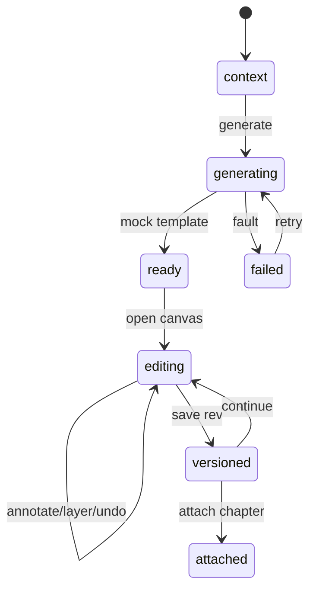

# 附图 · deep-demo（双闭环）

> **验收铁律**：缺编辑画布或不可撤销/不可图层 = **Fail**。

## 1. 必须闭环

| # | 闭环 | 状态机 |
|---|------|--------|
| G | **生成** | `idle → generating → ready`（可失败重试） |
| E | **编辑** | 选中→移动/加标注→图层显隐→undo/redo→save rev |
| V | **版本** | 多 rev 列表；恢复旧版需 Confirm |
| A | **挂章** | 选章 → confirmed 事件（内存） |

## 2. 最小种子

- 模板草图 ≥ 2 种。  
- 新资产默认带 1 背景层 + 1 标注层。  
- 挂章目标 ≥ 1 个假章节名（如「实施例 · 图1」）。

## 3. 非目标

真文生图、真 PDF/DOCX 插图回写、APP_PORTS、改五壳、写 PatentCase。

## 4. 验收清单

- [ ] 生成后能一键进画布  
- [ ] 画布：标注、图层、撤销均可点  
- [ ] 保存至少 2 个版本  
- [ ] 挂章有明确样机反馈  
- [ ] 横幅含「无真文生图」  
- [ ] **无**「仅预览图、不可编辑」路径作为唯一结局  
