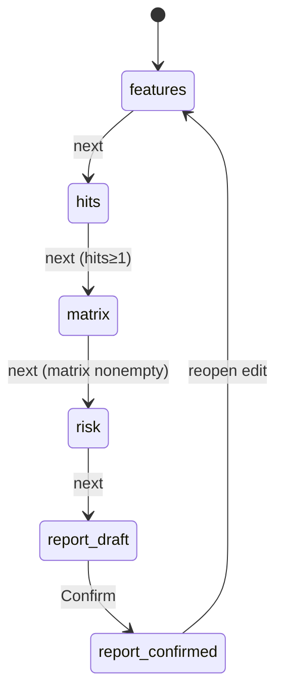

# FTO · 样机深业务（deep-demo）

> **样机诚实**：内存 store + 短延迟；无真 FTO。  
> **目标**：主路径五步均可点通并出 Confirm 草稿。

## 1. 必须闭环

| # | 行为 | 状态 |
|---|------|------|
| 1 | 编辑特征表并保存到 store | `features: ProductFeature[]` |
| 2 | 加载种子篮 / 示意导入 hits | `hits: SearchHit[]` |
| 3 | 生成或编辑矩阵单元格 | `matrix: ClaimMatrix` |
| 4 | 计算或覆盖风险 | `risk: RiskAssessment` |
| 5 | 报告预览 → Confirm | `report.status: draft → confirmed` |
| 6 | Confirm 后只读；可「重新打开编辑」清 confirmed | 显式动作，防误触 |

## 2. 主状态机



门禁（建议硬挡）：

- hits 为空 → 不能进 matrix（或进了禁用「自动比对」）。  
- matrix 为空 → 不能 Confirm。  
- Confirm **绝不**写 case-core。

## 3. 与 Search Hit

```ts
// 消费形状（与 search 对齐，可子集）
type SearchHit = {
  id: string
  publicationNumber: string
  title: string
  applicant?: string
  snippet?: string
  familyId?: string
  // FTO 样机可附：
  mockClaims?: { id: string; text: string }[]
}
```

种子篮 ID 建议与 search 种子公开号有交集，便于演示故事，**不**依赖跨端口 localStorage。

## 4. 非目标

真引擎、真律师签章、APP_PORTS、改 search/五壳、PatentCase 写库、塞 ai-data。

## 5. 验收

- [ ] 五步可走通；Confirm 产出草稿  
- [ ] 空 hits / 空矩阵无法 Confirm（或明确阻断）  
- [ ] 横幅含「无真 FTO 引擎」或「非法律意见」  
- [ ] 无 DomainCommand / 无 PatentCase 写入  
