> **正式稿见** [../domain-packs/patent-pack-design.md](../domain-packs/patent-pack-design.md)。本文为内/外循环丰富源稿，保留备查。

# 专利领域包（Domain Pack）完整设计

> 配套文档：《Agent 沙箱平台技术方案》第 8 章
> 覆盖：F1–F9 全流程 · 16 个 Bot 节点 · 五层业务逻辑体现 · Mermaid 图示

---

## 目录

**章节**：§0 方法论 · §1 生命周期全景（直线图/环视图/展开图）· §2 编排状态机 · §3 Handoff 信封 · §4 节点详设（16 节点）· §5 跨 Bot 交互时序与 Loop 索引（含流程定义图）· §6 汇总矩阵

**插图清单（25 张）**：

| # | 图 | 位置 |
|---|---|---|
| 1 | 生命周期全景（直线图） | §1 |
| 2 | 生命周期环视图（跨流程回路） | §1 |
| 3 | 生命周期展开图（F5/F6 bot 级） | §1 |
| 4 | 编排执行状态机 | §2 |
| 5–21 | 16 节点内循环图 | §4（每个节点一张） |
| 22 | F5 新申请交互时序 | §5.1 |
| 23 | F6 OA 循环交互时序 | §5.2 |
| 24 | F9→F3 布局飞轮时序 | §5.3 |
| 25 | F5 流程定义图 / F6 流程定义图 | §5.5（两张并列编号 25a/25b） |

---

## 0. 方法论：业务逻辑五层体现

| 层 | 内容 | 形态 |
|---|---|---|
| 规则层 | 公式 / 校验器 / 分类器 / 期限表 | **代码（裁判）** |
| 流程层 | 内循环 SOP / 分支 / 退出条件 | 编排脚本 / 状态机 |
| 行为层 | 人设 / 边界 / 追问策略 | system prompt（选手动作） |
| 产物层 | 模板 + Schema + validator | 契约文件 |
| 数据层 | 法条库 / TRIZ 库 / 模板库 / 判例库 | KB/RAG，断网 bot 打进镜像 |

铁律：**代码做裁判，LLM 做选手**；能写成 if/公式/校验器的绝不写进 prompt。

---

## 1. 生命周期全景

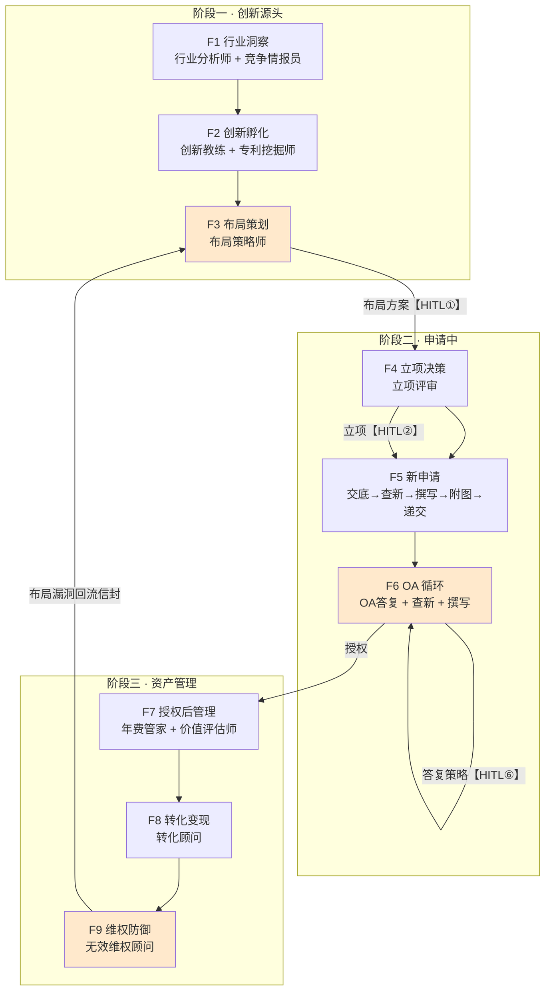
```mermaid
flowchart TD
    subgraph S1["阶段一 · 创新源头"]
        F1["F1 行业洞察<br/>行业分析师 + 竞争情报员"] --> F2["F2 创新孵化<br/>创新教练 + 专利挖掘师"]
        F2 --> F3["F3 布局策划<br/>布局策略师"]
    end
    subgraph S2["阶段二 · 申请中"]
        F4["F4 立项决策<br/>立项评审"] --> F5["F5 新申请<br/>交底→查新→撰写→附图→递交"]
        F5 --> F6["F6 OA 循环<br/>OA答复 + 查新 + 撰写"]
    end
    subgraph S3["阶段三 · 资产管理"]
        F7["F7 授权后管理<br/>年费管家 + 价值评估师"] --> F8["F8 转化变现<br/>转化顾问"]
        F8 --> F9["F9 维权防御<br/>无效维权顾问"]
    end
    F3 -->|"布局方案【HITL①】"| F4
    F4 -->|"立项【HITL②】"| F5
    F6 -->|"授权"| F7
    F6 -->|"答复策略【HITL⑥】"| F6
    F9 -->|"布局漏洞回流信封"| F3
    style F3 fill:#ffe9cc
    style F6 fill:#ffe9cc
    style F9 fill:#ffe9cc
```
全景直线图用于讲"阶段骨架"；下一张**环视图**补齐跨流程回流边（流程内部的多 bot 环见 §5.5）：

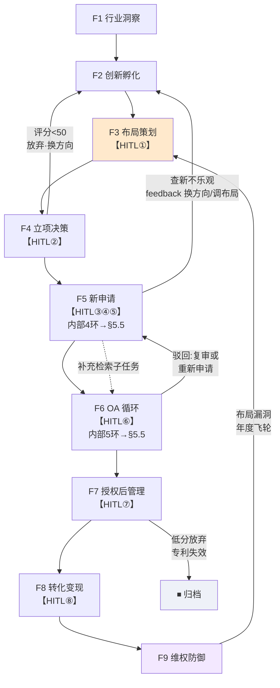
```mermaid
flowchart TD
    F1["F1 行业洞察"] --> F2["F2 创新孵化"]
    F2 --> F3["F3 布局策划<br/>【HITL①】"]
    F3 --> F4["F4 立项决策<br/>【HITL②】"]
    F4 --> F5["F5 新申请<br/>【HITL③④⑤】<br/>内部4环→§5.5"]
    F5 --> F6["F6 OA 循环<br/>【HITL⑥】<br/>内部5环→§5.5"]
    F6 --> F7["F7 授权后管理<br/>【HITL⑦】"]
    F7 --> F8["F8 转化变现<br/>【HITL⑧】"]
    F8 --> F9["F9 维权防御"]
    F9 -->|"布局漏洞<br/>年度飞轮"| F3
    F4 -->|"评分&lt;50<br/>放弃·换方向"| F2
    F5 -->|"查新不乐观<br/>feedback 换方向/调布局"| F2
    F5 -.->|"补充检索子任务"| F6
    F6 -->|"驳回:复审或<br/>重新申请"| F5
    F7 -->|"低分放弃<br/>专利失效"| END["⏹ 归档"]
    style F3 fill:#ffe9cc
    style F9 fill:#f3e8ff
    style END fill:#eef1f8
```

环视图与直线图分工：**直线图讲骨架，环视图讲回路**；F5/F6 内部的 bot 级环边（HITL 驳回、自修复、feedback、N 通外循环）在 §5.5 的流程定义图中，三层各管一摊，不重复。
直线图和环视图都把 F5/F6 折叠成单框（给管理者看骨架）。下一张**展开图**把它们还原为 bot 级节点——多 bot 关系与 loop 边在全景层级直接可见（工程评审用这张图）：

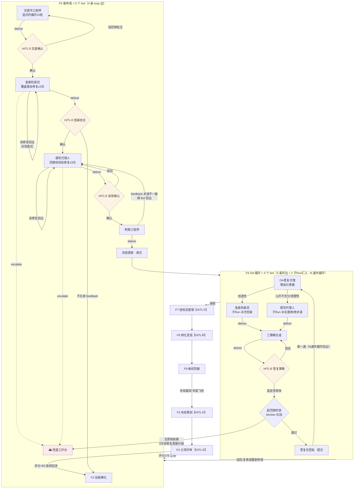
```mermaid
flowchart TD
    F2["F2 创新孵化"]
    F4["F4 立项评审 【HITL②】"]
    F4 -->|"评分≥75 立项"| F5
    F4 -->|"评分&lt;50 放弃回流"| F2

    subgraph F5["F5 新申请 = 5 个 bot（4 条 loop 边）"]
        D["交底书工程师<br/>追问内循环≤5轮"]
        H3{"HITL③ 交底确认"}
        S["查新检索员<br/>覆盖度自修复≤3次"]
        H4{"HITL④ 查新结论"}
        W["撰写代理人<br/>四类校验自修复≤3次"]
        H5{"HITL⑤ 权项确认"}
        P["附图工程师"]
        C5["流程管家 · 递交"]
        D -->|deliver| H3
        H3 -->|"驳回带批注"| D
        H3 -->|确认| S
        S -->|"自修复回边<br/>补检索式"| S
        S -->|deliver| H4
        H4 -->|"不乐观 feedback"| F2
        H4 -->|确认| W
        W -->|"自修复回边"| W
        W -->|deliver| H5
        H5 -->|"驳回"| W
        H5 -->|确认| P
        P -->|"feedback 术语不一致<br/>跨 bot 回边"| W
        P -->|deliver| C5
        S -.->|"escalate"| E1
        W -.->|"escalate"| E1
    end

    C5 --> F6
    subgraph F6["F6 OA 循环 = 3 个 bot（3 条环边 + 2 子Run汇入 · N 通外循环）"]
        A["OA答复代理<br/>理由分类器"]
        R["查新检索员<br/>子Run·补充检索"]
        W6["撰写代理人<br/>子Run·补实施例/修术语"]
        G["三策略生成"]
        H6{"HITL⑥ 答复策略"}
        SC{"超范围检查<br/>blocker 红线"}
        SUB["答复包签批 · 提交"]
        A -->|"创造性"| R
        A -->|"公开不充分/清楚性"| W6
        R -->|deliver| G
        W6 -->|deliver| G
        G -->|deliver| H6
        H6 -->|"驳回"| G
        H6 -->|"选定含修改"| SC
        SC -->|"无原始依据<br/>0次自修复直接升级"| E1
        SC -->|通过| SUB
        SUB -->|"新一通（N通外循环回边）"| A
    end

    E1["🚑 兜底工作台"]
    F6 -->|"授权"| F7["F7 授权后管理【HITL⑦】"]
    F6 -->|"驳回:复审或重新申请"| F5
    F7 --> F8["F8 转化变现【HITL⑧】"] --> F9["F9 维权防御"]
    F9 -->|"布局漏洞·年度飞轮"| F3["F3 布局策划【HITL①】"]
    F3 --> F4
    style E1 fill:#fdeaea
    style H3 fill:#fdf3e2
    style H4 fill:#fdf3e2
    style H5 fill:#fdf3e2
    style H6 fill:#fdf3e2
```

三张全景图分工：**直线图**给管理者讲骨架（F 级）；**环视图**讲跨流程回路（F 级回边）；**展开图**（本图）给工程/业务评审讲 F5/F6 内部的 bot 关系与 loop——F5 标出 4 条 loop 边（HITL③驳回、查新自修复、HITL⑤驳回、**附图→撰写 feedback**），F6 标出 3 条环边（HITL⑥驳回、超范围 blocker、**N 通外循环回边**）+ 2 个子 Run 汇入。


**HITL 决策点（8 个 = 8 个收费节点）**：①布局拍板 ②立项 ③交底确认 ④查新结论 ⑤权项确认 ⑥OA 答复策略 ⑦年费缴纳 ⑧交易签约

---

## 2. 编排执行状态机（flow 是带环图，不是直线）

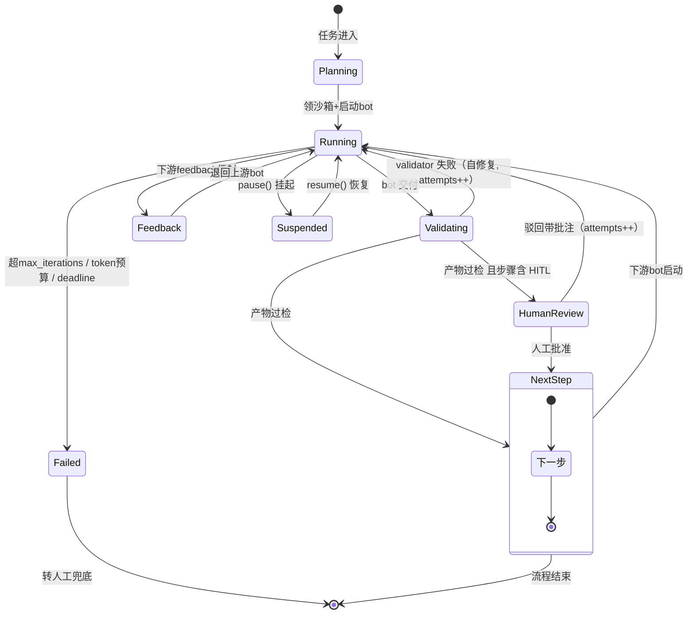
```mermaid
stateDiagram-v2
    [*] --> Planning: 任务进入
    Planning --> Running: 领沙箱+启动bot
    Running --> Validating: bot 交付
    Validating --> Running: validator 失败（自修复, attempts++）
    Validating --> HumanReview: 产物过检 且步骤含 HITL
    Validating --> NextStep: 产物过检
    HumanReview --> Running: 驳回带批注（attempts++）
    HumanReview --> NextStep: 人工批准
    NextStep --> Running: 下游bot启动
    Running --> Feedback: 下游feedback信封
    Feedback --> Running: 退回上游bot
    state NextStep {
        [*] --> 下一步
        下一步 --> [*]
    }
    Running --> Suspended: pause() 挂起
    Suspended --> Running: resume() 恢复
    Running --> Failed: 超max_iterations / token预算 / deadline
    NextStep --> [*]: 流程结束
    Failed --> [*]: 转人工兜底
```

---

## 3. Handoff 信封（流转协议）

```yaml
handoff:
  id: ho-20260920-0007
  flow: 新申请
  step: 查新检索 → 撰写
  type: deliver | feedback        # 交付 or 退回
  from: 查新检索员
  to: 撰写代理人
  inputs: [检索报告v2.pdf, 特征映射表.xlsx]
  acceptance: 权利要求书草案v2    # 下游应交付什么
  feedback:                        # type=feedback 时必填
    reason: 特征F3缺乏最接近对比文件
    requested: 补充检索F3相关IPC小类
  audit: {timestamp, sandbox_id, validator_results}
```

---

## 4. 节点详设（16 个）

> 每个节点：参与 flow / 沙箱策略 / 职责 / 输入输出 / 内循环 mermaid / 五层体现。

---

### 阶段一 · 创新源头

#### 1. 行业分析师（F1）· 沙箱：白名单联网

- **职责**：技术全景与空白点识别
- **输入**：技术领域关键词 / 产品线 → **输出**：全景图、趋势报告、空白点清单（按价值排序）

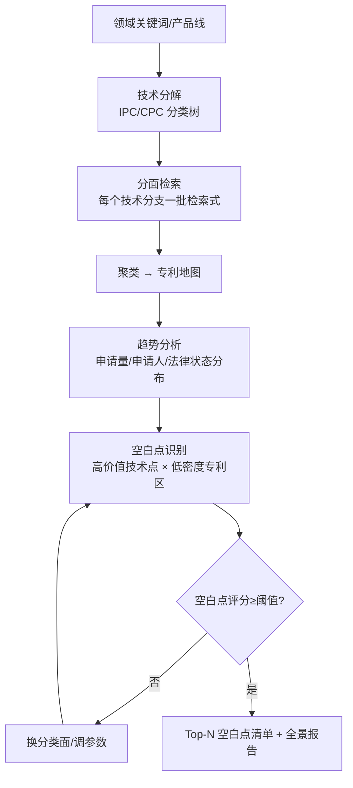
```mermaid
flowchart TD
    A["领域关键词/产品线"] --> B["技术分解<br/>IPC/CPC 分类树"]
    B --> C["分面检索<br/>每个技术分支一批检索式"]
    C --> D["聚类 → 专利地图"]
    D --> E["趋势分析<br/>申请量/申请人/法律状态分布"]
    E --> F["空白点识别<br/>高价值技术点 × 低密度专利区"]
    F --> G{"空白点评分≥阈值?"}
    G -- "否" --> H["换分类面/调参数"] --> F
    G -- "是" --> I["Top-N 空白点清单 + 全景报告"]
```

- **规则层**：空白点评分 = 市场热度 × (1 − 专利密度) × 规避难度；聚类阈值；Top-N 截断
- **行为层**：只做事实分析，每个结论必须挂数据；不下"该不该做"的判断
- **产物层**：全景报告模板（固定章节）、空白点清单 schema（技术点/热度/密度/规避难度/评分）
- **数据层**：IPC/CPC 分类表、行业市场数据源

#### 2. 竞争情报员（F1/F9）· 沙箱：白名单联网

- **职责**：竞对监控与预警
- **输入**：竞对清单 → **输出**：预警（P0/P1/P2）+ 竞对布局分析

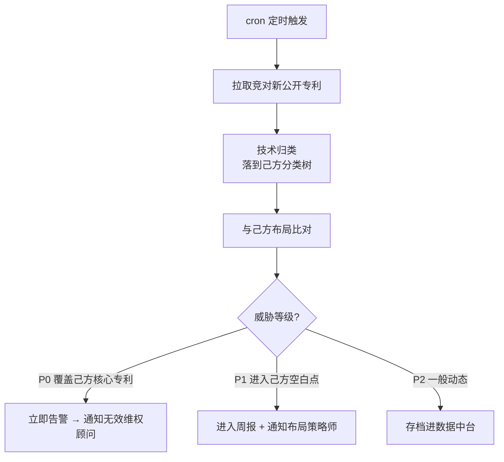
```mermaid
flowchart TD
    A["cron 定时触发"] --> B["拉取竞对新公开专利"]
    B --> C["技术归类<br/>落到己方分类树"]
    C --> D["与己方布局比对"]
    D --> E{"威胁等级?"}
    E -- "P0 覆盖己方核心专利" --> F["立即告警 → 通知无效维权顾问"]
    E -- "P1 进入己方空白点" --> G["进入周报 + 通知布局策略师"]
    E -- "P2 一般动态" --> H["存档进数据中台"]
```

- **规则层**：威胁分级规则（P0/P1/P2 定义）；比对规则代码
- **行为层**：归类时引用己方分类树标准术语；告警内容必须附证据链接
- **产物层**：预警模板、竞对雷达图模板
- **数据层**：竞对清单（配置）、己方分类树

#### 3. 创新教练（F2）· 沙箱：断网

- **职责**：从空白点/痛点产出技术方案
- **输入**：空白点清单 / 业务痛点 → **输出**：技术方案草案（多方案并列）

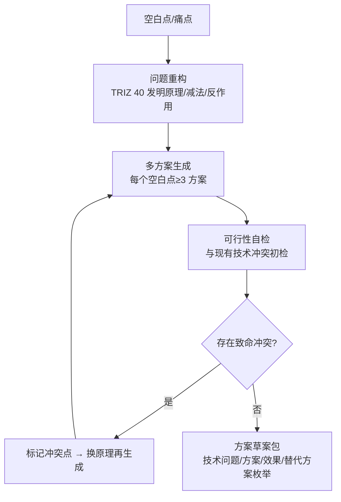
```mermaid
flowchart TD
    A["空白点/痛点"] --> B["问题重构<br/>TRIZ 40 发明原理/减法/反作用"]
    B --> C["多方案生成<br/>每个空白点≥3 方案"]
    C --> D["可行性自检<br/>与现有技术冲突初检"]
    D --> E{"存在致命冲突?"}
    E -- "是" --> F["标记冲突点 → 换原理再生成"] --> C
    E -- "否" --> G["方案草案包<br/>技术问题/方案/效果/替代方案枚举"]
```

- **规则层**：方案必填四要素；自检触发条件（关键词撞车表）
- **行为层**：发散约束——禁止评价方案好坏，只负责产生；每个方案附至少 2 个替代实现
- **产物层**：方案模板（四要素固定结构）
- **数据层**：TRIZ 原理库、本领域现有技术摘要库

#### 4. 专利挖掘师（F2）· 沙箱：白名单联网

- **职责**：从技术方案挖出全部可专利点
- **输入**：方案草案 → **输出**：可专利点清单（每方案 3–5 个保护点）

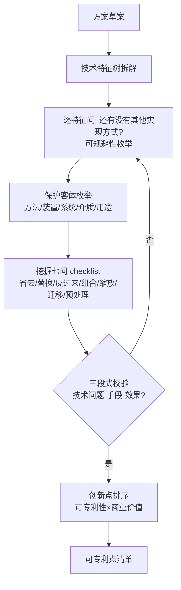
```mermaid
flowchart TD
    A["方案草案"] --> B["技术特征树拆解"]
    B --> C["逐特征问: 还有没有其他实现方式?<br/>可规避性枚举"]
    C --> D["保护客体枚举<br/>方法/装置/系统/介质/用途"]
    D --> E["挖掘七问 checklist<br/>省去/替换/反过来/组合/缩放/迁移/预处理"]
    E --> F{"三段式校验<br/>技术问题-手段-效果?"}
    F -- "否" --> C
    F -- "是" --> G["创新点排序<br/>可专利性×商业价值"]
    G --> H["可专利点清单"]
```

- **规则层**：挖掘七问 checklist（代码强制逐项执行）；三段式 validator
- **行为层**：每个特征至少给出 3 种替代实现才允许进下一步；不遗漏"用途"类保护
- **产物层**：可专利点 schema（技术问题/手段/效果/替代方案/客体类型/排序分）
- **数据层**：可专利性判例库（驳回案例反向教学）

#### 5. 布局策略师（F3）· 沙箱：断网 → 【HITL①】

- **职责**：把可专利点排成棋局
- **输入**：可专利点清单 + 全景图 → **输出**：布局方案（申请路线图）

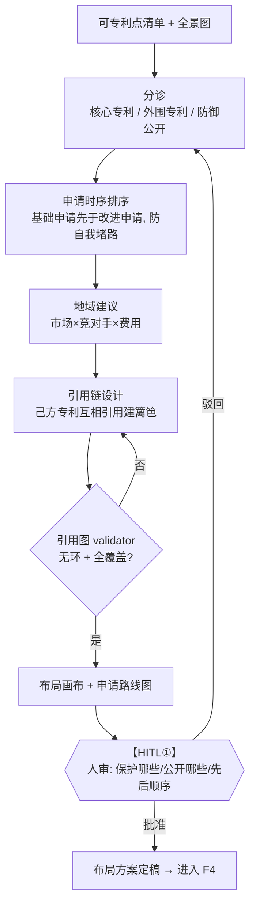
```mermaid
flowchart TD
    A["可专利点清单 + 全景图"] --> B["分诊<br/>核心专利 / 外围专利 / 防御公开"]
    B --> C["申请时序排序<br/>基础申请先于改进申请, 防自我堵路"]
    C --> D["地域建议<br/>市场×竞对手×费用"]
    D --> E["引用链设计<br/>己方专利互相引用建篱笆"]
    E --> F{"引用图 validator<br/>无环 + 全覆盖?"}
    F -- "否" --> E
    F -- "是" --> G["布局画布 + 申请路线图"]
    G --> H{{"【HITL①】<br/>人审: 保护哪些/公开哪些/先后顺序"}}
    H -- "驳回" --> B
    H -- "批准" --> I["布局方案定稿 → 进入 F4"]
```

- **规则层**：引用链 validator（图无环且每个可专利点被覆盖）；公开时点规则（申请日 18 个月前禁止论文/展会公开）
- **行为层**：防御性公开的建议必须说明"断谁的路"；时序建议必须标注冲突风险
- **产物层**：布局画布模板（棋盘图）、申请路线图 schema
- **数据层**：各国申请费用/审查周期表

---

### 阶段二 · 申请中

#### 6. 立项评审（F4）· 沙箱：白名单联网 → 【HITL②】

- **职责**：三轴评分与申请建议
- **输入**：可专利点 + 检索初筛 → **输出**：评分卡

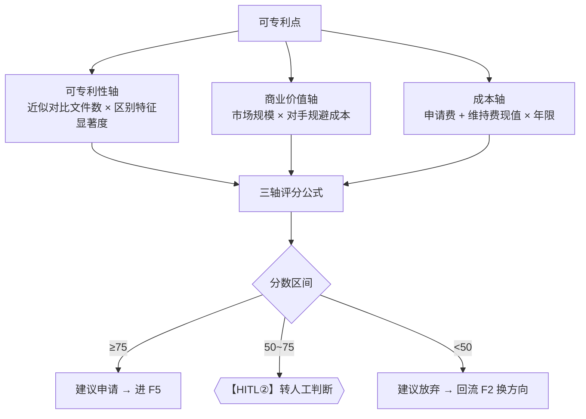
```mermaid
flowchart TD
    A["可专利点"] --> B["可专利性轴<br/>近似对比文件数 × 区别特征显著度"]
    A --> C["商业价值轴<br/>市场规模 × 对手规避成本"]
    A --> D["成本轴<br/>申请费 + 维持费现值 × 年限"]
    B --> E["三轴评分公式"]
    C --> E
    D --> E
    E --> F{"分数区间"}
    F -- "≥75" --> G["建议申请 → 进 F5"]
    F -- "50~75" --> H{{"【HITL②】转人工判断"}}
    F -- "<50" --> I["建议放弃 → 回流 F2 换方向"]
```

- **规则层**：评分公式代码化；阈值常量可配
- **行为层**：每个维度打分必须附证据来源
- **产物层**：评分卡模板（雷达图 + 文字依据）

#### 7. 交底书工程师（F5）· 沙箱：断网 → 【HITL③】

- **职责**：结构化交底书采集
- **输入**：技术方案 + 挖掘结果 → **输出**：交底书.docx

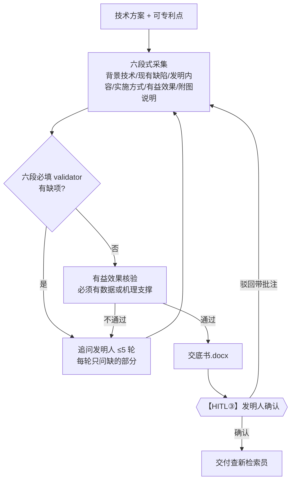
```mermaid
flowchart TD
    A["技术方案 + 可专利点"] --> B["六段式采集<br/>背景技术/现有缺陷/发明内容/实施方式/有益效果/附图说明"]
    B --> C{"六段必填 validator<br/>有缺项?"}
    C -- "是" --> D["追问发明人 ≤5 轮<br/>每轮只问缺的部分"]
    D --> B
    C -- "否" --> E["有益效果核验<br/>必须有数据或机理支撑"]
    E -- "不通过" --> D
    E -- "通过" --> F["交底书.docx"]
    F --> G{{"【HITL③】发明人确认"}}
    G -- "驳回带批注" --> B
    G -- "确认" --> H["交付查新检索员"]
```

- **规则层**：六段必填 validator；效果核验规则
- **行为层**：追问策略——一次只问一个缺项，用工程师语言不用法律语言；发明人说"大概"时要求具体参数
- **产物层**：交底书模板（六段固定结构）
- **数据层**：优质交底书样例库

#### 8. 查新检索员（F5/F6）· 沙箱：白名单联网 → 【HITL④】

- **职责**：支撑申请决策的检索报告
- **输入**：交底书（HITL③ 确认后）→ **输出**：检索报告 + 特征映射表

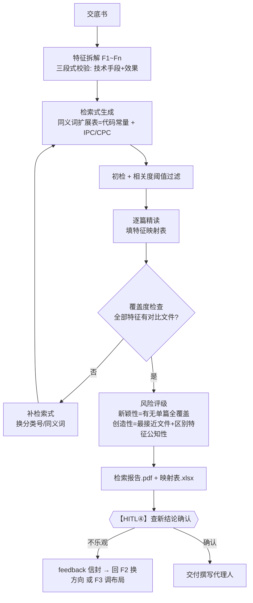
```mermaid
flowchart TD
    A["交底书"] --> B["特征拆解 F1~Fn<br/>三段式校验: 技术手段+效果"]
    B --> C["检索式生成<br/>同义词扩展表=代码常量 + IPC/CPC"]
    C --> D["初检 + 相关度阈值过滤"]
    D --> E["逐篇精读<br/>填特征映射表"]
    E --> F{"覆盖度检查<br/>全部特征有对比文件?"}
    F -- "否" --> G["补检索式<br/>换分类号/同义词"] --> C
    F -- "是" --> H["风险评级<br/>新颖性=有无单篇全覆盖<br/>创造性=最接近文件+区别特征公知性"]
    H --> I["检索报告.pdf + 映射表.xlsx"]
    I --> J{{"【HITL④】查新结论确认"}}
    J -- "不乐观" --> K["feedback 信封 → 回 F2 换方向 或 F3 调布局"]
    J -- "确认" --> L["交付撰写代理人"]
```

- **规则层**：检索式生成器、覆盖度检查、风险评级公式
- **行为层**：映射表逐格引用对比文件页码/段落；评级结论引用公式输出不自由发挥
- **产物层**：检索报告模板、映射表 schema（固定列：特征/对比文件/位置/相关性评级）

#### 9. 撰写代理人（F5/F6）· 沙箱：断网 → 【HITL⑤】

- **职责**：说明书 + 权利要求书
- **输入**：交底书 + 检索报告 → **输出**：申请文件包

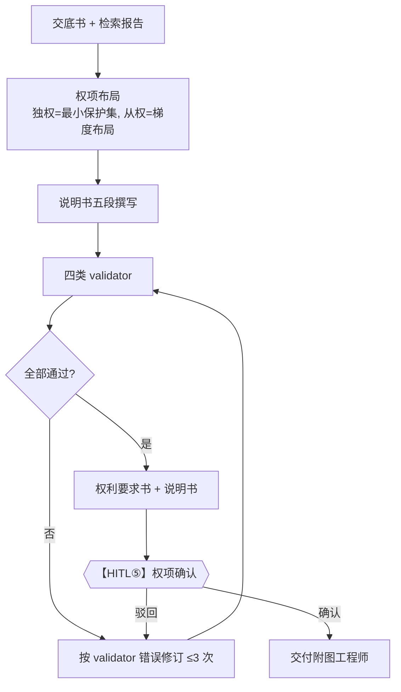
```mermaid
flowchart TD
    A["交底书 + 检索报告"] --> B["权项布局<br/>独权=最小保护集, 从权=梯度布局"]
    B --> C["说明书五段撰写"]
    C --> D["四类 validator"]
    D --> E{"全部通过?"}
    E -- "否" --> F["按 validator 错误修订 ≤3 次"]
    F --> D
    E -- "是" --> G["权利要求书 + 说明书"]
    G --> H{{"【HITL⑤】权项确认"}}
    H -- "驳回" --> F
    H -- "确认" --> I["交付附图工程师"]
```

- **规则层**：四类校验器——引用链完整性 / 支持性（权项术语说明书必有定义）/ 单一性 / 清楚性
- **行为层**：从权梯度策略提示（保护层级设计）；术语首次出现必须定义
- **产物层**：权项模板、说明书五段模板
- **数据层**：**法条库 + 审查指南库打进断网镜像**（撰写环境不出网 = 合规卖点）

#### 10. 附图工程师（F5/F6）· 沙箱：断网

- **职责**：说明书附图
- **输入**：权项 + 说明书 → **输出**：附图集

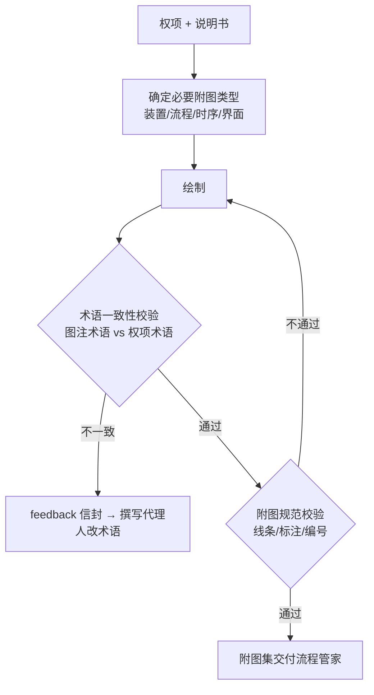
```mermaid
flowchart TD
    A["权项 + 说明书"] --> B["确定必要附图类型<br/>装置/流程/时序/界面"]
    B --> C["绘制"]
    C --> D{"术语一致性校验<br/>图注术语 vs 权项术语"}
    D -- "不一致" --> E["feedback 信封 → 撰写代理人改术语"]
    D -- "通过" --> F{"附图规范校验<br/>线条/标注/编号"}
    F -- "不通过" --> C
    F -- "通过" --> G["附图集交付流程管家"]
```

- **规则层**：专利附图规范检查器；术语一致性比对器
- **行为层**：流程图与权项步骤一一对应，不多画也不少画
- **产物层**：附图编号规范、图注模板

#### 11. 流程管家（F5–F7）· 沙箱：白名单联网

- **职责**：期限台账与递交
- **输入**：各 flow 节点状态 → **输出**：提醒 / 递交包 / 归档

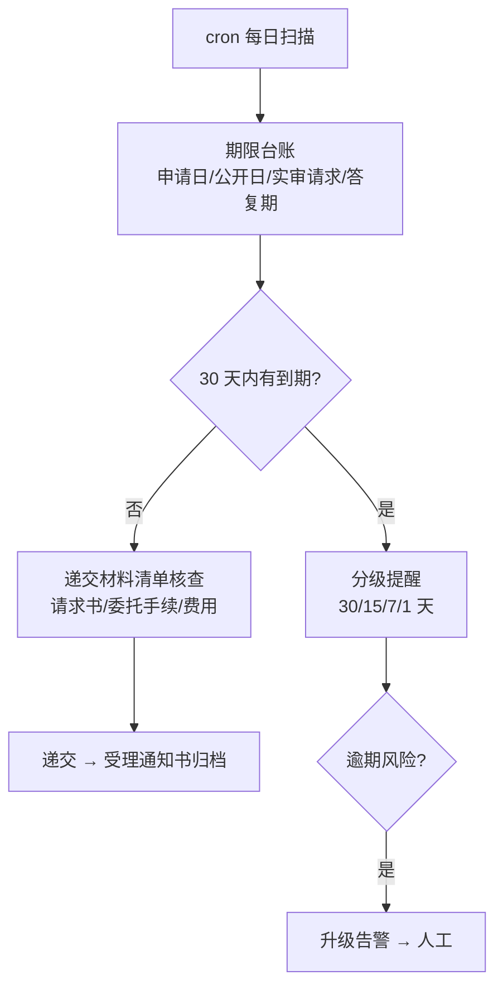
```mermaid
flowchart TD
    A["cron 每日扫描"] --> B["期限台账<br/>申请日/公开日/实审请求/答复期"]
    B --> C{"30 天内有到期?"}
    C -- "是" --> D["分级提醒<br/>30/15/7/1 天"]
    C -- "否" --> E["递交材料清单核查<br/>请求书/委托手续/费用"]
    E --> F["递交 → 受理通知书归档"]
    D --> G{"逾期风险?"}
    G -- "是" --> H["升级告警 → 人工"]
```

- **规则层**：期限表 = 代码常量（法定期限 + 滞纳金规则）；答复期计算器
- **产物层**：台账 schema、提醒模板

#### 12. OA 答复代理（F6）· 沙箱：白名单联网 → 【HITL⑥】

- **职责**：通知书 → 可提交答复
- **输入**：OA 通知书 + 原申请文件 → **输出**：答复包

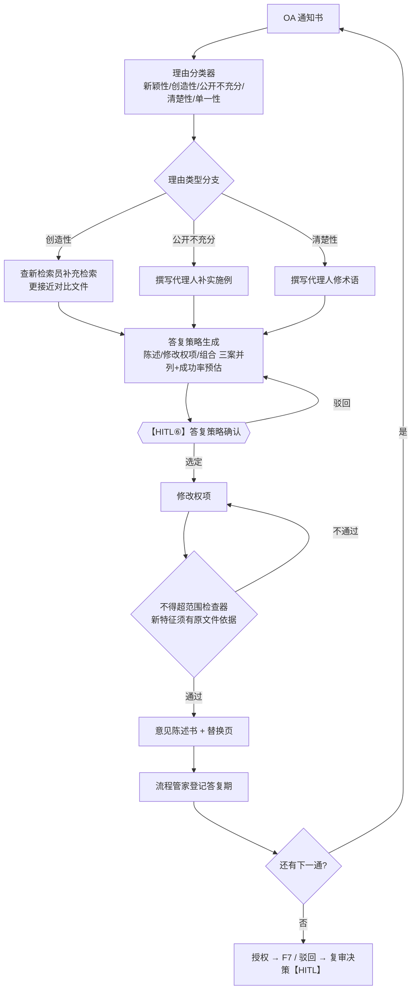
```mermaid
flowchart TD
    A["OA 通知书"] --> B["理由分类器<br/>新颖性/创造性/公开不充分/清楚性/单一性"]
    B --> C{"理由类型分支"}
    C -- "创造性" --> D["查新检索员补充检索<br/>更接近对比文件"]
    C -- "公开不充分" --> E["撰写代理人补实施例"]
    C -- "清楚性" --> F["撰写代理人修术语"]
    D --> G["答复策略生成<br/>陈述/修改权项/组合 三案并列+成功率预估"]
    E --> G
    F --> G
    G --> H{{"【HITL⑥】答复策略确认"}}
    H -- "驳回" --> G
    H -- "选定" --> I["修改权项"]
    I --> J{"不得超范围检查器<br/>新特征须有原文件依据"}
    J -- "不通过" --> I
    J -- "通过" --> K["意见陈述书 + 替换页"]
    K --> L["流程管家登记答复期"]
    L --> M{"还有下一通?"}
    M -- "是" --> A
    M -- "否" --> N["授权 → F7 / 驳回 → 复审决策【HITL】"]
```

- **规则层**：理由分类器（代码关键词 + LLM 兜底）；策略分叉矩阵（理由类型 × 修改幅度 → 推荐动作表）；**不得超范围检查器（代理行业生命线）**
- **行为层**：三案并列时每个方案必须附风险点和成功率预估依据
- **产物层**：答复策略卡模板（人审的正是这张卡）、陈述书模板

---

### 阶段三 · 资产管理

#### 13. 年费管家（F7）· 沙箱：白名单联网 → 【HITL⑦】

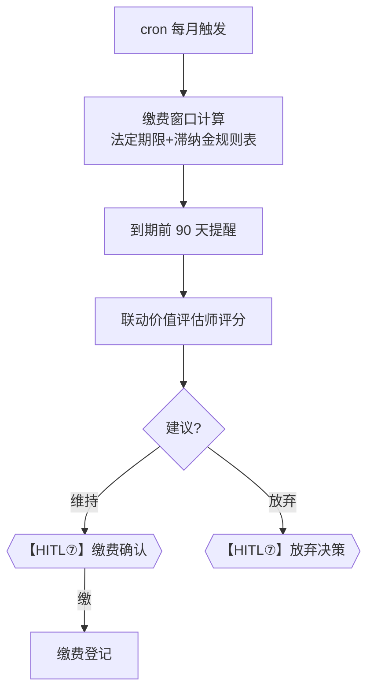
```mermaid
flowchart TD
    A["cron 每月触发"] --> B["缴费窗口计算<br/>法定期限+滞纳金规则表"]
    B --> C["到期前 90 天提醒"]
    C --> D["联动价值评估师评分"]
    D --> E{"建议?"}
    E -- "维持" --> F{{"【HITL⑦】缴费确认"}}
    E -- "放弃" --> G{{"【HITL⑦】放弃决策"}}
    F -- "缴" --> H["缴费登记"]
```

- **规则层**：期限表/滞纳金表 = 代码常量；建议规则（低分专利建议放弃）
- **产物层**：年费台账、提醒模板

#### 14. 价值评估师（F7）

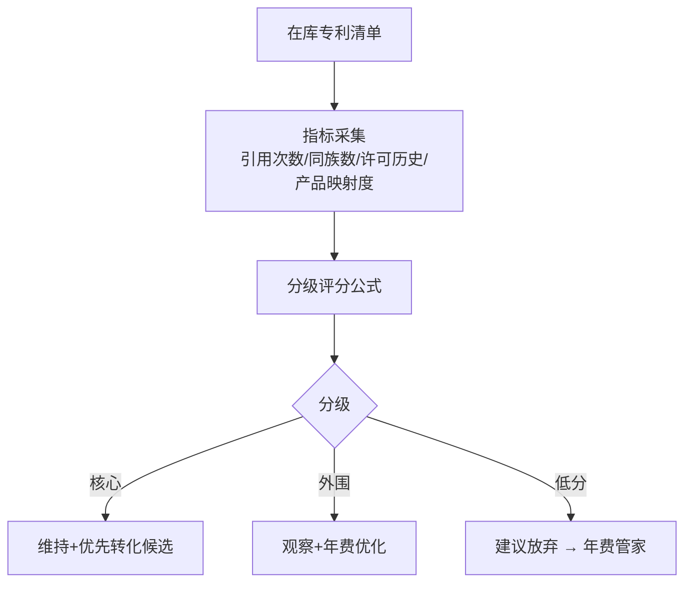
```mermaid
flowchart TD
    A["在库专利清单"] --> B["指标采集<br/>引用次数/同族数/许可历史/产品映射度"]
    B --> C["分级评分公式"]
    C --> D{"分级"}
    D -- "核心" --> E["维持+优先转化候选"]
    D -- "外围" --> F["观察+年费优化"]
    D -- "低分" --> G["建议放弃 → 年费管家"]
```

- **规则层**：分级评分公式；年度自动复评触发
- **产物层**：评分卡模板

#### 15. 转化顾问（F8）· 沙箱：白名单联网 → 【HITL⑧】

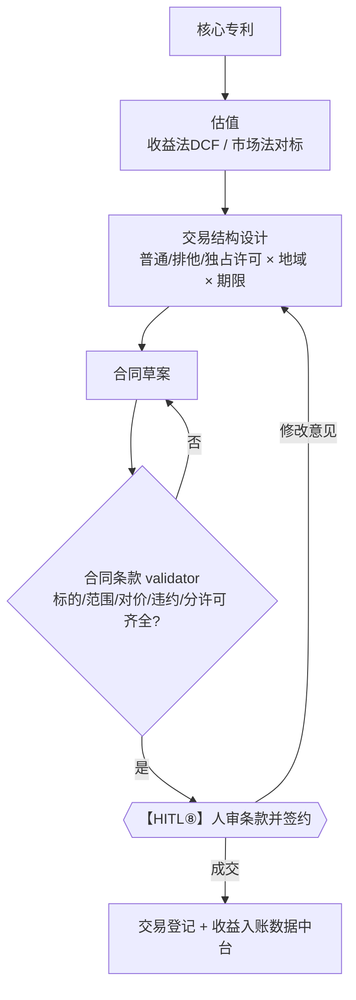
```mermaid
flowchart TD
    A["核心专利"] --> B["估值<br/>收益法DCF / 市场法对标"]
    B --> C["交易结构设计<br/>普通/排他/独占许可 × 地域 × 期限"]
    C --> D["合同草案"]
    D --> E{"合同条款 validator<br/>标的/范围/对价/违约/分许可 齐全?"}
    E -- "否" --> D
    E -- "是" --> F{{"【HITL⑧】人审条款并签约"}}
    F -- "修改意见" --> C
    F -- "成交" --> G["交易登记 + 收益入账数据中台"]
```

- **规则层**：估值公式；合同必备条款 validator
- **产物层**：合同模板库（许可/转让/质押/作价入股四类）

#### 16. 无效维权顾问（F9）· 沙箱：白名单联网

- **职责**：侵权监测与应对；**F9→F3 飞轮发起点**

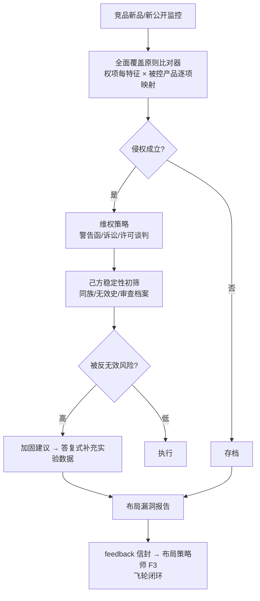
```mermaid
flowchart TD
    A["竞品新品/新公开监控"] --> B["全面覆盖原则比对器<br/>权项每特征 × 被控产品逐项映射"]
    B --> C{"侵权成立?"}
    C -- "是" --> D["维权策略<br/>警告函/诉讼/许可谈判"]
    C -- "否" --> E["存档"]
    D --> F["己方稳定性初筛<br/>同族/无效史/审查档案"]
    F --> G{"被反无效风险?"}
    G -- "高" --> H["加固建议 → 答复式补充实验数据"]
    G -- "低" --> I["执行"]
    H --> J["布局漏洞报告"]
    E --> J
    J --> K["feedback 信封 → 布局策略师 F3<br/>飞轮闭环"]
```

- **规则层**：全面覆盖比对器（逐项映射，缺一不可）；稳定性指标公式
- **产物层**：比对表 schema、布局漏洞报告模板

> ⚠️ 施工前必读：《agent-sandbox-platform-design.md》第 13 章（专利执业合规、技术秘密保护）与第 14 章（本文档全部三方依赖的假设验证清单）。

## 5. 跨 Bot 交互时序与 Loop 索引

> 单 bot 的内循环见 §4 各节点图；本节画**多个 bot 之间的多次交互**（sequence 时序），并给全系统 loop 的总索引。

### 5.1 F5 新申请 · 完整运行 trace（含 4 类 loop）

```mermaid
sequenceDiagram
    autonumber
    participant O as 编排器
    participant D as 交底书工程师
    participant S as 查新检索员
    participant W as 撰写代理人
    participant P as 附图工程师
    participant C as 流程管家
    participant H as 执业代理人(HITL)
    participant E as 兜底工作台

    O->>D: lease 沙箱 · 交底任务
    loop 内循环：六段采集+追问（≤5 轮，一次一项）
        D->>D: 缺项追问 → 六段 validator → 效果核验
    end
    D-->>O: deliver 交底书.docx
    O->>H: HITL③ 交底确认
    alt 驳回带批注
        H-->>O: feedback（批注）
        O->>D: 带批注重跑（HITL 循环）
        D-->>O: 再交付
    else 确认
        H-->>O: approved（执业证号入审计）
    end

    O->>S: handoff（交底书 → 查新任务）
    loop 内循环：覆盖度循环（检索→精读映射表）
        S->>S: 检索式生成 → 初检 → 逐篇精读
        alt 特征 F 无对比文件覆盖
            S->>S: 补检索式 · 同沙箱原地重跑（自修复）
        end
    end
    S-->>O: deliver 检索报告+映射表
    O->>H: HITL④ 查新结论确认
    H-->>O: approved / feedback（不乐观→回流 F2/F3 换方向）

    O->>W: handoff（交底+检索报告 → 撰写任务）
    loop 自修复循环：四类校验（≤3 次，逐条修订非重写）
        W->>W: 引用链/支持性/单一性/清楚性 validator
    end
    alt 自修复超 3 次
        O->>E: escalate（不静默重跑）
    else 通过
        W-->>O: deliver 权项+说明书
    end
    O->>H: HITL⑤ 权项确认
    H-->>O: approved

    O->>P: handoff（权项 → 附图任务）
    alt 图注术语与权项不一致
        P-->>O: feedback（差集清单）
        O->>W: 回流转：改术语（跨 bot 退回）
        W-->>O: 再交付 v2
        O->>P: 恢复附图
    end
    P-->>O: deliver 附图集
    O->>C: handoff（递交包）
    C-->>O: 受理归档 · 全程 handoff/validator/签批已落审计链
```

### 5.2 F6 OA 答复 · N 通循环 trace（含 blocker 红线）

```mermaid
sequenceDiagram
    autonumber
    participant U as 客户/接口人
    participant O as 编排器
    participant A as OA答复代理
    participant R as 查新检索员
    participant W as 撰写代理人
    participant H as 执业代理人(HITL)
    participant E as 兜底工作台

    loop N 通外循环（实务平均 2-3 轮）
        U->>O: 第 N 通审查意见通知书
        O->>A: 拆解通知书
        A->>A: 理由分类器（代码关键词先行，LLM 兜底）
        alt 创造性
            O->>R: 子 Run：补充检索更接近的对比文件
            R-->>O: deliver
        else 公开不充分
            O->>W: 子 Run：补实施例
            W-->>O: deliver
        else 清楚性
            O->>W: 子 Run：修术语
            W-->>O: deliver
        end
        A-->>O: 三策略并列（陈述/修改权项/组合 + 成功率预估）
        O->>H: HITL⑥ 答复策略签批
        alt 含权项修改
            O->>W: 按选定策略修改权项
            W-->>O: 新权项
            O->>O: 不得超范围检查器（字面/等同依据）
            alt 无原始依据 = blocker 红线
                O->>E: 直接 escalate（不自修复）
            else 通过
                O->>H: 答复包签批 → 提交
            end
        else 纯陈述
            O->>H: 陈述书签批 → 提交
        end
    end
    U->>O: 授权 → 转 F7 / 驳回 → 复审决策（HITL）
```

### 5.3 F9→F3 布局飞轮（年度级循环）

```mermaid
sequenceDiagram
    participant W as 无效维权顾问
    participant O as 编排器
    participant L as 布局策略师
    loop 每次维权/无效事件触发
        W->>W: 竞品扫描 → 全面覆盖比对 → 稳定性初筛
        W-->>O: 布局漏洞报告（feedback 信封）
        O->>L: 回流 F3：补局建议（新外围/新防御公开/时序调整）
        L->>L: 引用图 validator → HITL① 布局拍板
        L-->>O: 布局方案 v(n+1) → 驱动新一轮 F4-F8
    end
```

### 5.4 全系统 Loop 索引

| Loop | 发生位置 | 触发 | 上限 | 超限行为 | 图位置 |
|---|---|---|---|---|---|
| 内循环 | bot 内部 | 正常干活（检索/追问/布局） | max_steps 20-30 | 步数熔断 | §4 各节点图 |
| 自修复循环 | bot 内部 | validator 打回 | 3 次 | escalate 兜底台 | §4 / §5.1 |
| HITL 循环 | 步骤间 | 人工驳回带批注 | 人工控制 | — | §5.1 |
| 回流转 | 步骤间 | 下游 feedback（产物不足） | 全局 iterations | 全局熔断 | §1 展开图 / §5.1 / §5.5 |
| N 通外循环 | F6 | 新通知书到达 | 法定程序 | 授权/驳回 | §1 展开图 / §5.2 / §5.5 |
| 超范围红线 | F6 内部 | 修改无原始依据 | 0（blocker） | 直接 escalate | §5.2 |
| 全局熔断 | 整个 Run | iterations≥8 | — | 挂起转人工，绝不静默重跑 | §2 状态机 |
| 布局飞轮 | F9→F3 | 维权/无效事件 | 年度周期 | — | §1 环视图 / §5.3 |

### 5.5 F5 / F6 流程定义图（编排器加载的静态图 · 带环）

> 三个视角的分工：**流程定义图**（本节）= 编排器加载的静态图，环是图的边；**时序图**（§5.1/5.2）= 一次真实运行的 trace，环体现为 loop/alt；**状态机**（§2）= 所有图共用的转移规则。流程图里没有画出来的环，编排器就不会执行。

```mermaid
flowchart LR
    subgraph F5["F5 新申请 · 流程定义（带 4 类环）"]
        D["① 交底书工程师<br/>内循环:追问≤5轮"] -->|deliver| H3{"HITL③<br/>交底确认"}
        H3 -->|"驳回带批注 · HITL环"| D
        H3 -->|确认| S["② 查新检索员<br/>内循环:覆盖度自修复≤3次"]
        S -->|escalate<br/>自修复超限| E1["🚑 兜底工作台"]
        S -->|deliver| H4{"HITL④<br/>查新结论"}
        H4 -->|不乐观| X["回流 F2/F3<br/>换方向/调布局"]
        H4 -->|确认| W["③ 撰写代理人<br/>内循环:四类校验自修复≤3次"]
        W -->|escalate| E1
        W -->|deliver| H5{"HITL⑤<br/>权项确认"}
        H5 -->|驳回| W
        H5 -->|确认| P["④ 附图工程师"]
        P -->|feedback<br/>术语不一致·回流转| W
        P -->|deliver| C["⑤ 流程管家<br/>递交/归档"]
    end
    style H3 fill:#fdf3e2
    style H4 fill:#fdf3e2
    style H5 fill:#fdf3e2
    style E1 fill:#fdeaea
    style X fill:#f3e8ff
```

```mermaid
flowchart LR
    subgraph F6["F6 OA 答复 · 流程定义（带 5 类环）"]
        A["① 理由分类器<br/>代码关键词先行"] -->|"创造性"| R["② 查新检索员<br/>子Run:补充检索"]
        A -->|"公开不充分/<br/>清楚性"| W2["② 撰写代理人<br/>子Run:补实施例/修术语"]
        R -->|deliver| G["③ 三策略生成<br/>陈述/修改/组合+预估"]
        W2 -->|deliver| G
        G -->|deliver| H6{"HITL⑥<br/>答复策略签批"}
        H6 -->|驳回| G
        H6 -->|选定| SC{"④ 不得超范围检查<br/>blocker 红线"}
        SC -->|无原始依据<br/>0次自修复| E2["🚑 兜底工作台<br/>直接 escalate"]
        SC -->|通过| SUB["⑤ 答复包签批→提交"]
        SUB -->|"新一通<br/>N通外循环"| A
        SUB -->|授权| F7["转 F7 授权后管理"]
        SUB -->|驳回| RD["复审决策 HITL"]
    end
    style H6 fill:#fdf3e2
    style SC fill:#fdeaea
    style E2 fill:#fdeaea
```

**与直线图的关键差异**（本轮修正点）：
1. F5 有 4 条环边：HITL③ 驳回→交底、HITL⑤ 驳回→撰写、**附图→撰写 feedback 回边**（跨 bot 回流转的静态表达）、escalate→兜底；
2. F6 有 5 条环边：两个子 Run 汇入点、HITL⑥ 驳回→策略、**提交→理由分类（N 通外循环）**、超范围 blocker→兜底；
3. HITL 节点在流程图中是**显式决策菱形**（琥珀色），不再是步骤之间的隐式停顿——编排器按图转移，不是按顺序硬推。

---

## 6. 汇总：Bot × Flow × 沙箱 × HITL 矩阵

| # | Bot | Flow | 沙箱 egress | HITL |
|---|---|---|---|---|
| 1 | 行业分析师 | F1 | 白名单 | — |
| 2 | 竞争情报员 | F1/F9 | 白名单 | — |
| 3 | 创新教练 | F2 | 断网 | — |
| 4 | 专利挖掘师 | F2 | 白名单 | — |
| 5 | 布局策略师 | F3/F9 | 断网 | ① |
| 6 | 立项评审 | F4 | 白名单 | ② |
| 7 | 交底书工程师 | F5 | 断网 | ③ |
| 8 | 查新检索员 | F5/F6 | 白名单 | ④ |
| 9 | 撰写代理人 | F5/F6 | 断网 | ⑤ |
| 10 | 附图工程师 | F5/F6 | 断网 | — |
| 11 | 流程管家 | F5–F7 | 白名单 | — |
| 12 | OA答复代理 | F6 | 白名单 | ⑥ |
| 13 | 年费管家 | F7 | 白名单 | ⑦ |
| 14 | 价值评估师 | F7 | 白名单 | — |
| 15 | 转化顾问 | F8 | 白名单 | ⑧ |
| 16 | 无效维权顾问 | F9 | 白名单 | — |

**断网组（撰写/交底/附图/创新/布局）= 生成类，法条库与模板打进镜像；白名单组 = 检索/数据类。**
