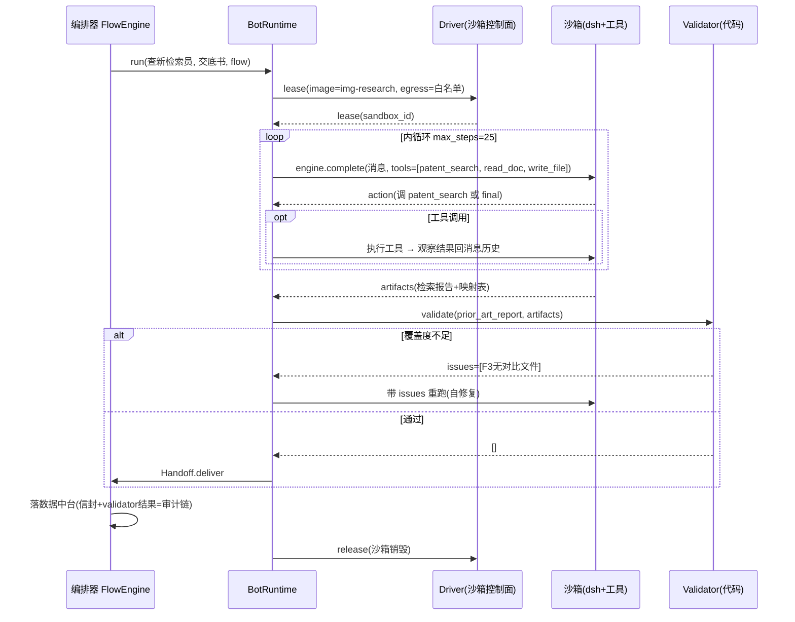

> **正式稿见** [../domain-packs/patent-pack-impl.md](../domain-packs/patent-pack-impl.md)。本文为讨论源稿，保留备查。

# 专利领域包 · 实现文档

> 配套：《patent-domain-pack-design.md》（业务逻辑与流程图）
> 本文回答一个问题：**每个节点在代码层面怎么跑起来**——运行时、循环驱动、校验器、编排器、逐节点装配。

---

## 0. 代码结构

```
patent-pack/
├── runtime/                    # 通用运行时（16 个节点共用）
│   ├── bot_runtime.py          # Bot 内循环驱动
│   ├── validators.py           # Validator 框架
│   ├── tools.py                # 工具注册表
│   └── handoff.py              # 信封序列化
├── orchestrator/
│   ├── flow_engine.py          # 状态机执行器
│   └── hitl.py                 # 挂起/恢复/审批
├── bots/                       # 每节点 = 装配配置（YAML）
│   ├── industry_analyst.yaml
│   ├── competitor_watch.yaml
│   ├── ...（共 16 个）
├── rules/                      # 规则层代码（裁判）
│   ├── prior_art.py            # 覆盖度/风险评级
│   ├── claim_drafting.py       # 四类校验器
│   ├── disclosure.py           # 六段校验
│   ├── layout_graph.py         # 引用图校验
│   ├── oa_response.py          # 理由分类器/超范围检查
│   ├── valuation.py            # 立项/年费/转化评分
│   └── enforcement.py          # 全面覆盖比对
├── prompts/                    # 行为层（每节点一个 .md）
├── templates/                  # 产物层（docx/xlsx 模板）
└── kb/                         # 数据层（法条库/TRIZ/判例，打进断网镜像）
```

## 1. 统一运行时：Bot 内循环怎么驱动

```python
# runtime/bot_runtime.py
@dataclass
class BotSpec:
    name: str
    image: str                    # 沙箱镜像（含 harness: dsh）
    egress: list[str]             # 白名单 or []
    tools: list[str]              # 本 bot 可调工具
    output_spec: str              # 产物契约名
    max_steps: int = 20           # 内循环上限
    max_retries: int = 3          # 自修复上限

class BotRuntime:
    def __init__(self, driver, registry, prompts):
        self.driver, self.registry, self.prompts = driver, registry, prompts

    async def run(self, spec: BotSpec, task_ctx: dict, flow_id: str) -> Handoff:
        lease = await self.driver.lease(flow_id, spec.image, spec.egress)
        try:
            artifacts, errors = None, None
            for attempt in range(spec.max_retries):
                # 第 2 次起：把 validator 错误作为 feedback 注入任务
                ctx = self._inject_feedback(task_ctx, errors)
                artifacts = await self._loop(spec, ctx, lease)   # 内循环
                errors = validate(spec.output_spec, artifacts)    # 代码裁判
                if not errors:
                    return Handoff.deliver(spec, artifacts, lease.audit())
            # 超限：不自爆，交给编排器转人工
            return Handoff.escalate(spec, artifacts, errors)
        finally:
            await self.driver.release(lease)

    async def _loop(self, spec, ctx, lease):
        msgs = [{"role": "system", "content": self.prompts.load(spec.name)},
                {"role": "user",   "content": ctx}]
        for step in range(spec.max_steps):
            act = await self.engine.complete(msgs, tools=spec.tools)   # dsh/harness
            if act.type == "final":
                return act.artifacts
            obs = await self.registry.call(act.tool, act.args, lease)  # 工具在沙箱内执行
            msgs += [act.as_message(), obs.as_message()]
        raise BudgetExceeded(f"{spec.name} 超 {spec.max_steps} 步")
```

**16 个节点共用这个 runtime，差异全部外置**——这就是"每个节点怎么实现"的第一层答案：实现一次，装配 16 次。

## 2. 一次完整执行的时序（以查新检索员为例）



## 3. Validator 框架（代码裁判的统一形态）

```python
# runtime/validators.py
@dataclass
class Issue:
    code: str          # 如 "COVERAGE_F3_MISSING"
    message: str       # 给 bot 重跑用的具体指令（不是给人看的）
    blocker: bool = True

def validate(spec_name: str, artifacts: Artifacts) -> list[Issue]:
    return REGISTRY[spec_name](artifacts)   # 每个 output_spec 注册一组校验函数

# 示例：交底书六段校验（rules/disclosure.py）
SECTIONS = ["背景技术", "现有技术缺陷", "发明内容", "具体实施方式", "有益效果", "附图说明"]

def check_disclosure(art) -> list[Issue]:
    doc = read_docx(art["交底书.docx"])
    issues = [Issue("MISSING_SECTION", f"缺少章节「{s}」，请补写后再交付")
              for s in SECTIONS if s not in doc.headings]
    # 效果必须有数据或机理支撑
    if "有益效果" in doc and not re.search(r"(\d+(\.\d+)?%|提高|降低|缩短|实验证明|机理)", doc["有益效果"]):
        issues.append(Issue("EFFECT_NO_EVIDENCE",
                            "有益效果只有定性描述，请补充数据或机理论证"))
    return issues
```

## 4. 编排器：状态机 + HITL 挂起恢复

```python
# orchestrator/flow_engine.py
class FlowEngine:
    def __init__(self, flows, runtime, store):
        self.flows, self.runtime, self.store = flows, runtime, store

    async def advance(self, run_id: str, trigger: Trigger):
        st = self.store.load(run_id)
        if trigger.type == "feedback":            # 下游退回
            st.goto(trigger.target_step)
        elif trigger.type == "hitl_approved":     # 人工批准
            st.goto_next()
        elif trigger.type == "hitl_rejected":     # 带批注重跑
            st.retry(trigger.comment)
        elif trigger.type == "validator_escalate":# 自修复超限
            st.suspend(reason="validator_failed_max_retries")
        if st.iterations > st.max_iterations:
            return st.fail("全局熔断：迭代超限")
        spec = self.flows.step_spec(st.current_step)
        handoff = await self.runtime.run(spec, st.task_ctx, run_id)
        if handoff.needs_human:                   # 本步含 HITL
            token = await self.runtime.driver.pause(handoff.lease)
            return st.suspend(hitl=handoff.artifacts, resume_token=token)
        self.store.append_audit(run_id, handoff)  # 审计链
        return self.advance(run_id, Trigger.deliver(handoff))

# orchestrator/hitl.py —— 人工界面与沙箱挂起的桥
async def resume_after_approval(run_id, decision: Approval):
    st = store.load(run_id)
    if decision.approved:
        lease = await driver.resume(st.resume_token)     # 沙箱原地唤醒
        return engine.advance(run_id, Trigger.hitl_approved)
    # 驳回：批注注入原 bot 任务，重跑
    return engine.advance(run_id, Trigger.hitl_rejected(decision.comment))
```

---

## 5. 16 个节点的实现（装配 + 规则代码 + prompt 要点）

### 原型 A：检索类（内循环 = 检索→精读→覆盖度检查）

共用 runtime 配置模式，差异 = 工具集 + validator + prompt。

**1. 行业分析师** `bots/industry_analyst.yaml`

```yaml
name: 行业分析师
image: img-research
egress: [专利库, 市场数据源]
tools: [patent_search, cluster_analysis, chart_render, write_file]
output_spec: landscape_report
max_steps: 30
```

```python
# rules/landscape.py —— 空白点评分（规则层核心）
def gap_score(heat: float, density: float, workaround_cost: float) -> float:
    return round(heat * (1 - density) * min(workaround_cost, 5), 2)

def check_landscape(art):
    df = read_xlsx(art["空白点清单.xlsx"])
    # 强制列：技术点/市场热度/专利密度/规避难度/评分
    missing = {"技术点","市场热度","专利密度","规避难度","评分"} - set(df.columns)
    if missing: return [Issue("SCHEMA", f"清单缺列 {missing}")]
    # 每行评分必须等于公式重算值（防 LLM 编造数字）
    bad = [i for i,r in df.iterrows()
           if abs(r["评分"] - gap_score(r["市场热度"], r["专利密度"], r["规避难度"])) > 0.01]
    return [Issue("SCORE_MISMATCH", f"第{bad}行评分与公式不符，用公式重算")] if bad else []
```

prompt 要点：`每个结论必须挂证据（专利号/数据年份）；禁止出现"建议立项"等越权判断；空白点按公式评分后排序输出`。

**2. 竞争情报员** `bots/competitor_watch.yaml`

```yaml
name: 竞争情报员
trigger: cron(每日 06:00)        # 与对话类节点唯一差异：事件源是定时器
tools: [patent_search, compare_layout, notify]
output_spec: watch_alert
```

```python
# rules/watch.py —— P0/P1/P2 分级（纯代码）
def threat_level(new_patent, own_core_claims, own_gaps):
    if claim_overlap(new_patent, own_core_claims) > 0.8: return "P0"
    if tech_branch(new_patent) in own_gaps:              return "P1"
    return "P2"
# P0 → 直接创建"无效维权顾问"的 Run（编排器收到 AlertEvent 触发 F9）
```

**8. 查新检索员** `bots/prior_art_searcher.yaml`

```yaml
name: 查新检索员
tools: [patent_search, read_doc, write_file]
output_spec: prior_art_report
max_steps: 25
```

```python
# rules/prior_art.py
def check_coverage(mapped, features):        # 覆盖度=自修复触发器
    return [Issue("COVERAGE_MISSING",
                  f"特征{f}无对比文件覆盖：请扩展同义词或换IPC分类号重检")
            for f in features if f not in mapped]

def risk_rating(documents, features):        # 风险评级=纯公式
    full = [d for d in documents if covers(d, features)]
    novelty = "高" if full else "中" if len(documents)>10 else "低"
    closest = min(documents, key=lambda d: distance(d, features))
    distinguishing = set(features) - set(closest.mapped)
    inventive = "高" if distinguishing <= COMMON_KNOWLEDGE else "中" if distinguishing else "低"
    return {"新颖性风险": novelty, "创造性风险": inventive, "最接近文件": closest.id}
```

prompt 要点：`映射表每格必须引用对比文件的具体段落号；无覆盖的特征不要硬填，留空让 validator 打回；评级只调用 risk_rating 工具输出，不自由发挥`。

**12. OA 答复代理** `bots/oa_responder.yaml`（检索+生成混合，实现最重的节点）

```python
# rules/oa_response.py
REASON_PATTERNS = {                       # 分类器：代码先行
    "创造性":   ["突出的实质性特点", "显著的进步", "结合对比"],
    "新颖性":   ["不具备新颖性", "单独对比"],
    "公开不充分": ["本领域技术人员不能实现", "公开不充分"],
    "清楚性":   ["不清楚", "得不到说明书的支持"],
}

def classify_rejection(oa_text) -> str:   # 关键词命中→直接定类；不命中→LLM兜底
    for reason, pats in REASON_PATTERNS.items():
        if any(p in oa_text for p in pats): return reason
    return llm_classify(oa_text)          # 兜底

def beyond_original_scope(new_claims, original_text) -> list[Issue]:
    # 超范围检查器：新权项每个特征必须在原申请文件有字面或等同依据
    issues = []
    for claim in new_claims:
        for feature in claim.features:
            if not (literal_match(feature, original_text)
                    or equivalent_match(feature, original_text)):   # 等同特征表=代码常量
                issues.append(Issue("BEYOND_SCOPE",
                    f"权项{claim.no}特征「{feature}」无原始依据，修改超范围，禁止提交"))
    return issues     # blocker=True：红线错误不给自修复，直接 escalate 人工
```

```yaml
# 流程层分支用编排器实现，不在 prompt 里
on_classify: 创造性 → 调用 查新检索员(补充检索)      # 子 Run
             公开不充分 → 调用 撰写代理人(补实施例)   # 子 Run
             清楚性 → 调用 撰写代理人(修术语)
then: 生成三策略并列 → HITL⑥ → beyond_original_scope 通过才允许成稿
```

### 原型 B：生成类（内循环 = 起草→validator 自修复）

**7. 交底书工程师**：校验器见 §3 的 `check_disclosure`；prompt 要点：`一次只追问一个缺失段落；用工程师语言；追问上限 5 轮，之后如实标注"待发明人补充"并交付（不硬编）`。

**9. 撰写代理人** `rules/claim_drafting.py`

```python
VALIDATORS = [check_citation_chain, check_support, check_unity, check_clarity]

def check_citation_chain(claims) -> list[Issue]:
    # 引用链完整性：从权引用必须指向已存在的权项，无悬空引用
    ids = {c.no for c in claims}
    return [Issue("DANGLING_REF", f"权项{c.no}引用权项{r}不存在")
            for c in claims for r in c.refs if r not in ids]

def check_support(claims, spec_text) -> list[Issue]:
    # 支持性：权项术语必须在说明书有定义位置
    return [Issue("NO_SUPPORT", f"权项{c.no}术语「{t}」说明书无定义")
            for c in claims for t in c.terms if t not in spec_text.index]
```

prompt 要点：`先布局权项层级再写说明书；首次出现的术语必须定义；validator 返回的错误逐条修改，不得整篇重写（保住已过检部分）`。

**10. 附图工程师**：`check_drawing` 校验器 = 附图规范规则 + 术语一致性比对（图注术语集合 ⊆ 权项术语集合，差集报 Issue，触发 feedback 信封回撰写代理人）。

**3. 创新教练 / 5. 布局策略师**（断网，纯 prompt+KB 驱动）：

```yaml
# bots/innovation_coach.yaml
name: 创新教练
image: img-ideation          # 镜像内含 TRIZ 库 kb/
egress: []                   # 断网
tools: [kb_query, write_file]
output_spec: idea_package
```

```python
# rules/ideation.py —— 四要素 schema 校验
REQUIRED = ["技术问题", "技术方案", "有益效果", "替代方案"]
def check_idea_package(art):
    ideas = read_yaml(art["方案包.yaml"])
    return [Issue("IDEA_INCOMPLETE",
                  f"方案{i}缺要素{e}，每方案必须四要素齐全且替代方案≥2个")
            for i, idea in enumerate(ideas)
            for e in REQUIRED if e not in idea]
```

布局策略师独有 `rules/layout_graph.py`：引用链有向图无环 + 全覆盖（networkx 五行代码），见设计文档。

### 原型 C：评分类（规则层为主，LLM 只做证据抽取）

**6. 立项评审 / 13. 年费管家 / 14. 价值评估师 / 15. 转化顾问**

```python
# rules/valuation.py —— 评分公式统一代码化
def project_score(prior_art_count, distinction, market, workaround_cost, cost_npv):
    patentability = max(0, 10 - prior_art_count) * distinction
    value = market * workaround_cost
    return round(0.4*patentability + 0.4*value + 0.2*(100-cost_npv), 1)

def annuity_advice(grade, cost):
    return "维持" if grade == "核心" else ("观察" if grade == "外围" else "建议放弃")
```

```yaml
# bots/project_review.yaml —— 这类节点 LLM 只做"找证据"
tools: [patent_search, extract_evidence, scoring_formula]   # scoring_formula 是代码工具，LLM 只能调用不能改
output_spec: review_scorecard
```

**设计要点**：评分公式注册成**工具**而非 prompt——LLM 收集证据后调用 `scoring_formula(证据)`，数字从代码出，LLM 无法编造分数。

### 原型 D：比对类（逐特征映射，validator 即业务核心）

**16. 无效维权顾问** `rules/enforcement.py`

```python
def literal_infringement_map(claim_features, accused_product) -> MapTable:
    # 全面覆盖原则：逐项映射，无 LLM 自由裁量
    return [{ "特征": f,
              "产品对应": find(f, accused_product) or None,   # 找不到=None
              "依据": evidence }
            for f in claim_features]

def check_infringement(map_table) -> str:
    missing = [m for m in map_table if m["产品对应"] is None]
    return "不侵权(缺特征)" if missing else "疑似侵权(全面覆盖成立)"
# 输出即比对表 schema → 人工律师复核（F9 的隐含 HITL）
```

---

> ⚠️ 施工前必读：《agent-sandbox-platform-design.md》第 13 章（专利执业合规、技术秘密保护）与第 14 章（本文档全部三方依赖的假设验证清单）。

## 6. 实现工作量分布（便于排期）

| 原型 | 节点 | 新增代码量 | 说明 |
|---|---|---|---|
| A 检索类 | 1/2/8/12 | runtime 已覆盖，每节点 ~100 行 validator + 1 个 YAML | 8 号先行（F5 主链路） |
| B 生成类 | 3/5/7/9/10 | 校验器较厚（引用链/支持性/六段），每节点 150–300 行 | 9 号撰写代理人是 validator 最重的 |
| C 评分类 | 6/13/14/15 | 公式集中在 valuation.py，每节点 <50 行 | 最快，半天一个 |
| D 比对类 | 16 | 比对器 ~200 行 | 依赖特征结构化质量 |

**统一运行时 + 编排器 ≈ 一周**；16 节点按 A→B→C→D 顺序接入，每个节点"YAML + validator + prompt"三件套齐备即算完成，验收标准 = 设计文档里那张内循环 mermaid 能全自动走完（HITL 点按预期挂起）。
