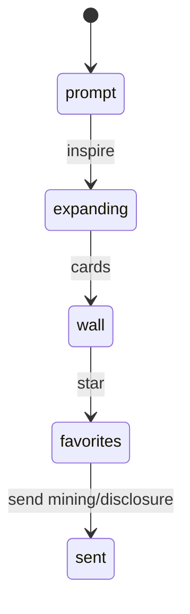

# 创新激发 · deep-demo

## 1. 闭环

| # | 行为 |
|---|------|
| 1 | 输入技术点并激发出 ≥6 卡 |
| 2 | 收藏 ≥2 张 |
| 3 | 送挖掘或送交底产生事件 |
| 4 | 「再来一批」更换卡片集合（非同一数组原地改字即可） |

## 2. 扩召实现（诚实）

- 词表/模板槽位填充即可（如「将 {技术点} 用于 {领域种子}」）。  
- `backend: 'mock'`；耗时可用短 delay。

## 3. 非目标

真 LLM、写库、APP_PORTS、改 mining 业务码（仅深链）。

## 4. 验收

- [ ] 四步可点  
- [ ] 无真模型请求  
- [ ] 送出仅占位  
- [ ] 横幅含「无真 LLM」  
