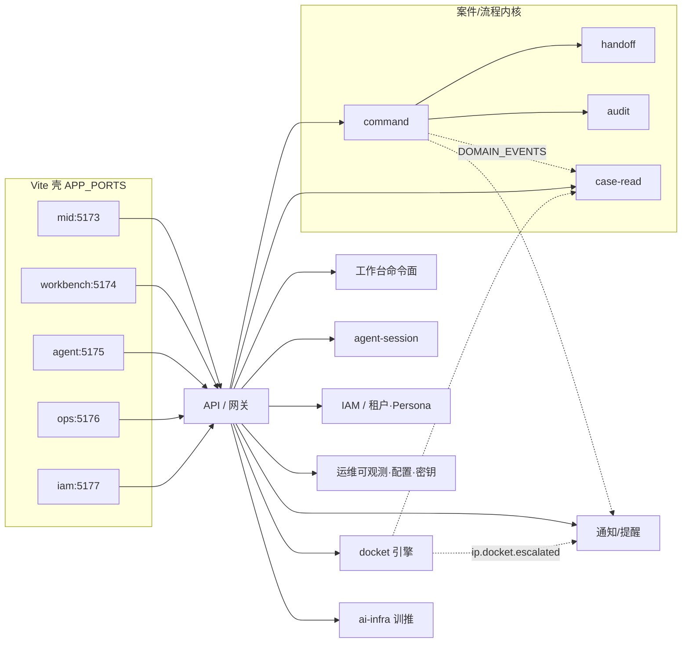

# 落地后端切分与数据归属

> **样机诚实**：今日只有 `apps/api-mock`（Node `http` 内存）+ 浏览器 `dispatchCommandLocal`；`DOMAIN_EVENTS` 是契约常量，**无 bus**。  
> **落地目标**：按领域切服务面（或一期模块边界），明确数据归属与同步/异步；壳继续做 BFF 消费者，**不**把 mid/workbench/agent 壳升级成微服务。  
> 服务候选清单与事件表见上级 [../backends.md](../backends.md)；本篇不复制掏空，只写**落地切分**。

## 1. 上下文（落地目标）

一期可把上图各方框落成 **同一 monorepo 内 `services/` 模块或进程**（见 [stack.md](./stack.md)、[../repos-and-vcs.md](../repos-and-vcs.md)），不是强制 Day-1 微服务网格。

## 2. 服务面一览

| 落地服务名 | 覆盖面 | 一期形态建议 |
|------------|--------|----------------|
| `case-core` | 案件/流程内核：case + command + handoff + audit | **必做**；可单体模块组 |
| `workbench-command` | 工作台命令面（流程进度 / 表单命令编排） | 可先并入 `case-core`，边界保留 |
| `agent-session` | Agent / HITL 会话与闸状态 | MVP 可内存→Postgres；写办案仍走 command |
| `iam` | 租户 · Persona · 会话声明 | MVP 起 OIDC；禁假 SSO |
| `ops-platform` | 可观测 · 配置 · 密钥 | 配置/密钥先做；真可观测跟 OTel |
| `notify` | 通知 / 提醒出站 | MVP 最小通道；不持有 `PatentCase` |
| `docket` | 期限 Docket 引擎 | MVP 调度器 + 升级命令；可先挂 `case-core` |
| `ai-infra` | 训推基建：GPU/调度/训练/批推/在线推理/发布 | **与 ops-platform 分家**；样机无真 GPU；见 [../ai-infra/](../ai-infra/README.md) |

对齐现仓概念：`DomainCommand` / `COMMAND_LABELS`、`DOMAIN_EVENTS`、`APP_PORTS`（`packages/contracts`）。服务面在原七面之上 **增 `ai-infra`**（训推；≠ ops）。

---

## 3. 各服务：职责 · 数据归属 · 同步/异步 · 样机 vs 落地

### 3.1 `case-core` — 案件/流程内核（case + command + handoff + audit）

| | |
|--|--|
| **职责** | 唯一写入口 `POST /v1/commands/dispatch`；跑 `@ip/domain` 的 `evaluateGuardrails` / `canPerformHandoff`；维护案聚合与交接状态机；追加审计；投影案读模型 |
| **数据归属** | **写**：Case 聚合（handoffs、engagement 闸相关字段）、Command 执行记录；**读投影**：`CaseSummary` / 完整案 DTO；**审计**：`AuditEntry`（单一写日志，强制 `AUDIT_SCHEMA_VERSION`） |
| **同步/异步** | 办理命令 **同步** 应答 `CommandResult`；审计同步落库 + 异步发 `ip.audit.appended` / `ip.command.dispatched`；投影订阅异步 |
| **对齐现仓** | `DomainCommand` · `dispatchCommand` · `HandoffState` / `TRANSITIONS` · `AuditEntry` · `DOMAIN_EVENTS.command*` / `handoffChanged` / `auditAppended` |
| **样机诚实** | 执法在浏览器 `dispatchCommandLocal`；api-mock 只轻改瘦字段、不跑 guardrails；壳 `auditLog` ≠ mock `auditLog` |
| **落地目标** | HTTP 为唯一写；删除成功后再 local 镜像；`GET /v1/audit`；完整 DTO 替换「CaseSummary 按 id merge」 |

handoff / audit 一期**建议并入** `case-core` 模块，边界用包或目录切开，避免过早拆库。

### 3.2 `workbench-command` — 工作台命令面

| | |
|--|--|
| **职责** | 工作台 Flow / 阶段办理的命令编排与案级 `flowProgress` 读模型；表单提交仍落到 `DomainCommand` |
| **数据归属** | `flowProgressByCase`（今日在 `AppContext`）；**不**另起一套命令名；不持有独立交接真相（handoff 属 `case-core`） |
| **同步/异步** | 用户点击办理 → **同步** dispatch；进度条刷新可同步 GET 或订阅 `ip.handoff.changed` |
| **对齐现仓** | workbench `:5174` · Flow / stages · `commandForHandoffAction` · `@ip/contracts` `CommandName` |
| **样机诚实** | Flow 进度仅浏览器内存；跨口靠 cookie / bridge，非共享后端 |
| **落地目标** | 进度进读模型；编排层可薄 BFF，**禁止**双份 `CommandName`；可与 `case-core` 同进程 |

### 3.3 `agent-session` — Agent / HITL 会话

| | |
|--|--|
| **职责** | 保存 `AgentSession`、HITL 闸（`clearedHitlGates`）、试运行 vs 正式执行分界；正式/HITL 确认后 **只**调 command |
| **数据归属** | 会话与闸状态；**不**拥有 Case 写权；Catalog 元数据可配置表或静态 |
| **同步/异步** | 会话 CRUD 同步；正式执行同步调 `case-core`；失败发 `ip.command.failed` 供 ops/notify |
| **对齐现仓** | `AGENT_CATALOG` · HITL ConfirmBar · `dispatchCommand(actor:'agent')` · `caseContextBuilt` |
| **样机诚实** | 会话在浏览器内存；试运行不写库；**无真 LLM**（见 HARNESS「不做的事」） |
| **落地目标** | 会话持久化；仍禁止把 LLM 当办案写通道；写办案唯一走 command |

### 3.4 `iam` — 租户 · Persona

| | |
|--|--|
| **职责** | 身份会话、租户绑定、Persona 声明下发；办案服务只收已验证声明 |
| **数据归属** | 用户/租户/角色/Persona 映射；**不**存 `PatentCase` |
| **同步/异步** | 登录/换 Persona **同步**；广播 `ip.persona.changed` 异步刷新各壳可见性 / Inbox |
| **对齐现仓** | `PersonaId` · workspace cookie · iam 薄壳 `:5177` · `APP_PORTS.iam` |
| **样机诚实** | cookie 跨口；**非真 SSO**；iam 壳空态占位 |
| **落地目标** | OIDC（或企业 IdP）；服务端强制 `ownerEnterpriseId` 等租户隔离；禁把 cookie Persona 当生产鉴权 |

### 3.5 `ops-platform` — 运维可观测 · 配置 · 密钥

| | |
|--|--|
| **职责** | 运行配置、密钥/凭证保险库引用、健康与指标暴露；ops 壳只读深链办案、不持案 |
| **数据归属** | 配置项、密钥引用（非明文进 Git）、告警规则元数据；SLA 聚合读模型（可订阅事件） |
| **同步/异步** | 配置读写同步；指标/日志异步采集（OTel）；告警判定可异步 |
| **对齐现仓** | ops `:5176` · [../ops-observability.md](../ops-observability.md) · `/config#alerts` 样机 |
| **样机诚实** | mock 数字/表格；试发 sessionStorage；**不接**真 ELK / Prometheus / Sentry / SMTP |
| **落地目标** | OpenTelemetry + 可私有化后端；密钥走保险库；仍**不**让 ops 持有 `PatentCase` |

### 3.5b `ai-infra` — 训推基建（≠ ops-platform）

| | |
|--|--|
| **职责** | GPU 资源与任务调度、训练/批量推理/在线推理环境与容器、性能与压测、模型发布与训-评-部署迭代标准 |
| **数据归属** | 集群/队列/作业/模型注册/端点发布元数据；**禁止** `PatentCase` / handoff / 办案 audit |
| **同步/异步** | 训练/批推 **异步** Job；在线推理经**模型网关**同步调用；发布门禁同步+切流异步 |
| **对齐现仓** | 今日仅 ops 内模型/infra **mock**；无真 GPU/K8s |
| **样机诚实** | 无集群；产品面建议并行壳 `apps/ai-infra:5179`（不改 APP_PORTS） |
| **落地目标** | 与 ops-platform 分平面；agent-session 只走网关消费已发布端点；详见 [../ai-infra/README.md](../ai-infra/README.md) |

### 3.6 `notify` — 通知 / 提醒

| | |
|--|--|
| **职责** | 出站通道（邮件/企微/Webhook 等）与用户提醒投递；订阅领域事件，不办案 |
| **数据归属** | 订阅规则、投递日志、用户提醒收件箱（轻量）；**禁止**存完整 `PatentCase` |
| **同步/异步** | **异步**消费 `ip.command.failed` / `ip.docket.escalated` / `ip.handoff.changed` 等；管理 API 同步 |
| **对齐现仓** | ops 通知样机 · mid Inbox · 详见 [reminders-notify.md](./reminders-notify.md) |
| **样机诚实** | 无真通道、无调度器；Inbox 部分为纯函数/双轨 mock |
| **落地目标** | 最小真通道 + 投递日志；与 `docket` 调度解耦 |

### 3.7 `docket` — 期限 Docket 引擎

| | |
|--|--|
| **职责** | 期限事件存储、到期扫描/升级、完成；发 `ip.docket.escalated` |
| **数据归属** | `DocketEvent` 及升级历史；案 id 外键；**不**替代 case 聚合写 |
| **同步/异步** | `docketEscalate` / `docketComplete` 命令可同步；**到期扫描必须异步调度** |
| **对齐现仓** | `DomainCommand` 已含 `docketEscalate` / `docketComplete` · `DOMAIN_EVENTS.docketEscalated` |
| **样机诚实** | 浏览器委托 `escalateDocketEvent`；无 cron / 无队列；mock 最多改 handoffNote |
| **落地目标** | 调度器（Redis/队列或 DB job）+ 命令路径；不接真官网爬取 |

---

## 4. 与上级 backends 的关系

| 上级候选（../backends.md） | 本篇落地名 | 说明 |
|----------------------------|------------|------|
| command / case-read / handoff / audit | `case-core` | 落地合并为一核，目录仍可拆 |
| inbox | 读侧属 `case-core`；提醒投递属 `notify` | 双轨合并见 reminders |
| docket | `docket` | 可同进程异模块 |
| billing | （本篇未单列） | 仍可先挂 `case-core`；事件 `ip.billing.holdChanged` |
| iam | `iam` | |
| agent-session | `agent-session` | |
| notify | `notify` | |
| （工作台编排） | `workbench-command` | 落地显式边界，非新命令体系 |
| （ops 配置观测） | `ops-platform` | 与 notify 分离：配置/密钥 ≠ 出站 |
| （训推基建） | `ai-infra` | **≠ ops-platform**；无 PatentCase；网关供 agent-session |

## 5. 相关链接

- [stack.md](./stack.md) · [roadmap.md](./roadmap.md) · [reminders-notify.md](./reminders-notify.md)
- [../backends.md](../backends.md) · [../data-flow.md](../data-flow.md) · [../data-model.md](../data-model.md)
- 契约：`packages/contracts/src/events.ts` · `commands.ts` · `ports.ts`
- [../../../apps/api-mock/README.md](../../../apps/api-mock/README.md)
