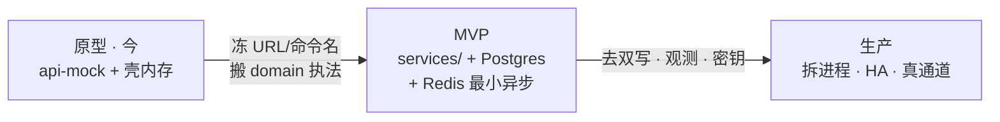

# 原型 → MVP → 生产 路线图

> **样机诚实**：当前可演示的是 harness + `api-mock`；无真库、无唯一写、无总线、无调度器、无真通道。  
> **落地目标**：三阶段可执行路径——从 `api-mock` + `@ip/contracts` + `@ip/domain` **长出**后端；先冻 URL/命令名，再换实现。

## 1. 阶段总览

| 阶段 | 用户可感知 | 后端真相 | 明确没有 |
|------|------------|----------|----------|
| **原型** | 多壳联调、命令可点、mock 读写开关 | 内存 store + 浏览器执法 | 真库 / SSO / SMTP / 调度 |
| **MVP** | 重启不丢案；提醒最小可用；登录真会话 | `case-core` 唯一写 + PG；Redis 任务 | 全量微服务网格、真 LLM |
| **生产** | SLA、审计导出、私有化部署包 | HA、对象存储、OTel、出站多通道 | 壳内业务 handler |

---

## 2. 原型（现状 · 保持诚实）

**已有资产（只链）：**

- 契约：`DomainCommand` / `COMMAND_LABELS` / `DOMAIN_EVENTS` / `APP_PORTS`
- 执法纯模块：`@ip/domain`（`evaluateGuardrails` / `canPerformHandoff` / docket helpers）
- HTTP 样机：[api-mock README](../../../apps/api-mock/README.md) — `/health` · `/v1/cases` · `/v1/cases/:id` · `/v1/inbox` · `POST /v1/commands/dispatch`
- 壳：`@ip/api` 优先 + fallback 内存；跨口 cookie / mid bridge

**本阶段只做：** 冻合同、补文档裂缝登记、e2e L0/L1 守住端口行为。  
**本阶段不做：** 假装已拆微服务；接真 SMTP；改 `apps/ops` 业务页预埋假后端。

---

## 3. MVP（从样机长出来）

### 3.1 怎么长

1. 在 monorepo 建 `services/case-core`（TypeScript），**依赖 workspace** `@ip/contracts` + `@ip/domain`（执法原样搬，不重写规则语言）。  
2. 实现与 api-mock **相同路径**的 HTTP；feature flag：壳指向新服务 URL（仍可经 `APP_DEV_URLS.api` 演进）。  
3. Postgres：Case 聚合 + Audit 追加；去掉「仅 API 有的 id 跳过」——改为完整 DTO 或明确 mapper。  
4. 命令成功后 **停止** 依赖 `dispatchCommandLocal` 作真相（可短暂只读缓存，不可再当写）。  
5. Redis：`docket` 到期扫描 + `notify` 出站队列（见 [reminders-notify.md](./reminders-notify.md)）。  
6. OIDC 最小：iam 壳接 IdP；办案 API 验 JWT/声明。  
7. `GET /v1/audit?caseId=` 暴露；废弃双份 auditLog。

### 3.2 MVP 范围切刀

| 必做 | 可缓 | 禁止 |
|------|------|------|
| `case-core` 唯一写 + PG | 独立 `docket` 进程（可同进程模块） | 真 LLM 办案写 |
| 审计单源 + GET | 全通道短信 | 改命令名字串「图个好看」 |
| Redis 调度最小提醒 | Kafka | 掏空 contracts 另起事件名 |
| OIDC 登录回路 | 多区域 | 把 api-mock 对外称生产 |

### 3.3 验收（可执行）

- 杀进程重启后 cases/audit 仍在。  
- 关写开关时行为与文档一致；开写时壳与 DB 一致（无长期双真相）。  
- 人为插入到期 docket → 扫描任务 → 出现提醒或 `ip.docket.escalated` 消费痕迹。  
- 无 token 调 dispatch → 401/403（不再靠 Persona cookie 冒充）。

---

## 4. 生产

- 按 [backends.md](./backends.md) 需要拆 `notify` / `docket` / `iam` 进程；库可仍逻辑分 schema。  
- 对象存储承载证据包；密钥进保险库（ops-platform）。  
- OTel 全路径；ops 壳接**真**只读指标（去掉「非 live」假数字或明确分区）。  
- 多通道出站 + 投递重试/死信；私有化安装文档与备份演练。  
- 前端：删除成功路径上的业务 handler；bridge 仅作遗留深链兼容直至废弃。

---

## 5. 风险与冻结项

### 5.1 必须冻结（破坏兼容 = 全壳+ e2e 同 PR）

| 冻结项 | 权威位置 | 说明 |
|--------|----------|------|
| URL | api-mock / 未来 gateway | `POST /v1/commands/dispatch` · `GET /v1/cases` · `GET /v1/cases/:id` · `GET /v1/inbox` · `GET /health` |
| 命令名 | `CommandName` / `DomainCommand['type']` | 含已对齐的 `docketEscalate` / `docketComplete`；不另起第三份名单 |
| 事件名 | `DOMAIN_EVENTS` | 如 `ip.command.dispatched`；无 bus 也先冻字符串 |
| 端口常量 | `APP_PORTS` | 开发口；生产用网关主机名，常量勿 silently 改含义 |

新增命令/事件：**先改 `@ip/contracts`**，再实现。

### 5.2 主要风险

| 风险 | 缓解 |
|------|------|
| 长期「HTTP 成功 + local 镜像」双真相 | MVP 明确切换日；flag 默认新写 |
| mock 建案 `c-mock-*` 读路径跳过 | 完整 DTO / 建案进库可查询 |
| 无调度器导致「提醒不行」 | Redis/DB job 进 MVP 必做（见 reminders） |
| 过早拆多仓 | 一期同仓 `services/`（[../repos-and-vcs.md](../repos-and-vcs.md)） |
| Persona cookie 残留当鉴权 | OIDC 后服务端拒绝未验证请求 |
| 改 ops 页预埋假后端 | 纪律：配置/通知走服务，不改业务页装真 |

### 5.3 已知裂缝（登记 · 落地时修）

见 [../README.md](../README.md)「已知文档裂缝」：双份 auditLog、mock 新建案跳过等——MVP 应用实现消掉，而非再写一层文档假装已好。

## 6. 相关链接

- [backends.md](./backends.md) · [stack.md](./stack.md) · [reminders-notify.md](./reminders-notify.md)
- [../backends.md](../backends.md) §7 迁移路径 · [../data-flow.md](../data-flow.md)
- [../../COMMANDS.md](../../COMMANDS.md) · [../../HARNESS.md](../../HARNESS.md)
