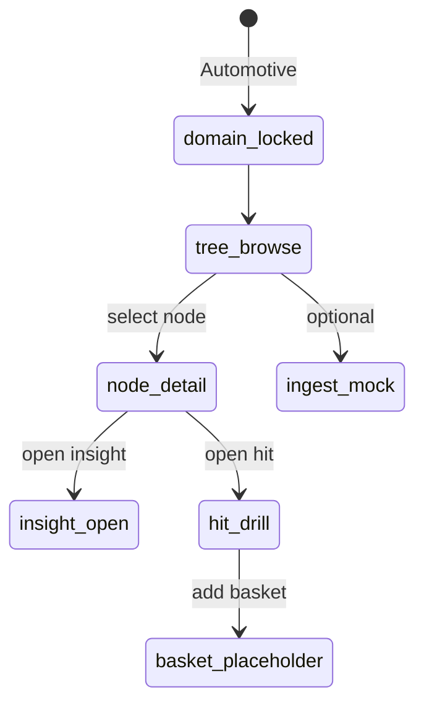

# 产业全景 · deep-demo（W5 最小闭环）

> **样机诚实**：全内存；汽车种子。  
> **波次**：实现排 **W5**；本规格可先评审。

## 1. 必须可点

| # | 验收项（对齐主计划 §4.5） |
|---|--------------------------|
| 1 | 选域「汽车」→ 展开 **≥3 层**树（如 整车→动力系统→电驱动…） |
| 2 | 点节点 → 相关企业列表（含地位标签）+ 专利布局示意 + 竞品对照 |
| 3 | **卡脖子 / 围剿 / 前沿** 三类洞察卡（种子文案可点） |
| 4 | 下钻假 Hit（search 形状）→ 可进工作篮**占位** |
| 5 | 横幅：种子域 · 无全球实时产业库 |

## 2. 状态机（示意）

## 3. 种子数据最低量

- Taxonomy 节点 ≥ 12（含 3 层路径）。  
- 企业 ≥ 12 张卡，挂到不同节点。  
- 预置边：零件→企业、企业→竞品、节点→洞察 ≥ 各 5。  
- Hit ≥ 6，字段对齐 search `SearchHit`。

## 4. 非目标

真全行业库、真图数据库、真持续爬取、改 APP_PORTS、写 case-core、把图谱塞进 ai-data。
