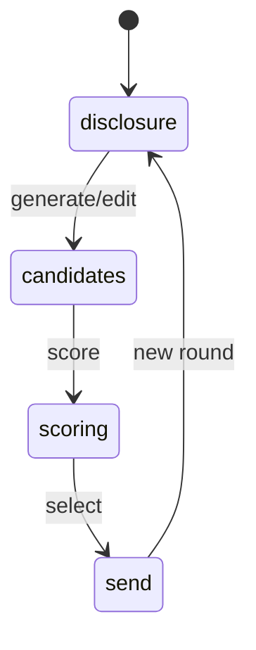

# 专利挖掘 · deep-demo

## 1. 必须闭环

| # | 行为 | 状态 |
|---|------|------|
| 1 | 编辑并保存交底 | `disclosure` |
| 2 | 生成/编辑候选发明点 | `candidates[]` |
| 3 | 打分并排序 | `scores` |
| 4 | 送立项或送撰写 | `intents[]` 事件；**不**写库 |

门禁：无候选 → 不能送出；送出必须写事件（内存）。

## 2. Search Hit

- 形状对齐 search `SearchHit` 子集。  
- 种子 ≥ 3 条可挂到候选「相关公开」字段。  
- 不依赖跨端口 localStorage。

## 3. 非目标

真引擎、真建案、APP_PORTS、改五壳、塞 ai-data。

## 4. 验收

- [ ] 四步可点通  
- [ ] 送出仅占位事件，无 DomainCommand  
- [ ] 横幅含「不写立案库」或等价诚实句  
- [ ] 可展示至少一条关联 Hit（种子）  
