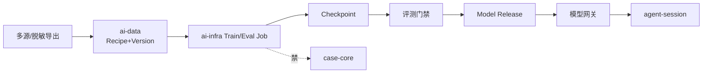

# 训练拓扑（ai-data ↔ ai-infra）

| 契约 | 说明 |
|------|------|
| 数据集 | `datasetId` + `version` + `manifest` checksum |
| 配方 | `recipeId`：配比、过滤、采样种子 |
| Job | `train.pretrain` / `train.sft` / `train.dpo` / `eval.*`（名可再冻） |
| 发布 | 仅门禁通过的 revision 可挂网关 |
