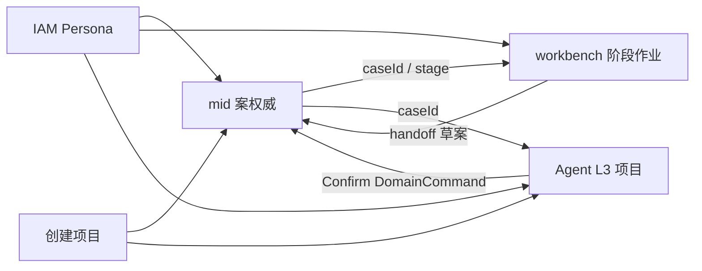

# 跨面项目串接（中台 · 工作台 · Agent · IAM）

> **冻结**：专利全链路**不够**；要从**创建项目**串起 **中台 + SaaS 工作台 + Agent（+IAM）**。  
> **禁止默认**：从专利专家席**中间截入**当主路径（勿一进来就丢进 `expert-draft`/`expert-oa`）。  
> **样机诚实**：mock `caseId` / 深链 / Confirm→DomainCommand 示意；禁真 case-core / 真 SSO。  
> **对齐**：[agent-l3-patent](./agent-l3-patent.md) · [agent-case-binding](./agent-case-binding.md) · [mid](./mid.md) · [workbench](./workbench.md) · [iam](./iam.md) · [cross-cutting](./cross-cutting.md)。

## 1. 主路径（从创建项目起）

```text
IAM（身份/租户/Persona）
    ↓ 已登录（样机可跳过真 OIDC）
【创建项目】← 权威起点（中台或 Agent「专利项目」入口皆可，见 §3）
    ↓ 得到 projectId + 可选 caseId（可后绑）
中台 mid          —— 案权威列表 / 阶段总览 / 队列
SaaS 工作台       —— 按 stage 做人工作业（交底/撰稿/…）
Agent L3 项目     —— 固定专家队协作（确认后写库示意）
```

一句话：**先有项目（与可选案），再进各面干活**；专家席是项目内能力，不是跨面入口。

## 2. 各面职责

| 面 | 端口 | 管什么 | 不管什么 |
|----|------|--------|----------|
| **IAM** | :5177 | 登录态、租户、Persona；各壳读同一会话声明 | 不持案、不跑专家剧本 |
| **中台 mid** | :5173 | **案权威**：队列、阶段分布、handoff 状态总览；建案/绑案入口之一 | 不做 Grok 多 bot；不替代工作台编辑器 |
| **工作台 workbench** | :5174 | **人工作业**：按 stage/flow 填工件、交底入口、阶段模块 | 不焊死 Agent 专家侧栏 |
| **Agent（L3 项目）** | :5175 `/agent/projects` | **专家队**：拆派/检索/交底/撰稿/附图/FTO/递交/OA；Confirm→命令示意 | **不**当案库权威；**不**跳中台验收 |

## 3. 入口（并列可达 · 同一项目对象）

| 用户意图 | 推荐入口 | 之后 |
|----------|----------|------|
| 「我要开一个专利项目」 | Agent 顶栏「专利项目」或 mid「新建项目/案」 | 写入同一 `projectId`（+ 可选 `caseId`） |
| 「看全公司案子」 | mid 作业总览 | 点进案 → 深链工作台阶段或 Agent 项目 |
| 「我在写这一阶段」 | workbench 对应 stage | 需要 AI 协助 → 深链 Agent 同 `caseId` 项目 |
| 「换身份/租户」 | iam | 回各壳；Persona 影响可见命令/闸 |

**废止主路径**：冷启动直接进某个专利专家 bot，再倒推建项目。

## 4. Handoff / 共享对象

| 对象 | 权威落点 | 各面怎么用 |
|------|----------|------------|
| `projectId` | 项目夹（Agent）↔ mid 项目/案关联（样机可同 id 或映射表） | 所有面带同一项目上下文 |
| `caseId` | **mid / case-core**（样机 mock） | 可空开；区内创建或绑定（[agent-case-binding](./agent-case-binding.md)） |
| Handoff 工件 | mid + contracts `HandoffArtifactKey` | 工作台编辑；Agent Confirm 后提案写；mid 展示状态 |
| DomainCommand | 唯一写入口 | 任一壳写库形状一致；禁壳直写库 |
| Persona | IAM | mid/workbench/agent 只读声明 |



## 5. 推荐用户故事（样机可点）

```text
1. IAM：选 Persona（或种子已登）
2. 创建项目（Agent「专利项目」或 mid 新建）→ 得 projectId；case 可稍后绑
3. mid：看见该项目/案出现在队列（mock）
4. workbench：从 mid 深链进当前 stage，做人工作业
5. Agent：同项目打开专家队；总控拆派 → 专家产出 → Confirm → 壳内写库示意
6. mid：handoff 状态更新示意（内存/api-mock）
```

截短验收至少：`创建项目 → mid 可见 → Agent 项目可进 → 一条 Confirm 示意`。  
**不要**把「打开 expert-oa」当成步骤 1。

## 6. 与 L3 专家链关系

- [agent-l3-patent](./agent-l3-patent.md) = **项目内**专家花名册与剧本。  
- **本文** = 项目如何挂上 mid / workbench / IAM。  
- 专家链路演示须挂在**已创建项目**下，且宜从总控/检索等**链路前端**开始，而非默认 OA/递交截入。

## 7. 不做

- 真 SSO / 真 case-core  
- Agent 可点跳 mid 当验收（映射+命令示意即可）  
- 在 L1/L2 焊死专利花名册  
- 无项目上下文的「裸专家」当跨面主入口  

## 8. Owner

规格：架构设计 · 实现：各面 Owner 按边界改本壳 · B 席可后扫  
