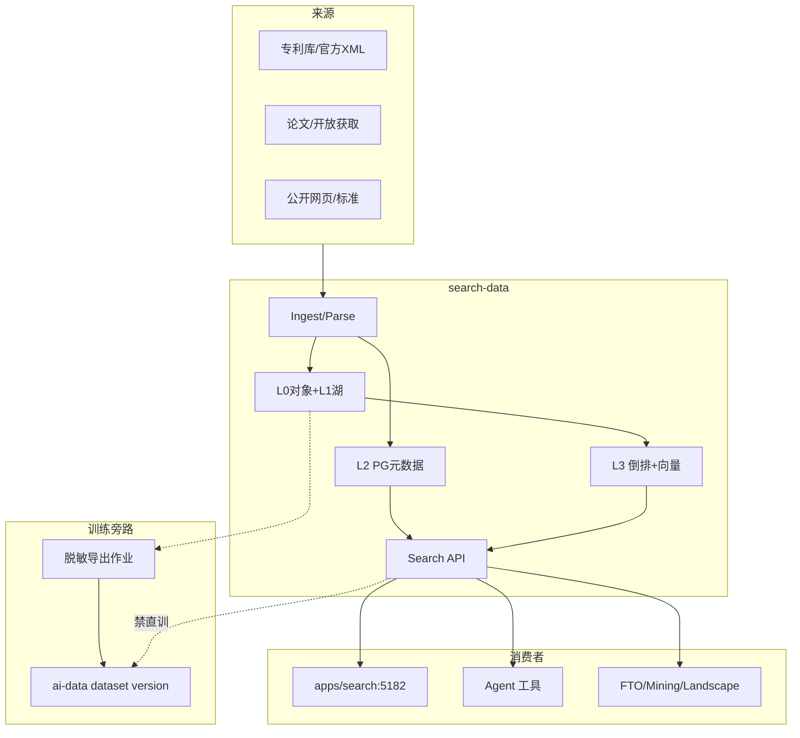

# 检索数据面 · 拓扑

> **样机**：无真箭头。  
> **落地**：唯一 Search API；训练导出走旁路作业。

## 1. 上下文

## 2. 边界表

| 邻居 | 允许 | 禁止 |
|------|------|------|
| **apps/search** | 经 Search API；契约对齐 `SearchQuery`/`Hit` | 浏览器直连 ES |
| **Agent** | 同 API；`backend` 字段诚实 | 另一套 Hit schema |
| **ai-data** | 经**导出作业**产训练候选 | 混桶、查询路径旁路进湖当训练集 |
| **case-core** | 无；办案脱敏另管道 | PatentCase 当检索主存 |
| **landscape/FTO/mining** | 读 Hit / family | 写索引 |

## 3. 同步语义

| 路径 | 模式 |
|------|------|
| 入库/增量索引 | 异步 Job |
| 查询 | 同步；超时 partial |
| 训练导出 | 异步；审计「谁导出了什么范围」 |
