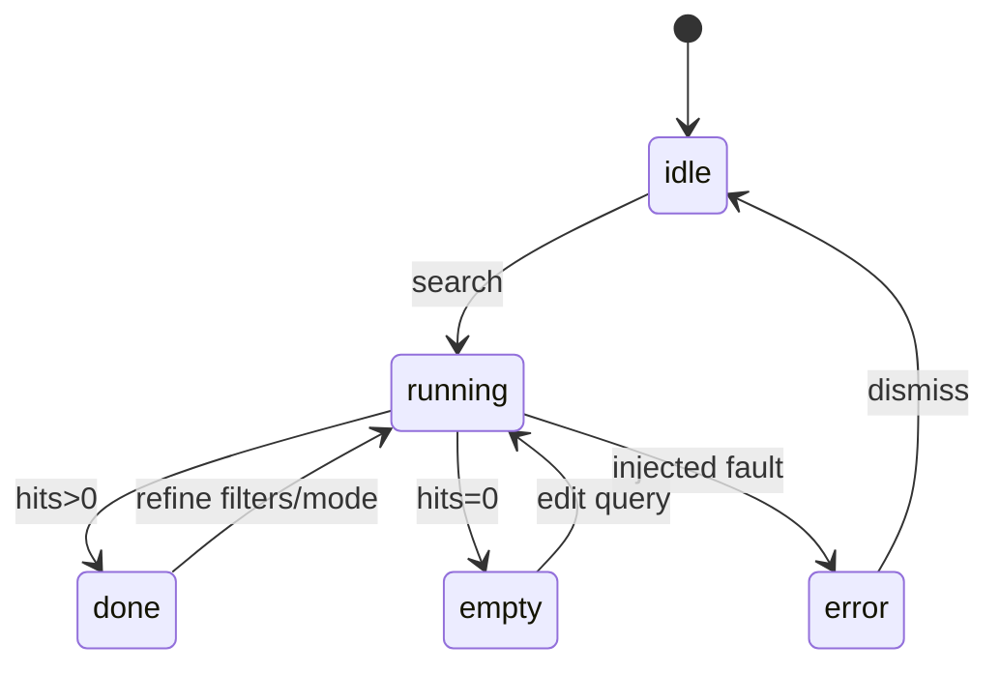

# Search · 样机深业务（deep-demo）

> **样机诚实**：全内存；可 setTimeout 假延迟；无真后台。  
> **目标**：可点闭环，而非空表单。

## 1. 必须做出的闭环

| # | 行为 | 状态机 |
|---|------|--------|
| 1 | 三模式任一切换后点检索 | `idle` → `running` → `done` \| `empty` \| `error` |
| 2 | 改过滤后自动或手动「应用」重跑 | 同上一行；`filters` 写入当前 Query |
| 3 | 同族折叠 / 展开成员 | UI 态；不改 hits 源数据 |
| 4 | 点命中开详情抽屉 | `selectedHitId` |
| 5 | 高级模式字段行增删 | 草稿态；检索时编成 `advanced` |
| 6 | （可选）收藏夹 | 仅内存列表；**不**写 case |
| 7 | Agent 面板或「复制为工具参数」 | 把当前 `SearchQuery` JSON 露出，证明同形状 |

## 2. 查询状态机

## 3. 种子数据

- ≥ 12 条假 `SearchHit`，含 ≥ 2 个 `FamilyGroup`。  
- 语义模式：对 text 做简单 token 重叠打分即可。  
- 关键词：支持示意 `AND`/`OR` 拆词。  

## 4. 非目标

真库、真同族、改 `APP_PORTS`、改 ai-data、写 PatentCase。

## 5. 验收

- [ ] 三模式都能出结果或诚实空态  
- [ ] 过滤改变结果集  
- [ ] 同族可展开  
- [ ] `SearchResponse.backend === 'mock'` 可见  
- [ ] 横幅文案含「无真检索后台」  
