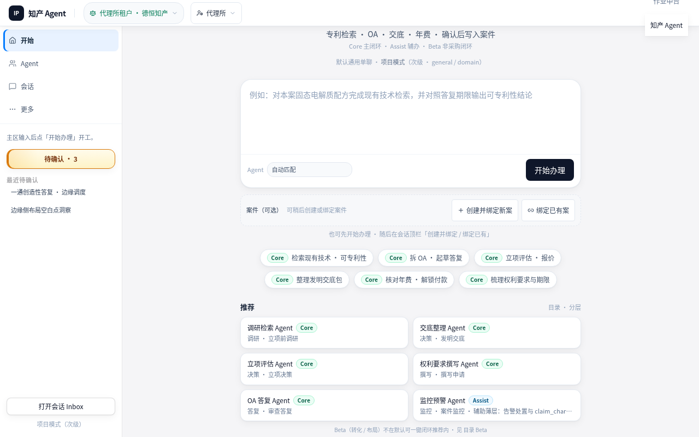
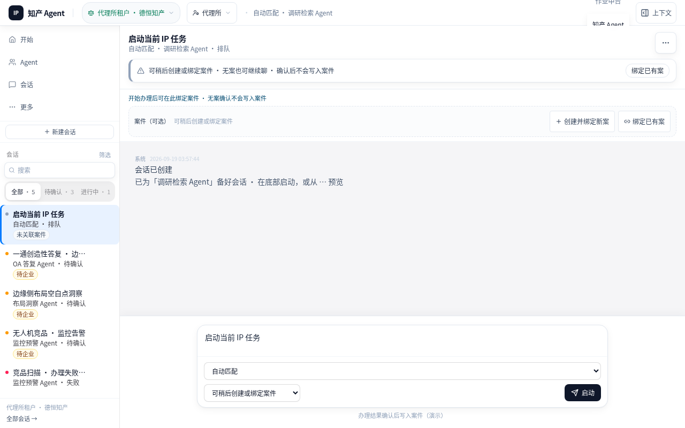
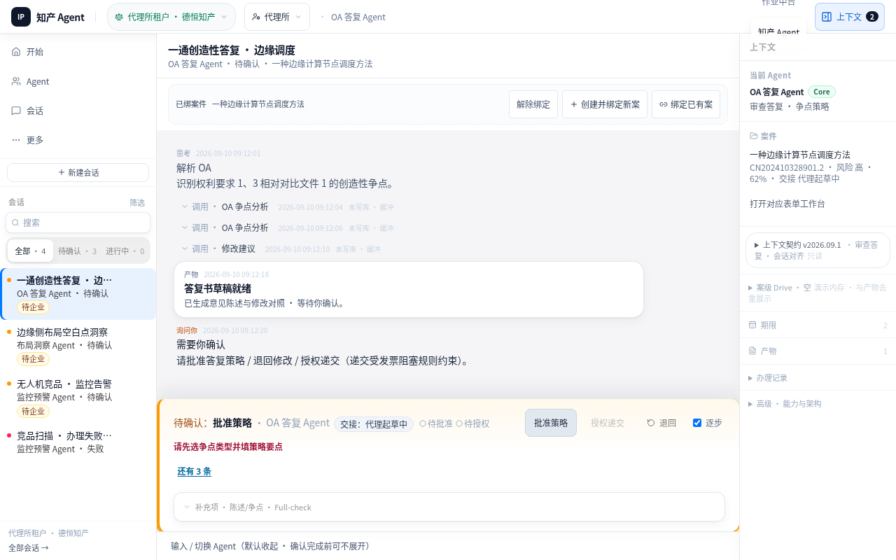
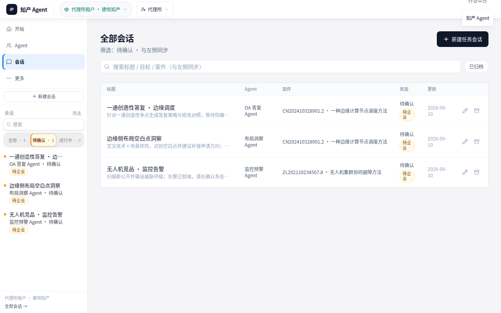
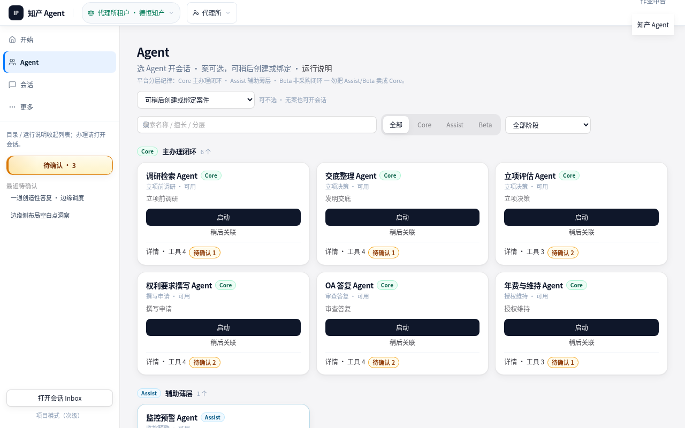
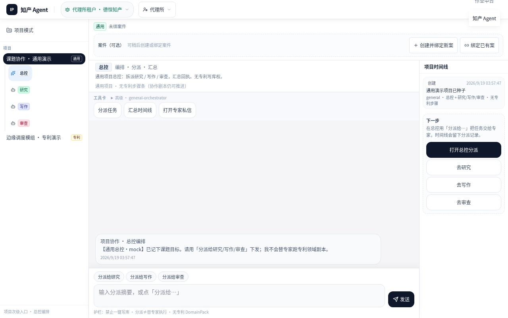
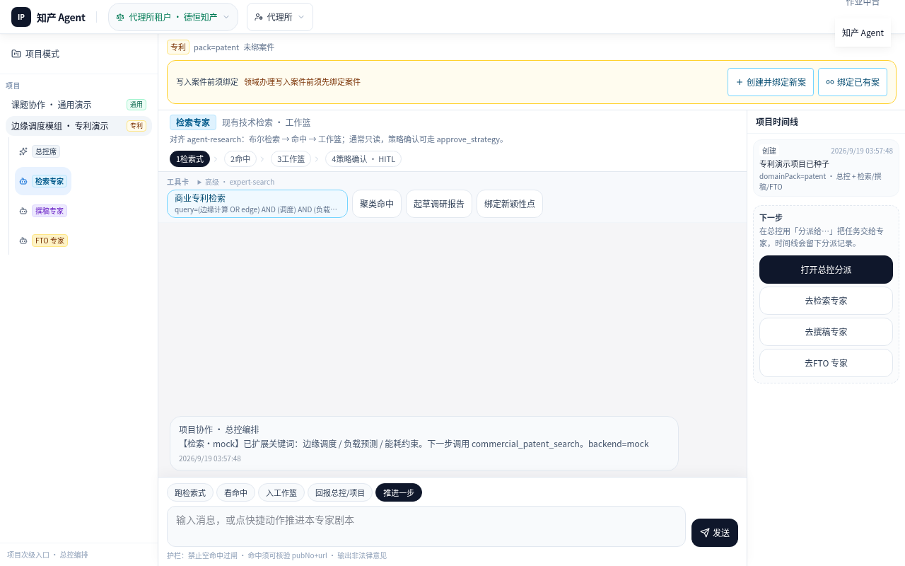

# e2e-hunt report · CP-agent-stepwise

- **runId**: `82c164aa-2c88-4acb-b124-b80880a3641b`
- **adapter**: ip-harness
- **driver**: playwright
- **status**: **passed**
- **steps**: 7
- **findings**: fail_hard=0, suspect=0
- **stopReason**: success
- **started**: 2026-09-19T03:57:43.795Z
- **finished**: 2026-09-19T03:57:48.428Z

## Steps

### Step 1 · judge=`pass_step`

- url: http://localhost:5175/agent
- action: `goto` {"type":"goto","url":"http://localhost:5175/agent"}
- nextCheckpoint: s2-start-session
- agent_reasoning: judgement=`pass_step` · basis=`rule:CP-agent-stepwise:s0-home→goto`
  - digest: url=http://localhost:5175/agent; next=s2-start-session; reached=s0-home,s1-case-bind
- screenshot: 
- networkDelta: failed=0 slow(>2s)=0 reqs=129

### Step 2 · judge=`pass_step`

- url: http://localhost:5175/agent/sessions/sess-1789790264645
- action: `click` {"type":"click","testId":"home-send"}
- nextCheckpoint: s4-hitl
- agent_reasoning: judgement=`pass_step` · basis=`rule:CP-agent-stepwise:s2-start-session→click`
  - digest: url=http://localhost:5175/agent/sessions/sess-1789790264645; next=s4-hitl; reached=s0-home,s1-case-bind,s2-start-session,s3-timeline,s5-session-casebind
- screenshot: 
- networkDelta: failed=0 slow(>2s)=0 reqs=0

### Step 3 · judge=`pass_step`

- url: http://localhost:5175/agent/sessions/sess-oa-1?focus=hitl
- action: `goto` {"type":"goto","url":"http://localhost:5175/agent/sessions/sess-oa-1?focus=hitl"}
- nextCheckpoint: s6-sessions-filter
- agent_reasoning: judgement=`pass_step` · basis=`rule:CP-agent-stepwise:s4-hitl→goto`
  - digest: url=http://localhost:5175/agent/sessions/sess-oa-1?focus=hitl; next=s6-sessions-filter; reached=s0-home,s1-case-bind,s2-start-session,s3-timeline,s4-hitl,s5-session-casebind
- screenshot: 
- networkDelta: failed=0 slow(>2s)=0 reqs=129

### Step 4 · judge=`pass_step`

- url: http://localhost:5175/agent/sessions?filter=needs_human
- action: `goto` {"type":"goto","url":"http://localhost:5175/agent/sessions?filter=needs_human"}
- nextCheckpoint: s7-catalog
- agent_reasoning: judgement=`pass_step` · basis=`rule:CP-agent-stepwise:s6-sessions-filter→goto`
  - digest: url=http://localhost:5175/agent/sessions?filter=needs_human; next=s7-catalog; reached=s0-home,s1-case-bind,s2-start-session,s3-timeline,s4-hitl,s5-session-casebind,s6-sessions-filter
- screenshot: 
- networkDelta: failed=0 slow(>2s)=0 reqs=129

### Step 5 · judge=`pass_step`

- url: http://localhost:5175/agent/agents
- action: `goto` {"type":"goto","url":"http://localhost:5175/agent/agents"}
- nextCheckpoint: s8-project-general
- agent_reasoning: judgement=`pass_step` · basis=`rule:CP-agent-stepwise:s7-catalog→goto`
  - digest: url=http://localhost:5175/agent/agents; next=s8-project-general; reached=s0-home,s1-case-bind,s2-start-session,s3-timeline,s4-hitl,s5-session-casebind,s6-sessions-filter,s7-catalog
- screenshot: 
- networkDelta: failed=0 slow(>2s)=0 reqs=129

### Step 6 · judge=`pass_step`

- url: http://localhost:5175/agent/projects/proj-demo-general
- action: `goto` {"type":"goto","url":"http://localhost:5175/agent/projects/proj-demo-general"}
- nextCheckpoint: s9-project-patent
- agent_reasoning: judgement=`pass_step` · basis=`rule:CP-agent-stepwise:s8-project-general→goto`
  - digest: url=http://localhost:5175/agent/projects/proj-demo-general; next=s9-project-patent; reached=s0-home,s1-case-bind,s2-start-session,s3-timeline,s4-hitl,s5-session-casebind,s6-sessions-filter,s7-catalog,s8-project-general
- screenshot: 
- networkDelta: failed=0 slow(>2s)=0 reqs=129

### Step 7 · judge=`stop`

- url: http://localhost:5175/agent/projects/proj-demo-patent/bots/expert-search
- action: `goto` {"type":"goto","url":"http://localhost:5175/agent/projects/proj-demo-patent/bots/expert-search"}
- note: success
- agent_reasoning: judgement=`stop` · basis=`rule:CP-agent-stepwise:s9-project-patent→goto`
  - digest: url=http://localhost:5175/agent/projects/proj-demo-patent/bots/expert-search; next=none; reached=s0-home,s1-case-bind,s2-start-session,s3-timeline,s4-hitl,s5-session-casebind,s6-sessions-filter,s7-catalog,s8-project-general,s9-project-paten
- screenshot: 
- networkDelta: failed=0 slow(>2s)=0 reqs=129

## CheapSignals / 失败请求摘要

- **telemetry**: mode=`network` · heap=`false`（默认关）
- **CheapSignals**: total=0 · whitelisted=0 · （本 run 无信号）
- **Network 汇总**: failed=0 · slow(>2s)=0 · reqs=774
- 失败请求: _无_

## Findings

_无 findings（样机白名单信号已过滤）_
